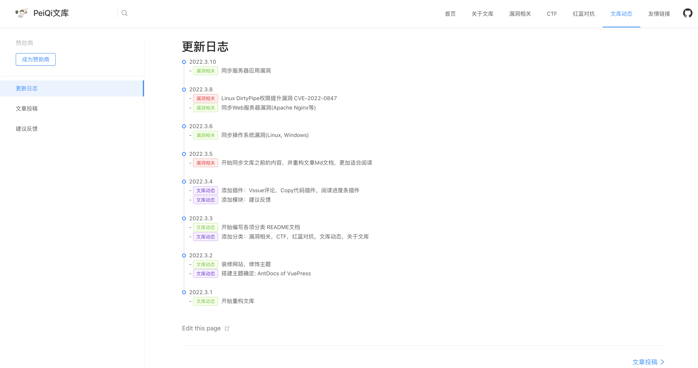

# 使用指南

## 文章阅读

<a-alert type="success" message="网络测绘标签可以用于快速找到与文章相同的Web站点 (默认FOFA语法)" description="" showIcon>
</a-alert>
 

<a-alert type="success" message="涉及代码审计等文章，配置了代码高亮，让研究者有更好的阅读体验" description="" showIcon>
</a-alert>
 

<a-alert type="success" message="文库中配置了内容搜索，可以快速找到想要看的文章，同样，每一篇文章都进行了分类，鼠标放在模块上就可以看到各个小分类" description="" showIcon>
</a-alert>
 

## 文库更新

<a-alert type="success" message="在更新日志模块可以快速了解文库最近更新文章以及未来动态" description="" showIcon>
</a-alert>
 

## 合作伙伴

<a-alert type="success" message="如果你的项目或公司想获取更多的曝光量，让更多的安全研究者获知，可以将你的项目按照已有模版发送至邮箱 ameliezoie6230@gmail.com,通过审核后将会出现在友情链接模块中" description="" showIcon>
</a-alert>
 
<template>
  <a-steps>
    <a-step status="finish" title="发送邮件">
      <a-icon slot="icon" type="user" />
    </a-step>
    <a-step status="finish" title="验证项目真实性">
      <a-icon slot="icon" type="solution" />
    </a-step>
    <a-step status="process" title="一周同步一次">
      <a-icon slot="icon" type="loading" />
    </a-step>
    <a-step status="wait" title="推至友情链接模块">
      <a-icon slot="icon" type="smile-o" />
    </a-step>
  </a-steps>
</template>

 

## 建议反馈

<a-alert type="success" message="在建议反馈模块大家可以登录Github后，提出文库建设意见或对文章进行修正，当然啦，大家也可以在里面聊聊天～" description="" showIcon>
</a-alert>
 

