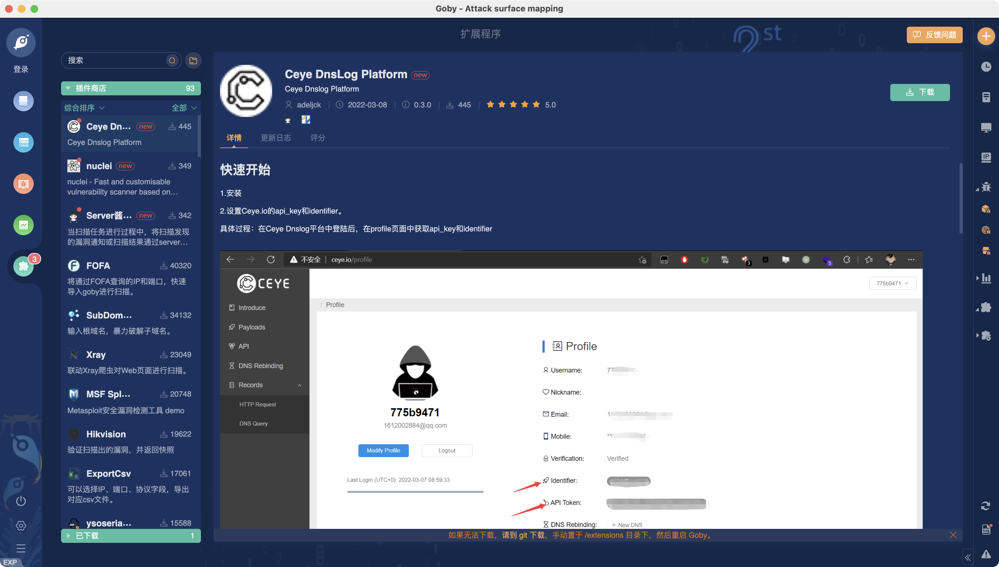

<template>
  

    <a-page-header
      :ghost="false"
      title="Gobysec/Goby"
      sub-title="新一代网络安全测试工具"
      @back="() => $router.go(-1)"
    >
      <template>
      <a-comment>
        <a slot="author">Goby</a>
        <a-avatar
          slot="avatar"
          src="/img/goby.svg"
          alt="Goby"
        />
        

          Goby 为新一代网络安全测试工具，能够针对一个目标企业梳理最全的攻击面信息，同时能进行高效、实战化漏洞扫描，并快速的从一个验证入口点，切换到横向。Goby 集成资产发现、漏洞发现、漏洞利用、漏洞全网扫描、反弹 shell、蜜罐识别、代理隧道、拓扑展示、报告输出、自定义插件等功能于一身，强大且灵活的框架覆盖绝大部分攻击流程。使攻击效果，不再依赖于攻击人员自身的能力及经验。Goby 内集成的“靶标漏洞”，全部为实际可利用漏洞，部分来自于历年攻防演习爆发的漏洞，更加贴近于企业对于攻防演习实战化的需求，以全面提升攻击队成绩。
        

        </a-tooltip>
      </a-comment>
    </template>
      <template slot="extra">
        <a-button href="https://github.com/gobysec/Goby" key="1" type="primary">
          Github
        </a-button>
      </template>
      <a-descriptions size="small" :column="4">
        <a-descriptions-item label="项目创作者">
          <a>Goby</a>
        </a-descriptions-item>
        <a-descriptions-item label="安全方向">
          <a>信息收集</a>
        </a-descriptions-item>
        <a-descriptions-item label="创建时间">
          <a>2019-09-22</a>
        </a-descriptions-item>
      </a-descriptions>
    </a-page-header>
  

</template>

 

