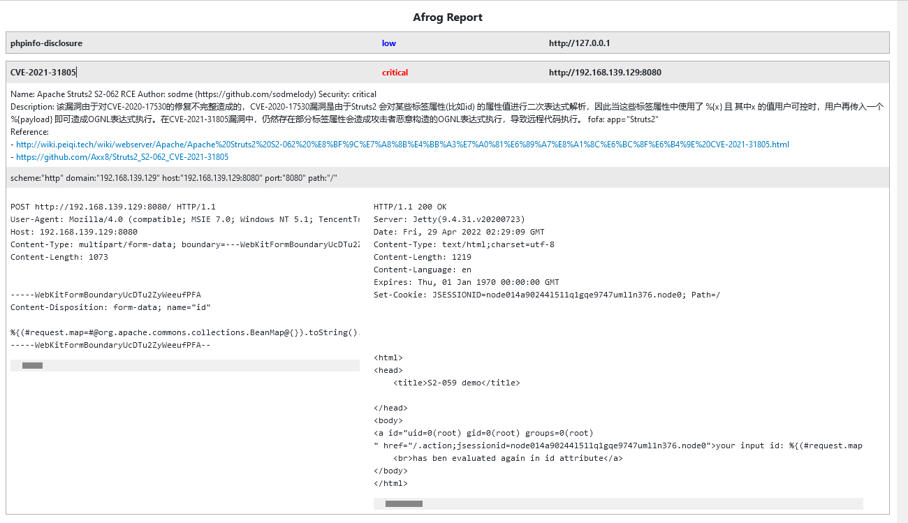

<template>
  

    <a-page-header
      :ghost="false"
      title="zan8in/afrog"
      sub-title="一个挖洞工具 - A tool for finding vulnerabilities"
      @back="() => $router.go(-1)"
    >
      <template>
      <a-comment>
        <a slot="author">zan8in</a>
        <a-avatar
          slot="avatar"
          src="/img/afrog.ico"
          alt="afrog"
        />
        

          afrog 是一款性能卓越、快速稳定、PoC 可定制的漏洞扫描（挖洞）工具，PoC 涉及 CVE、CNVD、默认口令、信息泄露、指纹识别、未授权访问、任意文件读取、命令执行等多种漏洞类型，帮助网络安全从业者快速验证并及时修复漏洞。
        

        </a-tooltip>
      </a-comment>
    </template>
      <template slot="extra">
        <a-button href="https://github.com/zan8in/afrog" key="1" type="primary">
          Github
        </a-button>
      </template>
      <a-descriptions size="small" :column="4">
        <a-descriptions-item label="项目创作者">
          <a>zan8in</a>
        </a-descriptions-item>
        <a-descriptions-item label="安全方向">
          <a>漏洞扫描器</a>
        </a-descriptions-item>
        <a-descriptions-item label="创建时间">
          <a>2022-03-28</a>
        </a-descriptions-item>
        <a-descriptions-item label="作者寄语">
          持续更新，喜欢请点赞🌟⭐，不迷路～
        </a-descriptions-item>
      </a-descriptions>
    </a-page-header>
  

</template>

 

 

