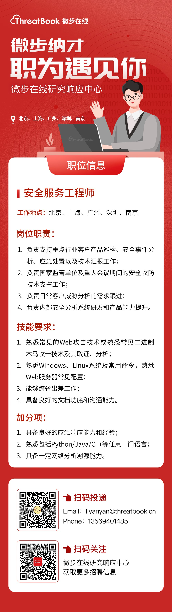

<template>
  <div style="background-color: #F5F5F5; padding: 24px;">
    <a-page-header
      :ghost="false"
      title="微步在线-研究响应中心"
      sub-title="威胁发现与响应专家"
      @back="() => $router.go(-1)"
    >
      <template>
      <a-comment>
        <a slot="author">微步</a>
        <a-avatar
          slot="avatar"
          src="/img/wbzx.svg"
          alt="微步在线"
        />
        <p slot="content">
          微步在线研究响应中心，负责微步在线安全分析与安全服务业务，主要研究内容包括威胁情报自动化研发、高级 APT 组织&黑产研究与追踪、恶意代码与自动化分析技术、重大事件应急响应等。微步在线研究响应中心由精通木马分析与取证技术、Web 攻击技术、溯源技术、大数据、AI 等安全技术的资深专家组成，并通过自动化情报生产系统、云沙箱、黑客画像系统、威胁狩猎系统、追踪溯源系统、威胁感知系统、大数据关联知识图谱等自主研发的系统，对微步在线每天新增的百万级样本文件、千万级 URL、PDNS、Whois 数据进行实时的自动化分析、同源分析及大数据关联分析。
        </p>
        </a-tooltip>
      </a-comment>
    </template>
      <template slot="extra">
        <a-button href="https://threatbook.cn/" key="1" type="primary">
          官网
        </a-button>
      </template>
    </a-page-header>
  </div>
</template>

<style>
tr:last-child td {
  padding-bottom: 0;
}
</style>


<br/>
<div  align="center"> 

</div>
<br/>

<center class="half">
    
</center>


<br/>


<a-alert type="success" message="注：招聘信息可直接联系HR，需备注以下信息：peiqi-岗位-姓名， 邮箱：liyanyan@threatbook.cn，联系方式：13569401485" description="" showIcon>
</a-alert>

<br/>
<a-alert type="success" message="（一）威胁追踪分析师" description="" showIcon>
</a-alert>

```shell
岗位职责：
1、负责高级黑客组织的发现及追踪
2、响应国内外重大网络安全事件
技能要求：
1、2年以上病毒样本分析经验，能够熟练分析Windows/Linux/Android其中任一种平台的病毒木马，并能够快速得出分析结论
2、熟练使用OD/Windbg/IDA/GDB等调试和逆向工具
3、掌握YARA/Snort规则的编写
4、熟练掌握对样本、域名、IP地址、URL等数据的关联分析工作

加分项：
1、具备良好的报告撰写能力
2、有APT组织追踪经验
```

<br/>
<a-alert type="success" message="（二）安全服务工程师" description="" showIcon>
</a-alert>

```shell
地点：北上广深南京
岗位职责：
1. 负责支持重点行业客户产品巡检、安全事件分析、应急处置以及技术汇报工作；
2. 负责国家监管单位及重大会议期间的安全攻防技术支撑工作；
3. 负责日常客户威胁分析的需求跟进；
4. 负责内部安全分析系统研发和产品能力提升。

岗位要求：
1. 熟悉常见的Web攻击技术或熟悉常见二进制木马攻击技术及其取证、分析；
2. 熟悉Windows、Linux系统及常用命令、熟悉Web服务器常见配置；
3. 能够跨省出差工作；
4. 具备良好的文档功底和沟通能力；
5. 满足以下至少一项条件者优先：
   (1) 具备良好的应急响应能力和经验；
   (2) 熟悉包括Python/Java/C++等任意一门语言；
   (3) 具备一定网络分析溯源能力。

```

<br/>
<a-alert type="success" message="（三）安全分析师--主机检测方向-java方向" description="" showIcon>
</a-alert>

```shell
岗位职责：
负责Java 方向安全技术的研究：
1、Webshell检测技术的研究，包括Java内存马、Jsp Webshell 等
2、Java应用漏洞检测与资产识别

岗位要求：
1、具备Java基础编码能力，有过代码编写经验
2、熟悉Jsp Webshell实现原理，常见绕过方式，现有检测方式及其原理
3、掌握Java方向应用漏洞分析，漏洞产生原理，现有检测方式
4、熟悉Linux系统命令的使用
5、熟悉各类常见安全渗透工具的使用，如Burpsuite、MSF、Nmap等

加分项：
1、曾经参与过各类安全比赛，获得过较好的名次
2、 具备样本分析、Webshell、漏洞检测，高级威胁研究、EDR等任一方向的实际工作经验
```

<br/>
<a-alert type="success" message="（四）高级应急响应工程师" description="" showIcon>
</a-alert>

```
地点：北京、上海、深圳
岗位职责：
1. 负责支持APT、高级威胁等重大安全事件的应急处置、溯源取证及技术汇报等工作；
2. 负责重大安全事件的攻击手法、检测防御思路提炼以及内部赋能；
3. 跟踪最新安全事件，输出最新流行安全事件的处置经验，在团队内部进行系统培训；
4. 体系化输出应急响应领域的技术文章，提升应急响应品牌影响力；
5. 研究最新的应急取证技术，完善应急响应服务技术体系和内部应急响应工具集；
6. 完善内部应急响应知识和经验的沉淀，维护内部知识库；        
岗位要求
1. 三年以上安全行业工作经验；
2. 熟悉常见安全攻防对抗手段，安全防护经验，熟悉常见安全漏洞及技术原理，有丰富的应急响应经验；
3. 熟悉流量、日志、样本的分析取证，并能够在实战中运用；
4. 熟悉主流安全产品的机制原理；
5. 熟悉Windows、Linux系统的使用，能够完成日常应急响应与取证；
6. 踏实的人生态度，较强执行力，热爱网络安全；
7. 良好的文档功底、沟通能力与培训能力；
8. 加分项（满足以下至少一项条件者）
  (1) 具备较强的应急响应能力和一线实战经验
  (2) 熟悉IDA、Windbg等调试工具的使用，并能够进行恶意程序的静态分析与动态调试
  (3) 在应急响应领域有一定的影响力
  (4) 体系化输出应急响应方面的技术文章
  (5) 开发或编写过应急响应领域内的工具（如安全检查工具、日志分析工具、某专杀工具等）
  (6) 具有CISP、CISAW、CISSP等证书
```

<br/>
<a-alert type="success" message="（五）高级渗透测试工程师" description="" showIcon>
</a-alert>

```
地点：北京、上海
岗位职责：
1. 负责支持重点行业客户的渗透测试、攻防演练等工作；
2. 支撑公司内部各产品线的安全测试；
3. 研究前沿攻击技术，跟踪最新漏洞，输出研究成果，并进行内部赋能；
4. 完善内部渗透测试知识和经验的沉淀，维护内部知识库；
5. 负责国家监管单位及HW、重保等重大安全活动的现场支撑工作。      
岗位要求：
1. 三年以上安全行业工作经验；
2. 熟悉常见安全攻防对抗手段，熟悉渗透测试流程及安全防护经验，熟悉常见安全漏洞及技术原理，有丰富的攻防对抗经验；
3. 至少在APP、C/S架构、内网、免杀、web渗透、代码审计、等方面擅长一项；
4. 具有漏洞分析能力，并且能够根据需求编写相关的漏洞利用工具；
5. 踏实的人生态度，较强执行力；
6. 良好的文档功底、沟通能力与培训能力；
7. 加分项（满足以下至少一项条件者）
  (1) 独立挖掘通用漏洞，具有CNVD证书或CVE编号；
  (2) 开发过安全工具或平台；
  (3) 在Freebuf、先知等平台输出过安全文章；
  (4) 具有CISP、CISAW、CISSP等证书。
```

