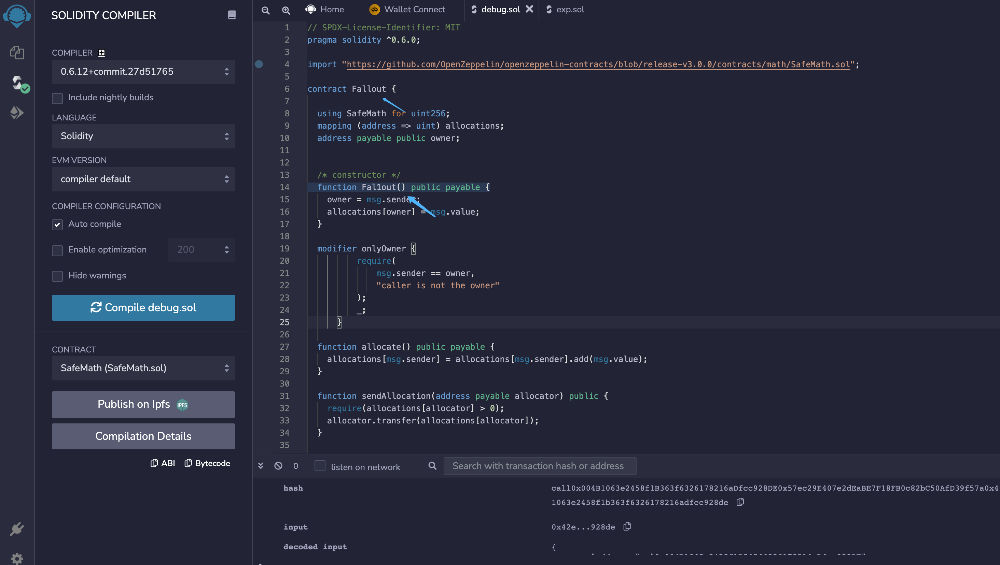

# 2.Fallout

## 题目描述


## 解题过程

题目源码

```javascript
// SPDX-License-Identifier: MIT
pragma solidity ^0.6.0;

import '@openzeppelin/contracts/math/SafeMath.sol';

contract Fallout {
  
  using SafeMath for uint256;
  mapping (address => uint) allocations;
  address payable public owner;


  /* constructor */
  function Fal1out() public payable {
    owner = msg.sender;
    allocations[owner] = msg.value;
  }

  modifier onlyOwner {
	        require(
	            msg.sender == owner,
	            "caller is not the owner"
	        );
	        _;
	    }

  function allocate() public payable {
    allocations[msg.sender] = allocations[msg.sender].add(msg.value);
  }

  function sendAllocation(address payable allocator) public {
    require(allocations[allocator] > 0);
    allocator.transfer(allocations[allocator]);
  }

  function collectAllocations() public onlyOwner {
    msg.sender.transfer(address(this).balance);
  }

  function allocatorBalance(address allocator) public view returns (uint) {
    return allocations[allocator];
  }
}
```

我们可以注意到构造函数 Fallout 被写成了 Fal1out，导致该函数不是构造函数，可以直接调用获取 owner权限



调用方法即可获取权限

