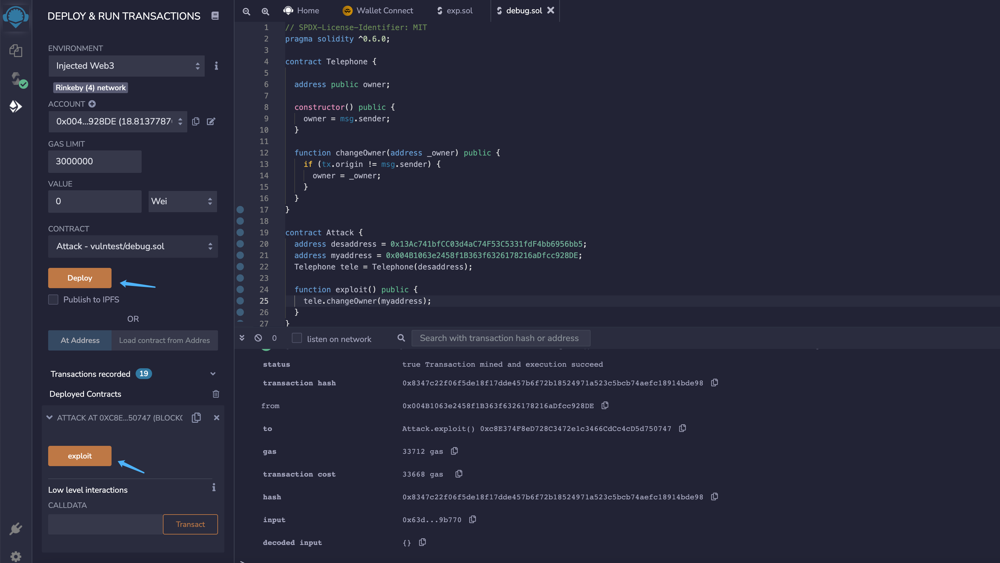

# 4.Telephone

## 题目描述


## 解题过程

题目源码

```javascript
// SPDX-License-Identifier: MIT
pragma solidity ^0.6.0;

contract Telephone {

  address public owner;

  constructor() public {
    owner = msg.sender;
  }

  function changeOwner(address _owner) public {
    if (tx.origin != msg.sender) {
      owner = _owner;
    }
  }
}
```

这里需要区分  tx.origin 和 msg.sender ，msg.sender是函数的直接调用方，

而 tx.origin 则必然是这个交易的原始发起方，无论中间有多少次合约内/跨合约函数调用，一定是账户地址而不是合约地址。


回到代码块中, 需要做到的是 tx.origin != msg.sender

```javascript
function changeOwner(address _owner) public {
    if (tx.origin != msg.sender) {
      owner = _owner;
    }
  }
```

如上图，我们只需要部署一个第三方合约A调用目标合约B，就可以通过判断获取 owner权限

