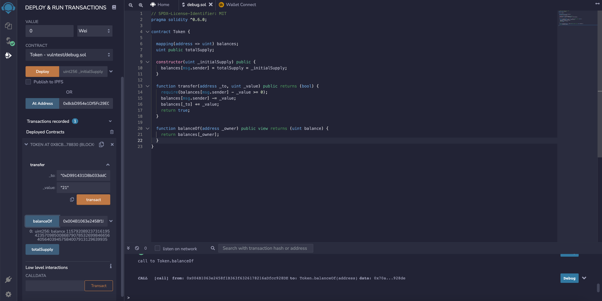

# 5.Token

## 题目描述


## 解题过程

题目源码

```javascript
// SPDX-License-Identifier: MIT
pragma solidity ^0.6.0;

contract Token {

  mapping(address => uint) balances;
  uint public totalSupply;

  constructor(uint _initialSupply) public {
    balances[msg.sender] = totalSupply = _initialSupply;
  }

  function transfer(address _to, uint _value) public returns (bool) {
    require(balances[msg.sender] - _value >= 0);
    balances[msg.sender] -= _value;
    balances[_to] += _value;
    return true;
  }

  function balanceOf(address _owner) public view returns (uint balance) {
    return balances[_owner];
  }
}
```

根据题目提示我们默认含有20代币，注意一下 transfer方法

```javascript
// 向某地址转移代币，且需要通过require的大于0的检测
function transfer(address _to, uint _value) public returns (bool) {
    require(balances[msg.sender] - _value >= 0);
    balances[msg.sender] -= _value;
    balances[_to] += _value;
    return true;
  }
```

以太坊虚拟机（EVM）为整数指定固定大小的数据类型。这意味着一个整形变量只能表达一定范围的数字。

例如，uint8，只能存储[0,255]之间的数字，如果想存储256，那么就会上溢，从而将变量的值变为0。相对应的，如果从一个uint8类型的值为0的变量中减1，就会发生下溢，该变量会变成255。

所以我们需要通过下溢出来完成攻击


部署合约后可以看到默认20代币，产生下溢我们就可以向任意地址转移 21代币，发生下溢



```javascript
Overflow 在 solidity 中非常常见, 你必须小心检查, 比如下面这样:

if(a + c > a) {
  a = a + c;
}
另一个简单的方法是使用 OpenZeppelin 的 SafeMath 库, 它会自动检查所有数学运算的溢出, 可以像这样使用:

a = a.add(c);
如果有溢出, 代码会自动恢复.
```