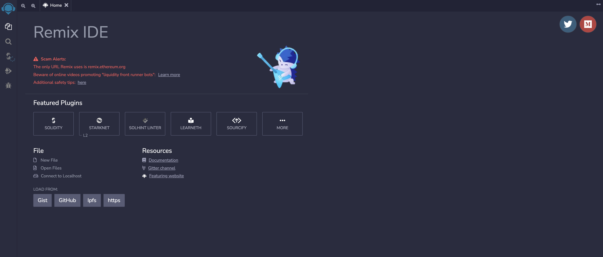
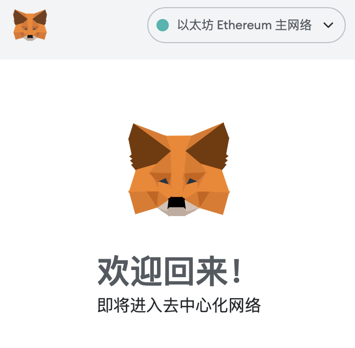
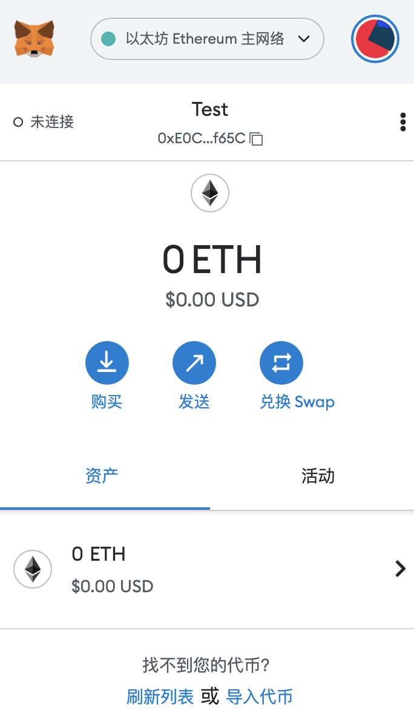

# 工具安装与使用

## Remix

Remix 是以太坊官方推荐的`智能合约开发IDE（集成开发环境`，适合新手，可以在浏览器中快速部署测试智能合约，你不需要在本地安装任何程序。

<a-alert type="success" message="https://remix.ethereum.org" description="" showIcon>
</a-alert>
<br/>



### 创建 Solidity程序

```Solidity
// SPDX-License-Identifier: MIT
// compiler version must be greater than or equal to 0.8.13 and less than 0.9.0
pragma solidity ^0.8.13;

contract HelloWorld {
    string public greet = "Hello World!";
}

```


### 编译并部署

编译成功后在虚拟机中部署，部署成功后，你会在下面看到名为 `HelloWorld 的合约`，点击 greet，就能看到我们代码中写的 `Hello Worl d!` 了。


## MetaMask

MetaMask是一款浏览器插件钱包，不需下载安装客户端，只需添加至浏览器扩展程序即可使用。



### 安装

谷歌商店搜索 MetaMask


安装后可以在浏览器扩展中找到它，我们创建第一个钱包




<a-alert type="success" message="注意钱包需要创建后保存私钥并记住地址，防止钱包丢失" description="" showIcon>
</a-alert>
<br/>