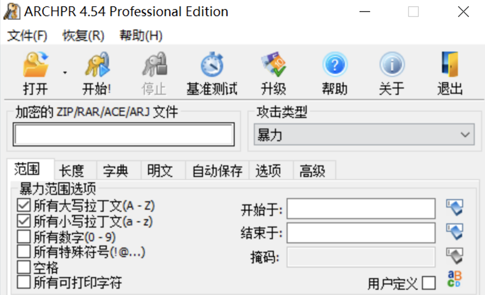

# 密码破解

## 关于

ZIP,RAR,7Z等后缀为压缩包格式后缀，用户可以通过压缩的方法将多个目录和文件压缩至一个 ZIP或RAR 文件中，并附加密码来保证信息的安全，但弱口令将会导致压缩包密码被爆破的问题。

目前已经有了完善的工具进行常见几类的压缩包密码破解，当密码只存在数字或弱口令时，通过一定的时间可以破解出压缩包的密码获取内容

## ZIP爆破示例

这里创建一个密码为 123456 的弱口令压缩包，导入工具中

勾选数字和选择最大密码长度为6进行爆破

## 工具

<a-alert type="success" message="" description="Ziperello: https://static.ctfhub.com/tools/attachment/6_0eed0205bb82cc96f33505cca2e6b1a24bc3b3fa.zip?1581276163" showIcon>
</a-alert>
 

<a-alert type="success" message="" description="RAR Password Unlocker: https://static.ctfhub.com/tools/attachment/66_af7da340697cdc838711241bd1b23455a83d4685.zip?1581285864" showIcon>
</a-alert>
 

<a-alert type="success" message="" description="ARCHPR: http://www.downcc.com/soft/130539.html" showIcon>
</a-alert>
 

