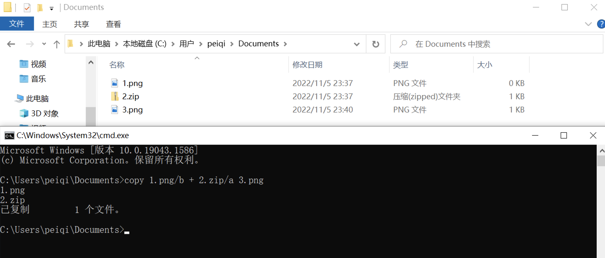
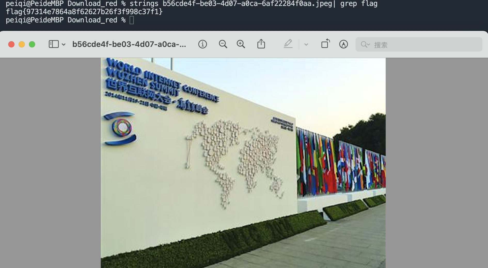

# 附加式隐写

##  关于

 附加式隐写文件是一种采用特殊方式将图片文件于其他字符或文件结合产生的文件，例如使用附加式隐写在一张PNG图片中的末尾附加ZIP压缩包文件，当用户拿到文件时，正常可以打开并浏览PNG图片信息，但如果修改文件后缀 png 为 zip 后，再次打开就会以 ZIP压缩包的格式来打开。这是因为操作系统识别的过程中是，从文件头标志，到文件的结束标志位，当系统识别到图片的结束标志位后，默认不再继续识别。


## 





## BuuCTF - 乌镇峰会种图 (文件附加字符串)

文件附加字符串隐写我们可以通过工具或命令来实现快速查找关键字 Flag等字符获得我们需要的线索



或者使用 010 editor 或 winhex 等工具搜索关键字


## BJDCTF2020 - 认真你就输了 (文件附加文件)


一般文件附加文件形式的隐写我们可以使用 Binwalk 或 Foremost 工具来进行文件的分离

```java
binwalk -e Test.png
foremost -T Test.png
```

