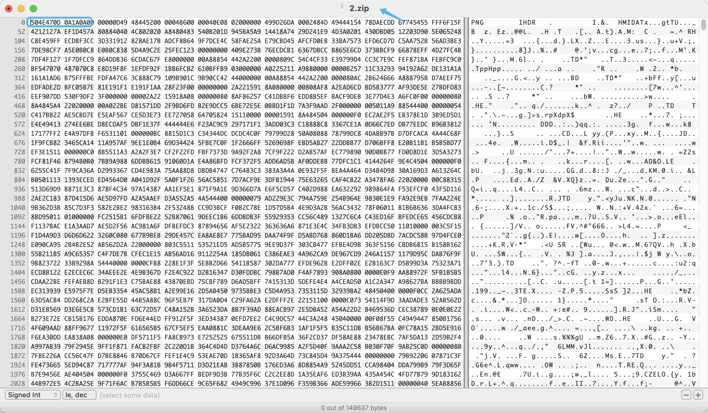

# 标识修复

## 关于

当题目中出现文件损坏或打不开时，我们可以通过十六进制查看工具打开文件，查看文件头是否被修改或删除，使用工具手动更新缺失的数据修复文件头

例如上图中虽然后缀为 zip文件且损坏无法打开，但通过工具打开后发现原因为 PNG的文件头中的 89 被删除导致，通过添加缺失的字符到文件头并修改正确的后缀为 PNG就可以修复文件并重新打开。

## BJDCTF2020 - 鸡你太美 (文件头修复)

GIF文件无法打开，为损坏状态，使用工具打开

拿一张正常的GIF文件可以对比出缺失的部分

对比后发现缺失的数据为 GIF的文件头 47 49 46 38, 手动添加修复后即可打开文件

## 扩展名表

| 扩展名         | 文件头标识（HEX）                   | 文件描述                         |
| -------------- | ----------------------------------- | -------------------------------- |
| 7z             | 37 7A BC AF 27 1C                   | 7-ZIP compressed file            |
| ami            | 5B 76 65 72 5D                      | Lotus Ami Pro                    |
| avi            | 41 56 49 20                         | Audio Video Interleave (AVI)     |
| BMP            | 42 4D 3E                            | Windows Bitmap                   |
| html           | 68 74 6D 6C 3E                      | HTML                             |
| ico            | 00 00 01 00 00                      | Icon File                        |
| jar            | 5F 27 A8 89                         | JAR Archive File                 |
| mp4            | 00 00 00 18 66 74 79 70 33 67 70 35 | MPEG-4 video files               |
| jpg; jpe; jpeg | FF D8 FF E0 00                      | JPG Graphic File                 |
| png            | 89 50 4E 47 0D 0A 1A 0A             | PNG Image File                   |
| tar; cpio      | 30 37 30 37 30 37                   | CPIO Archive File                |
| pdf            | 25 50 44 46 2D 31 2E                | Adobe Acrobat                    |
| zip            | 50 4B 30 30 50 4B 03 04             | WINZIP Compressed                |
| xml            | 3C 3F 78 6D 6C                      | XML Document                     |
| gif            | 47 49 46 38 37 61                   | Graphics interchange format file |