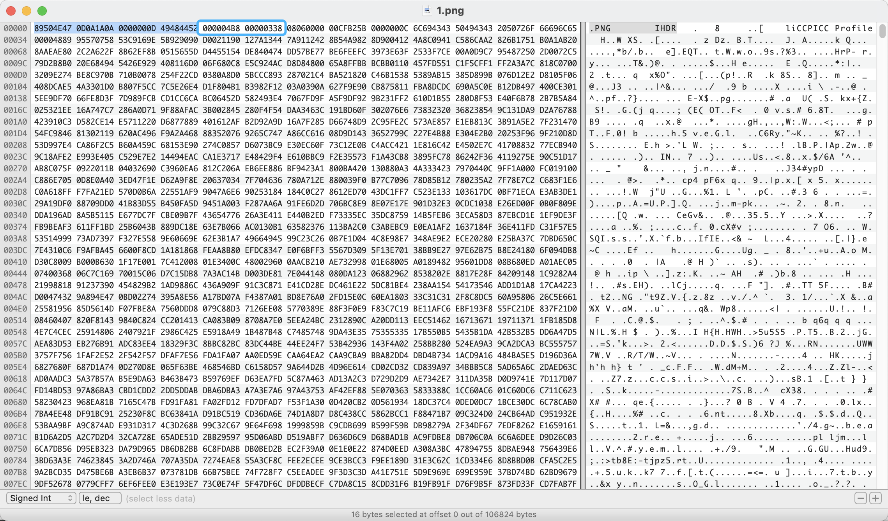

# 高度修复

## 关于

图片中可以通过修改数据块中的数据来减小文件的高度达到隐藏数据的目的.



如上图使用一张 PNG图片做演示，其中  000004B8 00000338 为 图片高度的数据段，通过修改这一部分就可以隐藏图片中的信息

## BuuCTF - 大白 (PNG高度修复)

```java
89 50 4E 47 0D 0A 1A 0A (PNG文件头)
.....
00 00 02 A7 00 00 01 00 (宽高)
.....
6D 7C 71 35 (13位IHDR数据块后的4字节)
```

找到CRC后通过脚本爆破高度

```java
#!/usr/bin/env python
#-*- coding:UTF-8 -*-
import binascii
import struct
import os
crcbp = open("BuuCTF - 大白.png","rb").read()#填文件名
for i in range(1024):
    for j in range(1024):
        data = crcbp[12:16] + struct.pack('>i',i) + struct.pack('>i',j) + crcbp[24:29]
        crc32 = binascii.crc32(data) & 0xffffffff
        if crc32 == 0x6D7C7135 :#此处填CRC值
            print (i);
            print (j);
            print (hex(i),hex(j))
```


修复高度就可以看到隐藏信息

