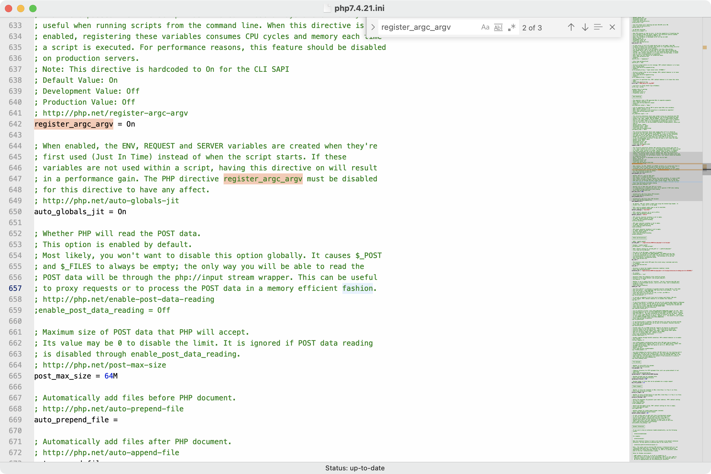
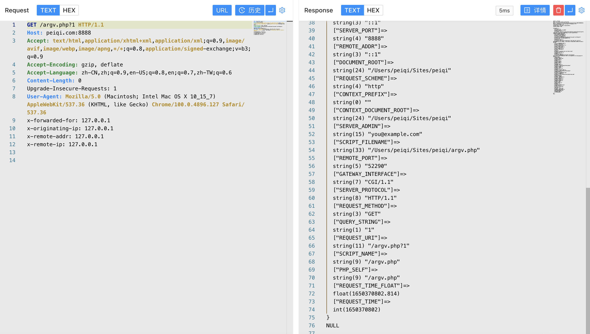
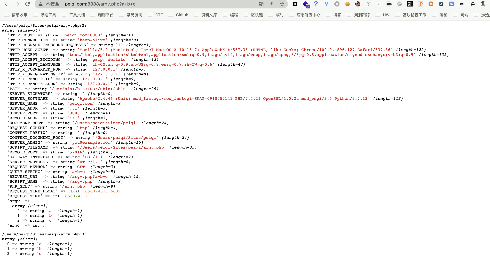
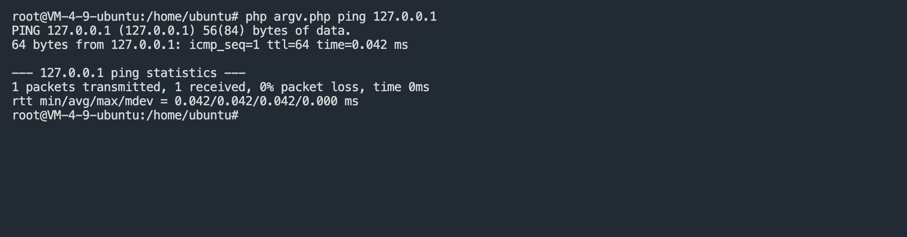

# 命令行模式

在PHP的配置文件 php.ini 中，有一个与PHP执行相关的参数配置 `register_argc_argv`, 其中主要存在两种模式来进行参数传递，一种是CLI模式，另一种为Web模式


首先我们先使用代码了解CLI模式下的参数传递, 根据文档我们看到变量传递主要是参数 `$argc` 与 `$argv`

```php
<?php
var_dump($argc);
var_dump($argv);
?>
```


| 函数               | 类型/值 | 说明                                                         |
| ------------------ | ------- | ------------------------------------------------------------ |
| register_argc_argv | boolean | Tells PHP whether to declare the argv & argc variables (that would contain the GET information). See also command line. |
| register_argc_argv | TRUE    | Setting this to TRUE means that scripts executed via the CLI SAPI always have access to argc (number of arguments passed to the application) and argv (array of the actual arguments).The PHP variables $argc and $argv are automatically set to the appropriate values when using the CLI SAPI. These values can also be found in the $_SERVER array, for example: $_SERVER["argv"]. |


这里是对 `register_argc_argv` 配置开启与不开启的一个描述，当我们想要从 Url中赋值给参数 `$_SERVER['argv']`时，就需要在配置文件中打开选项



我们对比下配置打开与不打开参数传入的变化

```php
<?php
var_dump($_SERVER);
var_dump($_SERVER["argv"]);
?>
```




这里可以发现只有当该配置打开时，`$_SERVER` 才会通过Web中的请求进行 `argv 参数`的赋值，我们在源码中看一下 `argv参数`的处理方法


我们可以注意到实际参数传递过程为 `+号` 分割，测试参数传递 `argv[0]=a, argv[1]=b, argv[2]=c`



例如如下的代码，当`$_SERVER['argv']`可控时，我们就可以通过参数传递来达到变量的控制

```php
<?php
$a = $_SERVER['argv'][1];
switch($a) {
    case "echo" : {
        echo "abc"; 
        break;
    }
    case "ping" : {
        $b = $_SERVER["argv"][2];
        echo shell_exec("/sbin/ping -c 1 $b");
        break;
    }
}
?>
```

正常使用逻辑应为PHP文件调用执行 ping 命令



`register_argc_argv` 配置为 On，可从Web请求控制 `argv参数` 时


