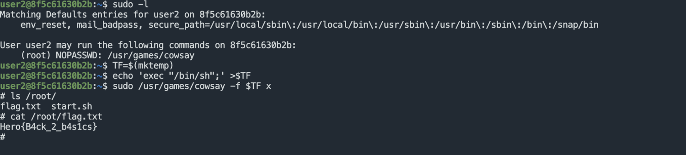
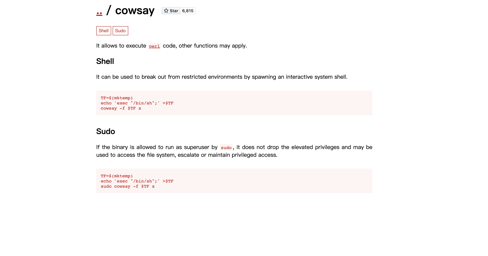

# SUDO

部分服务器为了方便管理人员运维管理，为某些命令或可执行文件设置可以使用SUDO无密码以Root权限调用的配置，当我们获取到的用户有这样的权限时，就可以通过SUDO提权来获取服务器最高权限

## 常规提权

```
sudo -l
```


只需要一条命令就可以知道是否有这样的权限，显示ALL就代表着所有命令都可以SUDO无密码执行

## 可执行文件提权

常规运维过程中只会给运维人员某个命令含有这样的权限，例如 yum，find，namp 等



上图就是对某个可执行文件设置了此配置，利用后就可以获取Root权限

