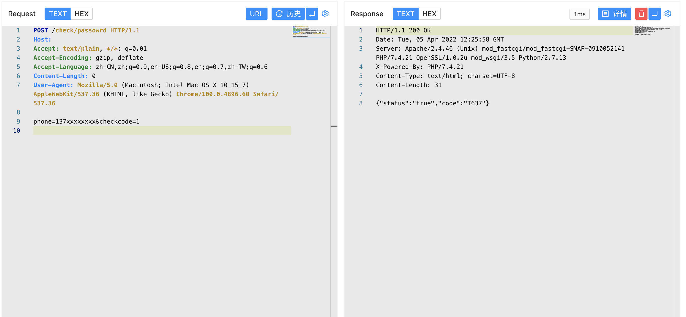
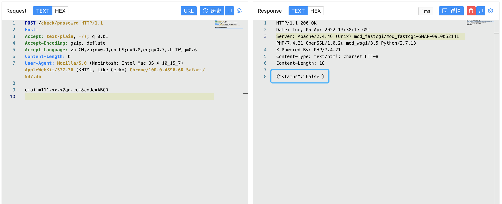
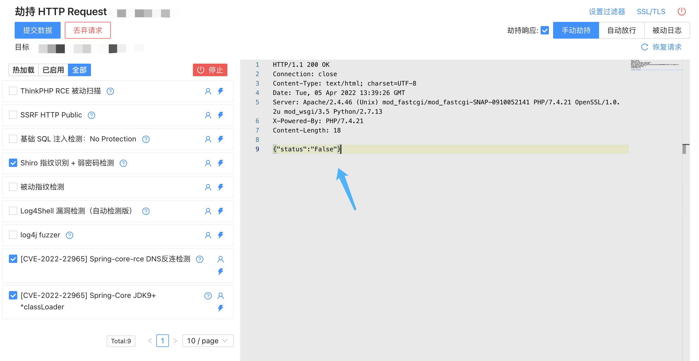

# 验证码安全

## 关于

账号密码找回是用户登录中十分重要的一环，在大多数网站都含有这一功能点，当找回密码存在一些例如验证码可被爆破，响应包存在验证码信息等漏洞时，用户的信息安全就会收到威胁，导致用户的敏感信息被读取。

## 验证码可被爆破

找回密码的过程中，如果发送的验证码为可被爆破的长度，而且站点没有限制验证次数数量，就会导致攻击者可以更改账户密码，获取用户权限

## 返回包存在验证码

在部分站点中由于开发人员的逻辑错误，导致验证码回显在HTTP响应中，攻击者通过抓取请求就可以获取验证码修改密码

## 请求包数据修改

攻击者在验证码发送时抓包修改请求中的手机号或邮箱等数据，由于账户验证与手机号数据未绑定，就导致请求数据更改获取验证码

[参考文章:TerraMater TOS 任意用户账号密码修改漏洞 CVE-2020-28186 ](http://wiki.peiqi.tech/wiki/webapp/TerraMaster/TerraMaster%20TOS%20%E4%BB%BB%E6%84%8F%E8%B4%A6%E5%8F%B7%E5%AF%86%E7%A0%81%E4%BF%AE%E6%94%B9%E6%BC%8F%E6%B4%9E%20CVE-2020-28186.html)

当请求中包含了这些数据的时候可以尝试去更改发包查看请求

## 验证码未绑定

当站点发送验证码时，后端请求没有绑定手机号去进行验证码接口调用，导致当一个用户找回密码时，另一个用户可以使用他的验证码来绕过验证，如下图，攻击者通过A用户获取验证码来通过B用户的验证码验证来获取用户权限

## 响应包判断绕过

当站点通过某个用户可修改的数据来进行判定验证码是否通过时，攻击者通过修改响应包返回包来达到验证码绕过

当存在漏洞时，通过劫持响应来修改HTTP返回包，例如改变1为0，False为Ture

