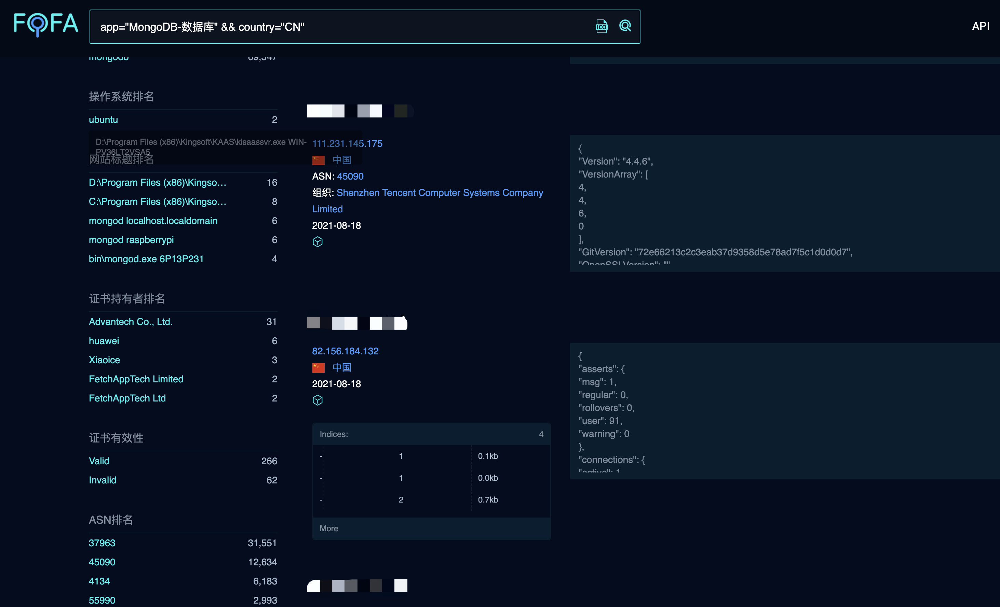

# MongoDB 27017端口

## 关于

<a-checkbox checked>MongoDB服务安装后，默认未开启权限验证。如果服务监听在0.0.0.0，则可远程无需授权访问数据库。</a-checkbox> 

<a-checkbox checked>3.0之前版本的MongoDB,默认监听在0.0.0.0，3.0及之后版本默认监听在127.0.0.1。</a-checkbox> 

<a-checkbox checked>3.0之前版本，如未添加用户管理员账号及数据库账号，使用--auth参数启动时，在本地通过127.0.0.1仍可无需账号密码登陆访问数据库，远程访问则提示需认证；</a-checkbox> 

<a-checkbox checked>3.0及之后版本，使用--auth参数启动后，无账号则本地和远程均无任何数据库访问权限。</a-checkbox> 

## 攻击方法

可以直接使用 Navicat 工具连接即可

在FOFA搜索引擎中，当出现未授权的请况将会显示如下图

