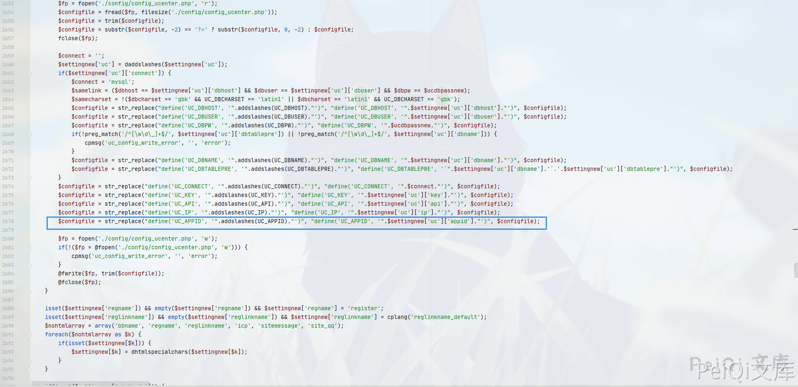

# Discuz!X 3.4 admincp_setting.php 后台SQL注入漏洞

## 漏洞描述

不久以前Discuz!X的后台披露了一个sql注入的漏洞，这里也要感谢漏洞的发现和研究者（无糖的kn1f3)。

## 影响版本

<a-checkbox checked>Discuz!X <3.4 R20191201 版本</a-checkbox></br>

## 环境搭建

将 `upload`目录下的文件拷入`phpstudy`下的WWW目录打开网站按照步骤安装就行了


## 漏洞复现


来到后台页面, 在 `UCenter 应用 ID` 位置的参数添加单引号并抓包


发现出现SQL语句报错


使用报错注入去获取版本号


这里的参数为 `settingnew[uc][appid]`


查看文件 `\source\admincp\admincp_setting.php`， 在2677行找到了输入点





根据报错语句找到SQL语句执行点，在文件`uc_client\model\base.php` 中的 206行


通过这里的语句可以看到我们可以使用 `union注入` 的方法来写入恶意文件(`secure_file_priv不能为Null`)


```plain
1' union select "<?php phpinfo();?>"  into outfile 'D:/test.php';--+
```


也可以使用其他的方法