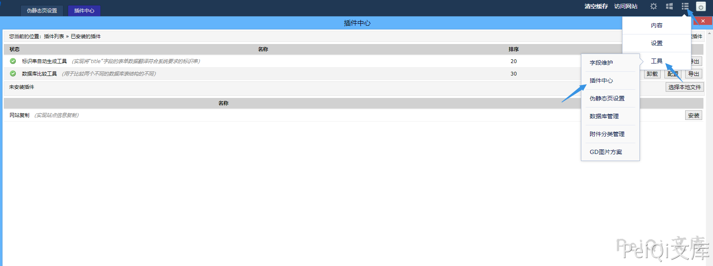
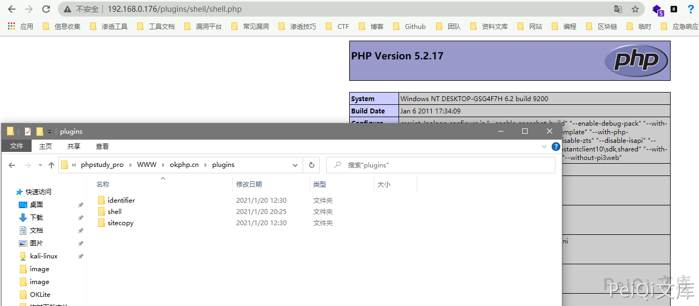

# OKLite 1.2.25 后台插件安装 任意文件上传

## 漏洞描述

OKLite v1.2.25 后台插件过滤不完善导致可以上传恶意木马文件

## 漏洞影响

<a-checkbox checked>OKLite 1.2.25</a-checkbox></br>

## 漏洞复现

关于执行逻辑参照上一篇`OKLite 1.2.25 后台模块导入 任意文件上传 CVE-2019-16131`


出现漏洞的位置在于`framework/admin/plugin_control.php`


```php
public function unzip_f()
	{
		$id = $this->get('id','int');
		$rs = $this->model('res')->get_one($id);
		if(!$rs){
			$this->json(P_Lang('附件不存在'));
		}
		if($rs['ext'] != 'zip'){
			$this->json(P_Lang('非ZIP文件不支持在线解压'));
		}
		if(!file_exists($this->dir_root.$rs['filename'])){
			$this->json(P_Lang('文件不存在'));
		}
		$info = $this->lib('phpzip')->zip_info($this->dir_root.$rs['filename']);
		$info = current($info);
		if(!$info['filename']){
			$this->json(P_Lang('插件有异常'));
		}
		$info = explode('/',$info['filename']);
		if(!$info[0]){
			$this->json(P_Lang('插件有异常'));
		}
		if(file_exists($this->dir_root.'plugins/'.$info[0])){
			$this->json(P_Lang('插件已存在，不允许重复解压'));
		}
		if(!$info[1]){
			$this->json(P_Lang('插件打包模式有问题'));
		}
		$this->lib('phpzip')->unzip($this->dir_root.$rs['filename'],$this->dir_root.'plugins/');
		$this->json(true);
	}
```


这里可以看到需要上传ZIP压缩包格式的插件，跟进`zip_info`函数


函数位置 `framework/libs/phpzip.php`


这里会返回关于ZIP压缩包的一些信息


往下看关键位置


```php
$info = explode('/',$info['filename']);
		if(!$info[0]){
			$this->json(P_Lang('插件有异常'));
		}
		if(file_exists($this->dir_root.'plugins/'.$info[0])){
			$this->json(P_Lang('插件已存在，不允许重复解压'));
		}
		if(!$info[1]){
			$this->json(P_Lang('插件打包模式有问题'));
		}
		$this->lib('phpzip')->unzip($this->dir_root.$rs['filename'],$this->dir_root.'plugins/');
		$this->json(true);
```


这里用 explode函数以 `/` 分隔返回两个值，也就是说格式应为 `AAA/BBB`这样的目录格式，直接上传ZIP文件则会报错 `插件打包模式有问题`





在这里上传一个ZIP文件，格式要是解压出来为目录，目录中含PHP文件就行了


```php
$this->lib('phpzip')->unzip($this->dir_root.$rs['filename'],$this->dir_root.'plugins/');
		$this->json(true);
```


最后两行告诉了文件解压的位置，上传的文件在 `plugins目录下`





若有收获，就点个赞吧