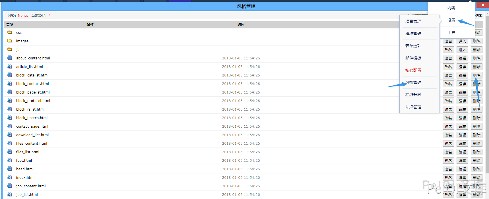

# OKLite 1.2.25 后台风格模块 任意文件删除 CVE-2019-16132

## 漏洞描述

OKLite 1.2.25 后台风格模块存在 对危险字符未过滤，导致可以删除任意目录和文件

## 漏洞影响

<a-checkbox checked>OKLite 1.2.25</a-checkbox></br>

## 漏洞复现

出现漏洞的函数在文件 `framework/admin/tpl_control.php` 中的 `delfile_f()` 函数


这里删除文件主要调用了 `rm函数`, 位置在 `framework/libs/file.php`


```php
/**
	 * 删除操作，请一定要小心，在程序中最好严格一些，不然有可能将整个目录删掉
	 * @参数 $del 要删除的文件或文件夹
	 * @参数 $type 仅支持file和folder，为file时仅删除$del文件，如果$del为文件夹，表示删除其下面的文件。为folder时，表示删除$del这个文件，如果为文件夹，表示删除此文件夹及子项
	 * @返回 true/false
	**/
	public function rm($del,$type="file")
	{
		if(!file_exists($del)){
			return false;
		}
		if(is_file($del)){
			unlink($del);
			return true;
		}
		$array = $this->_dir_list($del);
		if(!$array){
			if($type == 'folder'){
				rmdir($del);
			}
			return true;
		}
		foreach($array as $key=>$value){
			if(file_exists($value)){
				if(is_dir($value)){
					$this->rm($value,$type);
				}else{
					unlink($value);
				}
			}
		}
		if($type == "folder"){
			rmdir($del);
		}
		return true;
	}
```


这里对传入的参数遍历，获得的文件名或文件夹进行删除


回过头看 调用get函数传入参数时是否有对 `../` 的过滤


可以看到参数我们是可控的，使用这里的漏洞进行任意文件删除





抓包修改成功删除文件