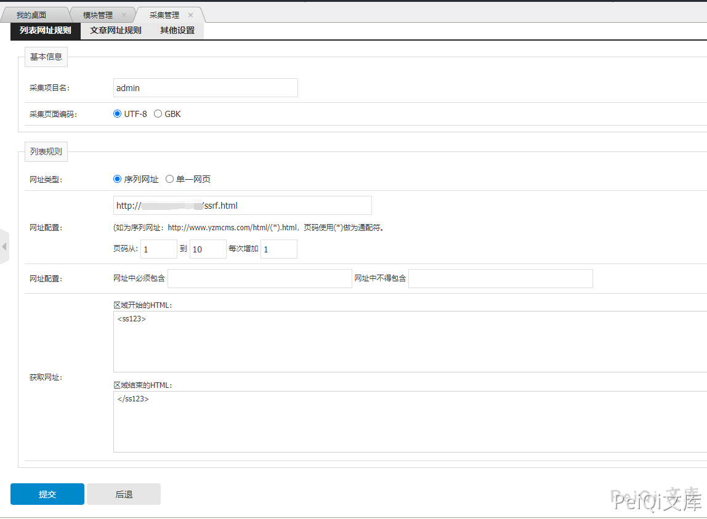
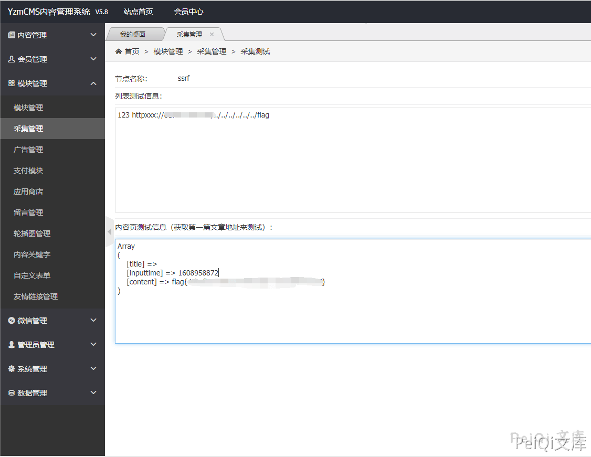
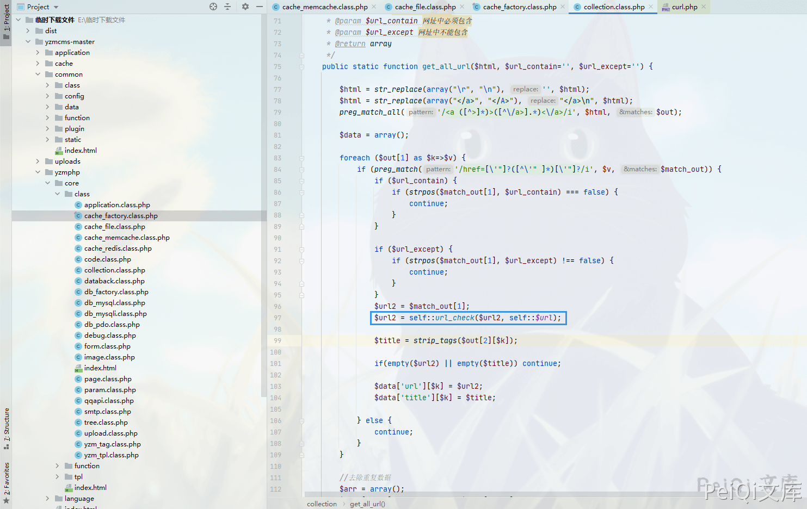

# YzmCMS 后台采集模块 SSRF漏洞

## 漏洞描述

[YzmCMS内容管理系统](https://www.yzmcms.com/)是一款`轻量级开源内容管理系统`，它采用自主研发的框架`YZMPHP`开发。程序基于PHP+Mysql架构，并采用MVC框架式开发的一款高效开源的内容管理系统，可运行在Linux、Windows、MacOSX、Solaris等各种平台上。

源码存在协议识别的缺陷，导致存在SSRF漏洞

## 漏洞影响

<a-checkbox checked>YzmCMS version <  V5.8正式版</a-checkbox> 	

## 环境搭建

<a-alert type="success" message="按照文档安装即可:https://github.com/yzmcms/yzmcms" description="" showIcon>
</a-alert>
 

## 漏洞复现

登录后台 --> 模块管理 --> 采集管理

添加采集规则

在你的服务器上编辑HTML代码

根目录可能不同，payload需要更改

点击采集读取根目录下的 Flag

出现漏洞的代码位置 `yzmcms/yzmphp/core/class/cache_factory.class.php`

这里调用 `*url_check`* 函数

可以看到这里只检测了前4位是否为 http，使用 httpxxx 即可绕过