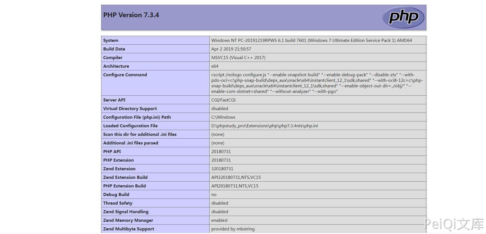

# 极致CMS 后台文件编辑插件 后台任意文件写入漏洞

## 漏洞描述

极致CMS后台中含有文件编辑插件，通过逻辑漏洞可任意修改文件

## 漏洞影响

<a-checkbox checked>极致CMS</a-checkbox> 

## 网络测绘

<a-checkbox checked>icon_hash="1657387632"</a-checkbox> 

## 漏洞复现

登陆后台查看插件处，有一个后台编辑的插件

<a-checkbox checked>安装之后设置密码并使用, 如果已经设有密码，重新安装插件即可解决密码未知问题</a-checkbox> 

修改为php代码

成功执行php代码的命令